# Démo 1 – Autoscaling d’un App Service Plan / Rules & Elastic

Dans cette démonstration, nous allons :

1. Utiliser le **bash** avec la commande **az** pour :
- Créer un **App Service Plan**
- Récupérer son **Resource ID**
- Configurer un **Autoscale Azure Monitor**
- Ajouter des **règles de scaling basées sur l’utilisation CPU**
2. Voir la différence entre auto scaling Rules & Elastic

------------------------------------------------------------------------

# 🟢 Partie 1 --- Mise en place du App Service Plan (avec Azure Cli)

---

## 1 – Définir les variables

Pour simplifier les commandes Azure CLI, nous définissons deux variables :

- le **Resource Group** (à modifier pour coller avec votre RG)
- le **nom de l’App Service Plan**

```bash
RG='az204'
ASP_NAME='AppServicePlanAz204'
```

---

## 2 – Créer un App Service Plan

Nous créons un **App Service Plan** dans le Resource Group.

Le SKU **P1V4** correspond à un plan **Premium**, qui supporte notamment **l’autoscaling**.

```bash
az appservice plan create \
   --name $ASP_NAME \
   --resource-group $RG \
   --sku P1V4
```

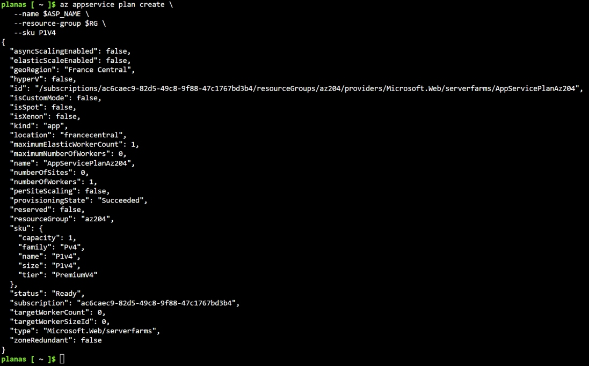

---

## 3 – Récupérer l’ID de la ressource

Certaines commandes Azure CLI nécessitent le **Resource ID complet**.

Nous allons le récupérer avec la commande suivante :

```bash
ASP_ID=$(az appservice plan show \
    --name $ASP_NAME \
    --resource-group $RG \
    --query id \
    --output tsv)

echo $ASP_ID
```

Exemple de résultat :

```
/subscriptions/.../resourceGroups/az204/providers/Microsoft.Web/serverfarms/AppServicePlanAz204
```

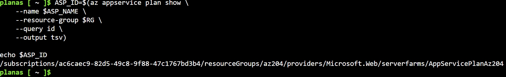

------------------------------------------------------------------------

# 🟢 Partie 2 --- Autoscale rules (avec Azure Cli)

---

## 1 – Créer une configuration d’autoscaling

Nous allons maintenant créer une **configuration d’autoscale** pour ce plan.

Nous indiquons simplement :

- **minimum : 1 instance**
- **maximum : 5 instances**
- **nombre initial : 1**

Noter que pour l’instant, **aucune règle n’est définie**.

```bash
az monitor autoscale create \
  --resource-group $RG \
  --resource $ASP_ID \
  --min-count 1 \
  --max-count 5 \
  --count 1
```

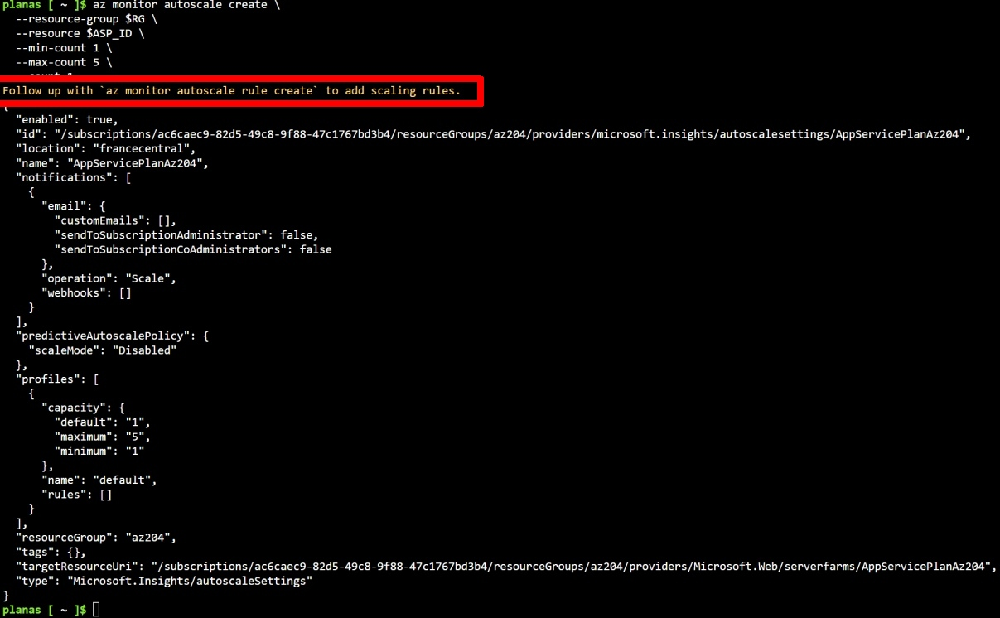

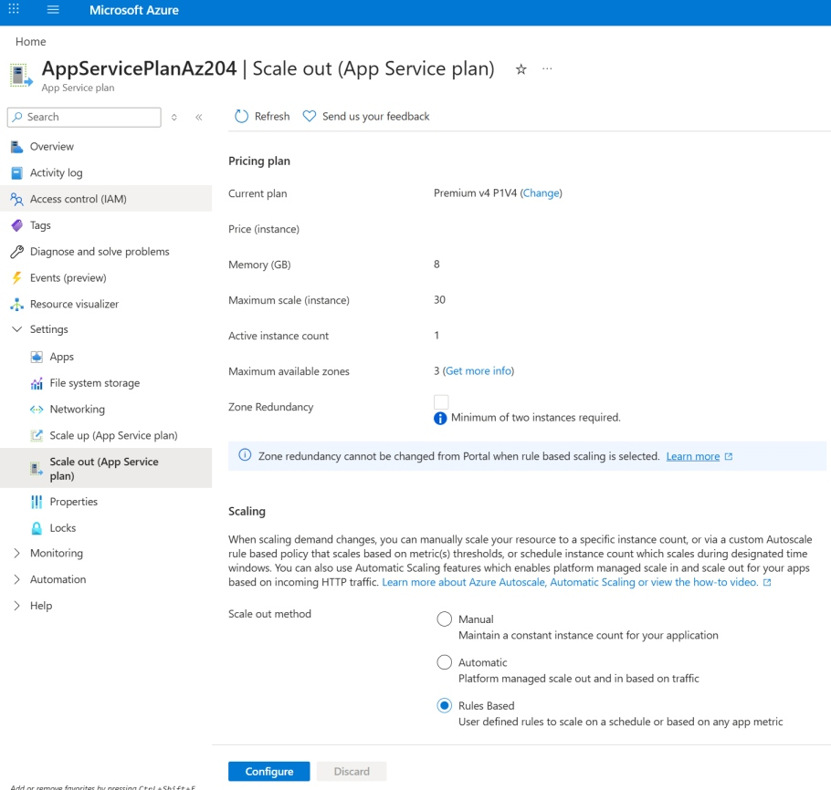

---

## 2 - Important : Autoscale vs Autoscale Rules

Cette commande crée **uniquement la configuration d’autoscale**, mais **aucune règle**.

Le message affiché indique :

> Follow up with `az monitor autoscale rule create` to add scaling rules.

Il est important de comprendre la différence :

| Commande | Rôle |
|---|---|
| `az monitor autoscale create` | crée la configuration d’autoscaling |
| `az monitor autoscale rule create` | ajoute une règle de scaling |

Les règles sont évaluées par **Azure Monitor**.

---

## 3 – Créer une règle de Scale Out

Cette règle indique :

➡ **Si le CPU moyen dépasse 70 % pendant 10 minutes**  
➡ **Ajouter 1 instance**

```bash
az monitor autoscale rule create \
  --autoscale-name $ASP_NAME \
  --resource-group $RG \
  --scale out 1 \
  --condition "CpuPercentage > 70 avg 10m"
```

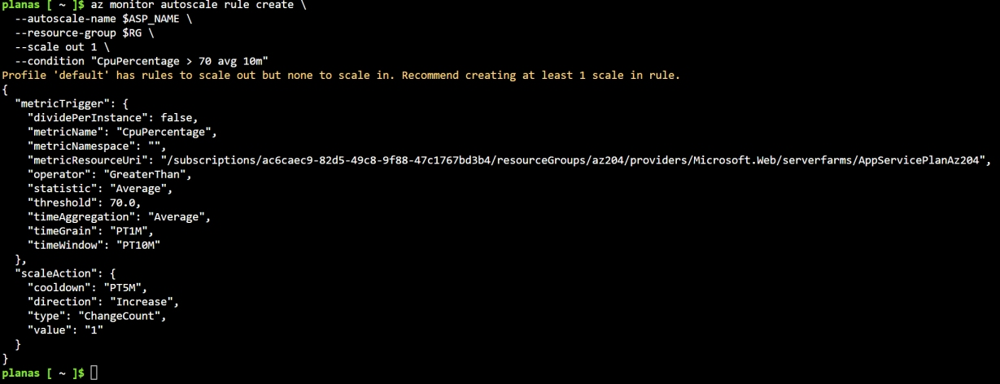

---

## 4 – Créer une règle de Scale In

Cette règle indique :

➡ **Si le CPU moyen descend sous 30 % pendant 10 minutes**  
➡ **Retirer 1 instance**

```bash
az monitor autoscale rule create \
  --autoscale-name $ASP_NAME \
  --resource-group $RG \
  --scale in 1 \
  --condition "CpuPercentage < 30 avg 10m"
```

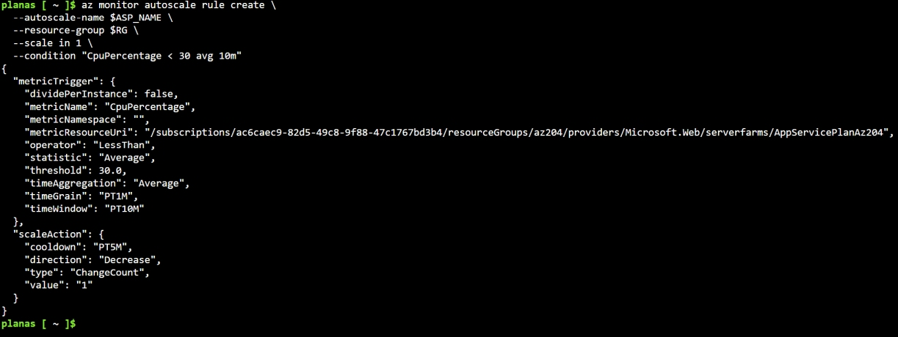

---

## 5 – dans le portail Azure

Après avoir configuré l'autoscaling avec **Azure CLI**, il est intéressant d'observer comment ces paramètres apparaissent dans le **portail Azure**.

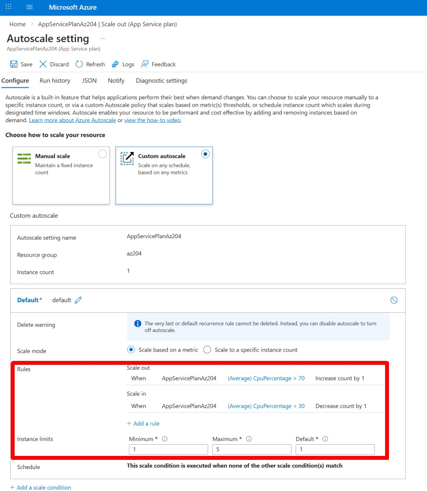

------------------------------------------------------------------------

# 🟢 Partie 3 --- Autoscale elastic (via le portail)

---

## 1 – Scaling au niveau de l’App Service Plan

Dans le portail Azure vous pouvez voir les plans qui peuvent faire de l'autoscale elastic :

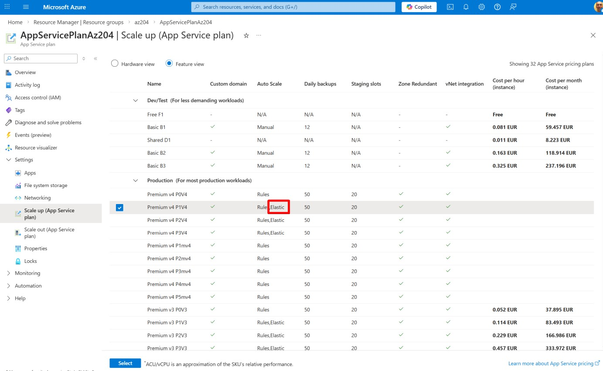

1. Ouvrir l’**App Service Plan**
2. Aller dans **Scale out (App Service plan)**

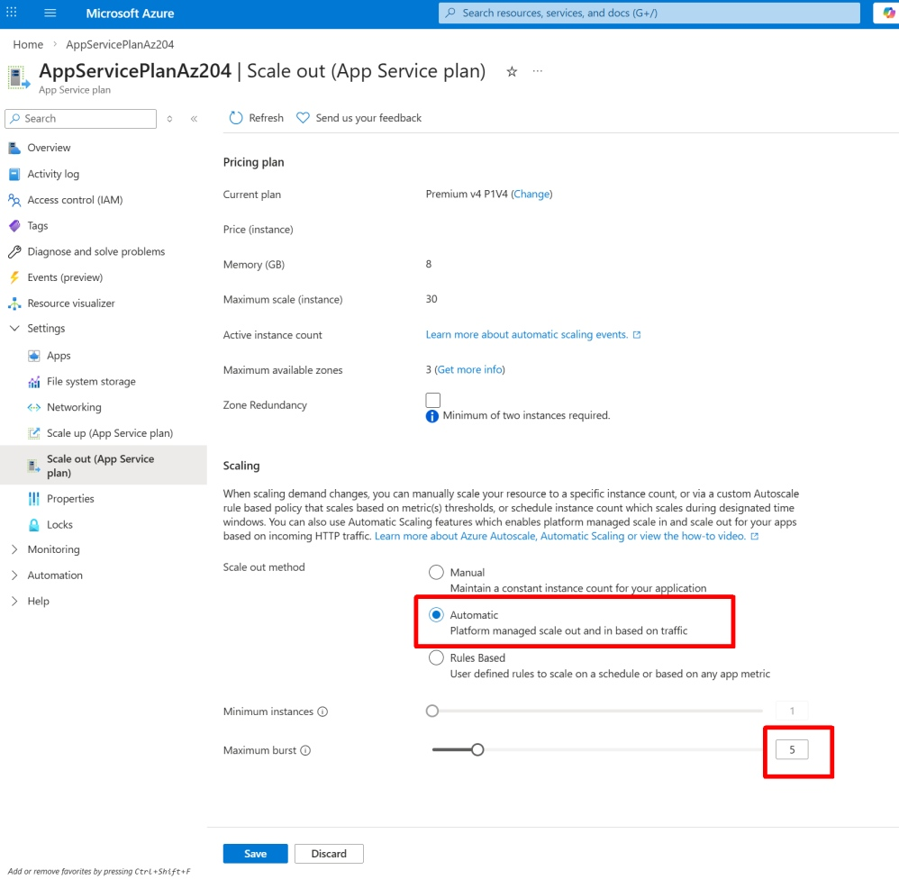

3 modes de scaling sont possibles :
- Manual : Nombre d’instances fixe.
- Automatic : Azure gère automatiquement le scaling **en fonction du trafic HTTP, etc...**.
- Rules Based : Scaling basé sur des **règles Azure Monitor** (CPU, mémoire, métriques…).

Choisir :
- Le mode **Automatic**
- Et configurer **maximum burst** à **5 instances**

Ainsi Azure peut donc automatiquement ajouter des instances lorsque la charge augmente.

---

## 2 – Voir les applications dans un App Service Plan

Un **App Service Plan peut héberger plusieurs applications**.

Dans le menu du plan : Cliquer sur **Apps**

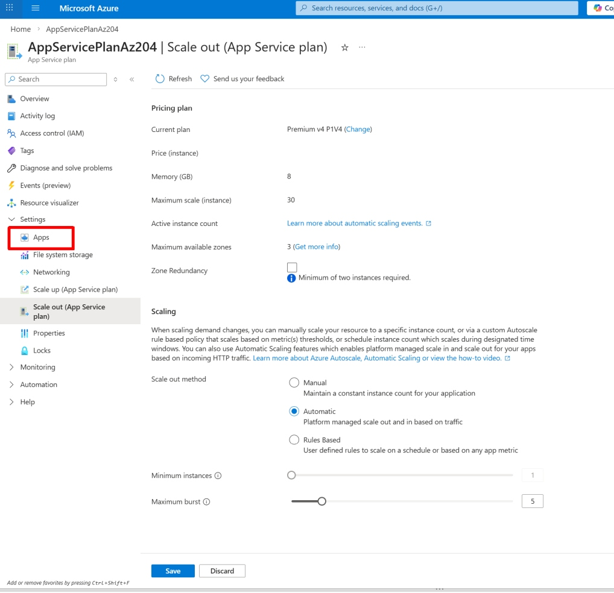

Toutes les applications listées **partagent les mêmes ressources** :
- CPU
- mémoire
- instances

Si le plan scale à **5 instances**, toutes les applications utilisent ces **5 instances**.

---

## 3 – Scaling au niveau d’une Web App

Si l’on ouvre maintenant une **Web App** individuelle :

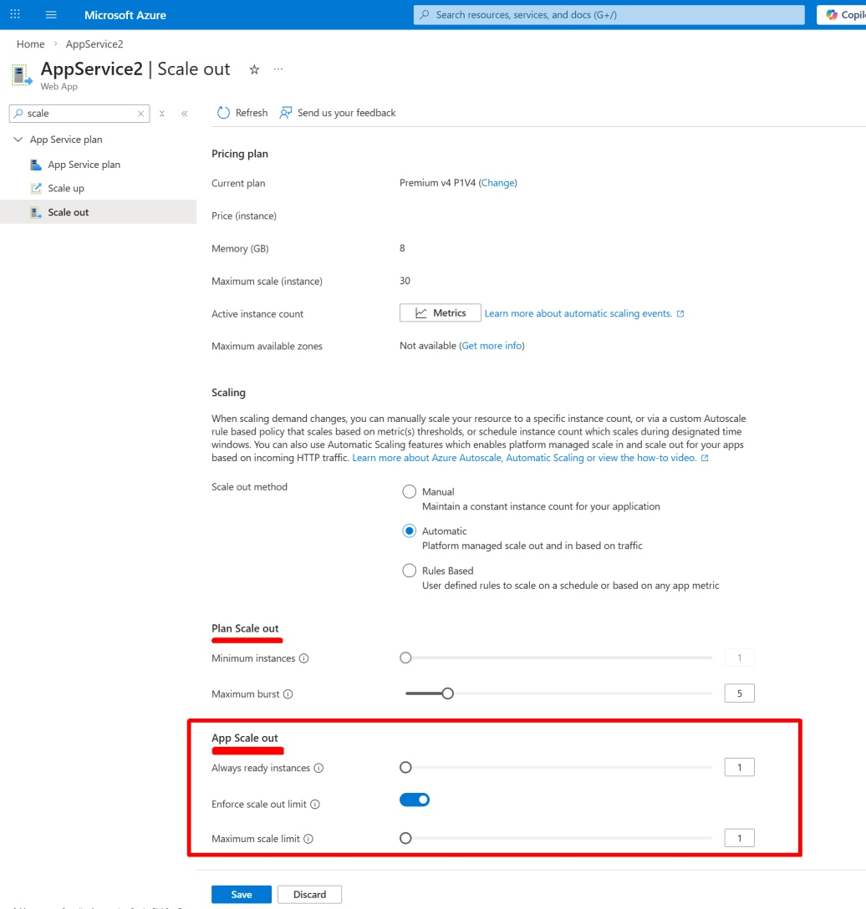

On observe deux sections :
- **Plan Scale out**
- **App Scale out**.

### App Scale out

Dans la section **App Scale out**, ces options sont spécifiques à l'application et pas au plan :
- **Always ready instances**
- **Maximum scale limit**

Ces paramètres permettent d'optimiser la répartition du trafic pour une application spécifique.

⚠️ **Important :**

Le **nombre réel de machines** est toujours défini par le **App Service Plan**.

------------------------------------------------------------------------

# 🟢 Partie 4 --- Conclusion

Dans cette démonstration, nous avons :

1️⃣ Créé un **App Service Plan Premium (P1V4)** avec **Azure CLI**  
2️⃣ Configuré un **Autoscale Azure Monitor** pour ce plan  
3️⃣ Ajouté des **règles de scaling** basées sur la métrique **CPU** :

- **Scale out** si CPU > 70 %
- **Scale in** si CPU < 30 %

Azure Monitor analyse les métriques et **ajuste automatiquement le nombre d’instances**.

Nous avons également vu dans le **portail Azure** :

- la différence entre **Autoscale Rules** et **Autoscale Elastic**
- comment visualiser les règles dans **Scale out (App Service plan)**
- qu’un **App Service Plan peut héberger plusieurs Web Apps**

---

## 💡 À retenir pour l’examen AZ-204

- Le **scale out se configure au niveau du App Service Plan**
- Plusieurs **App Services peuvent partager le même plan**
- Toutes les applications utilisent **les mêmes instances**
- Les règles de scaling sont évaluées par **Azure Monitor**
- Les options **App Scale out** optimisent une application mais **ne changent pas le nombre d’instances du plan**