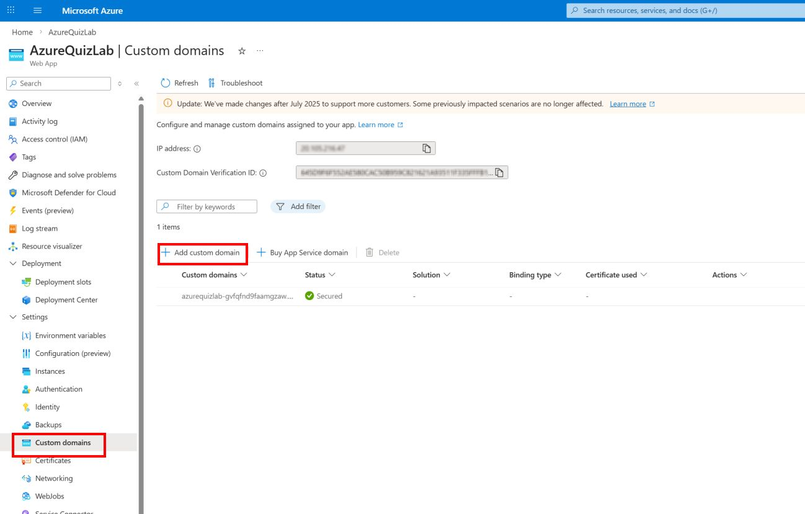
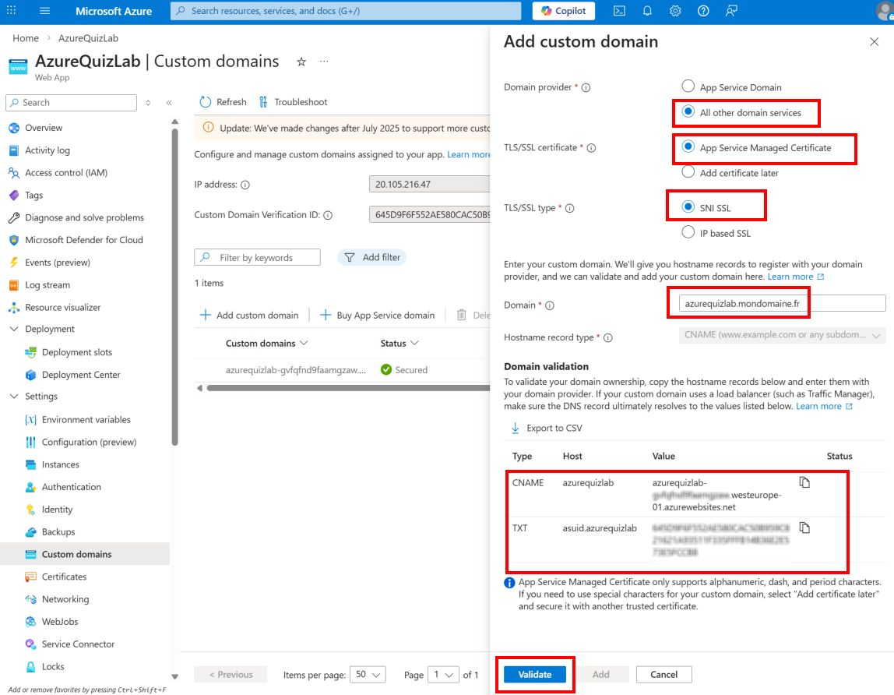
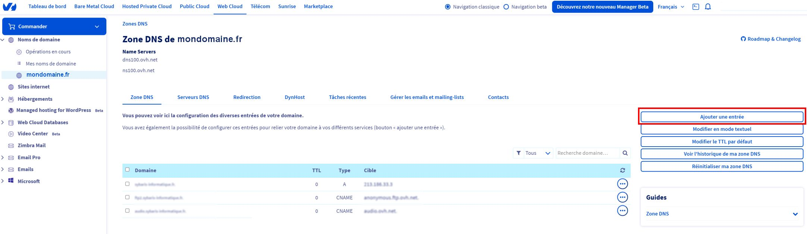
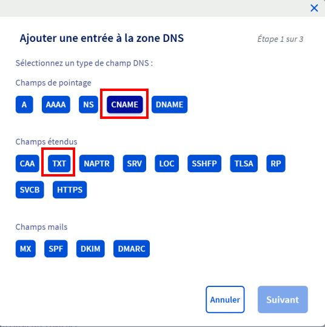
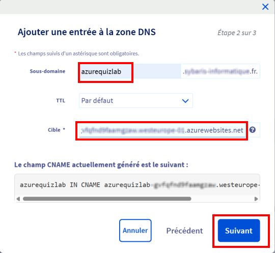

# Démo 2 – Ajouter un Custom Domain + Certificat SSL (Azure Web App + OVH)

## 🎯 Objectifs

- Ajouter un custom domain à une Azure Web App
- Configurer les DNS OVH (TXT + CNAME)
- Activer un certificat SSL gratuit

---

## 📌 Contexte

- Domaine : mondomaine.fr
- Sous-domaine : azurequizlab.mondomaine.fr
- Web App : votreapp.azurewebsites.net

---

## Étape 1 — Vérifier le plan

Le plan doit être au minimum :

```bash
Basic (B1)
```

---

## Étape 2 — Ajouter le domaine

Azure → Web App → Custom domains → Add custom domain

```bash
azurequizlab.mondomaine.fr
```



Dans le panneau qui s’ouvre :
- **Domain provider**  → Sélectionner : `All other domain services`
- **TLS/SSL certificate**  → Sélectionner : `App Service Managed Certificate` (certificat gratuit)
- **TLS/SSL type** → Sélectionner : `SNI SSL`
- **Domain**  → Remplir avec  `azurequizlab.mondomaine.fr` (en remplacant mondomaine.fr par le domaine correct)



Azure affiche automatiquement :
- un **CNAME**
- un **TXT**

👉 Ces informations sont à configurer chez votre fournisseur DNS (OVH)

✔ Le bouton **Validate** sera utilisé après configuration DNS

---

## Étape 3 — Ajouter le TXT (validation DNS)

Dans Azure, récupérer l’enregistrement TXT :

- **Type** : TXT  
- **Host** : `asuid.azurequizlab`  
- **Value** : `<token fourni par Azure>`

---

Dans OVH :

👉 Aller dans **Zone DNS**



👉 Cliquer sur **Ajouter une entrée**

👉 Sélectionner : **TXT**



---

Configurer :

- **Sous-domaine** → `asuid.azurequizlab`
- **Valeur** → `<token Azure>`

👉 Valider

---

## Étape 4 — Ajouter le CNAME (routage)

Dans OVH :

👉 Cliquer sur Ajouter une entrée

👉 Sélectionner : **CNAME**

Configurer :
- **Sous-domaine** → `azurequizlab`
- **Cible** → `votreapp.azurewebsites.net`



👉 Valider

---

## Étape 5 — Ajouter le SSL

Custom domains → Add binding  
SNI SSL → Certificat gratuit

---

## Étape 6 — Tester

https://azurequizlab.mondomaine.fr


