# Démo 3 –  Azure App Service Deployment Slots & Swap

## 🎯 Objectifs

-   Créer et utiliser des deployment slots
-   Tester une version avant mise en production
-   Réaliser un swap
-   Comprendre le fonctionnement des configurations lors d'un swap

------------------------------------------------------------------------

## 📌 Prérequis

-   Avoir fait le **TP2 (Azure SQL, Configuration et Logs)**

## 📌 Prérequis formateur

Exécuter le script suivant pour accepter le pricing tier P0V3

```bash
SUBSCRIPTION_ID=$(az account show --query id -o tsv)
az policy assignment update --name "Limit-AppServicePlan-SKUs-Assignment" --scope "/subscriptions/$SUBSCRIPTION_ID" --params '{ "allowedSKUs": { "value": ["F1","B1","P0V3"] } }'
```

------------------------------------------------------------------------

# 🟢 Partie 1 --- Préparer un environnement staging (SQL)

## Étape 1 --- Créer la base de données de staging

👉 Reprendre les **parties 2, 3 et 4 du TP2** :

-   Création de la base de données (suffixe staging)
-   Configuration du firewall
-   Exécuter le script SQL

👉 Objectif : Créer une base **staging indépendante** de la production

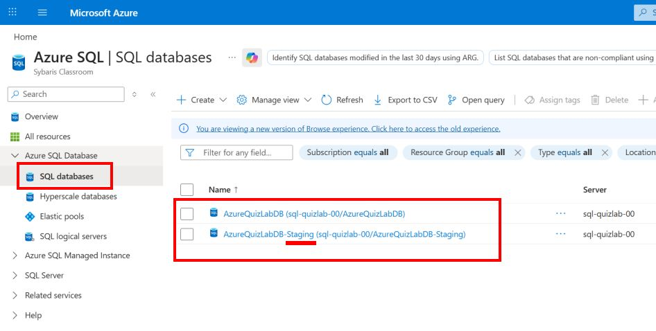

------------------------------------------------------------------------

## Étape 2 --- Récupérer la connection string

Dans Azure :

SQL Database → Connection strings

👉 Copier la connection string pour utilisation ultérieure

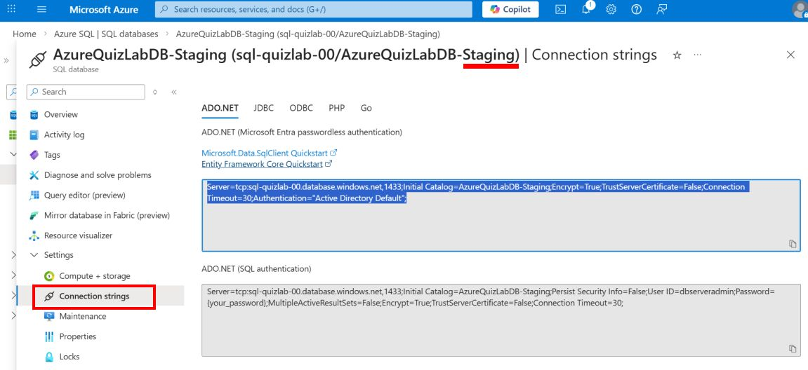

------------------------------------------------------------------------

# 🟢 Partie 2 --- Préparer l'environnement App Service

## Étape 3 --- Vérifier le pricing tier

App Service → Scale up (App Service plan)

👉 Choisir : Premium v3 -- P0V3

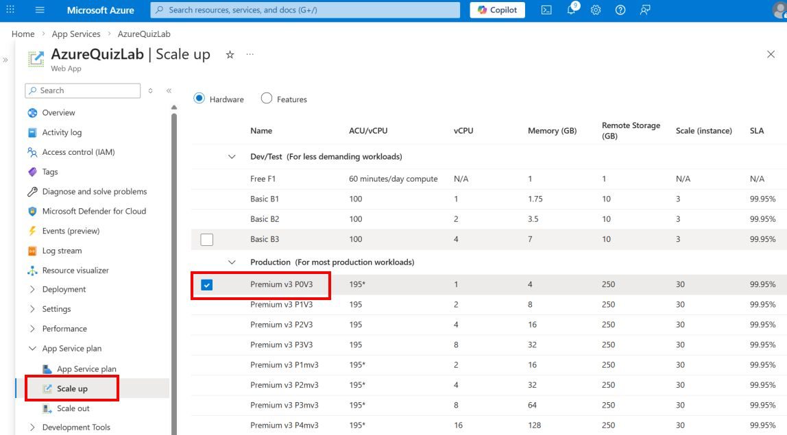

------------------------------------------------------------------------

## Étape 4 --- Désactiver le déploiement en production

App Service → Deployment Center → Disconnect

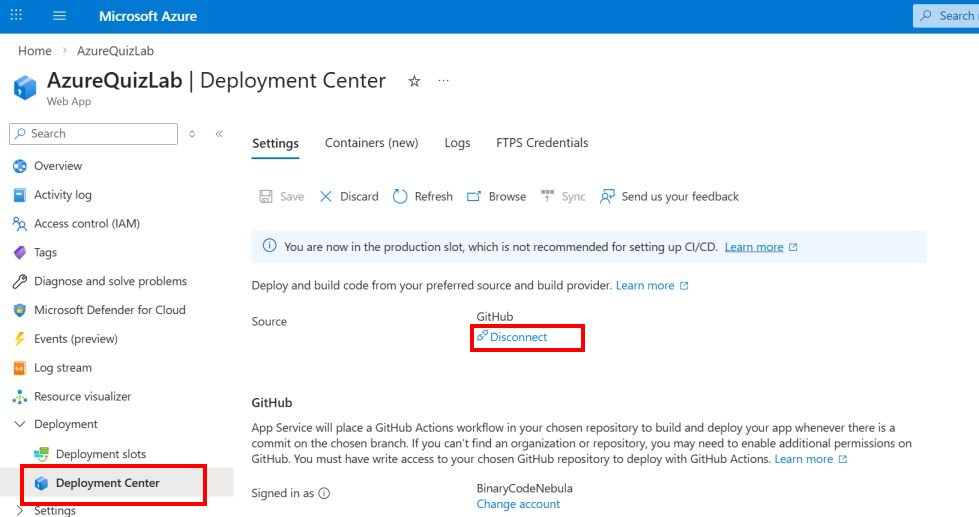

------------------------------------------------------------------------

# 🟢 Partie 3 --- Configuration des paramètres

## Étape 5 --- Configurer la connection string

App Service → Environment variables → Connection strings

👉 Modifier la connection string existante\
👉 Cocher : Deployment slot setting

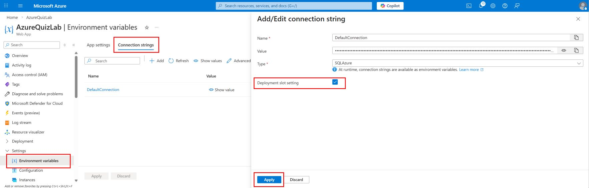

------------------------------------------------------------------------

# 🟢 Partie 4 --- Création du slot staging

## Étape 6 --- Créer le slot

App Service → Deployment slots → Add

Configurer : - Name : staging - Clone settings : ✔️

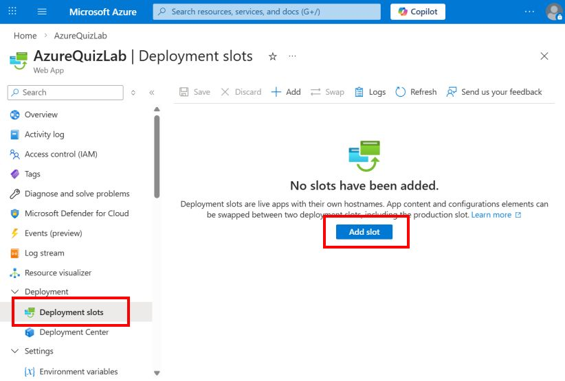

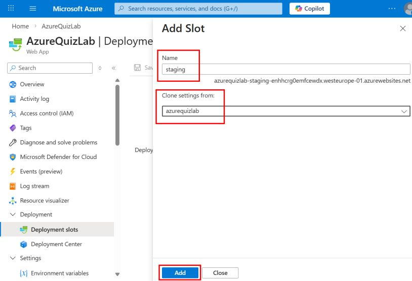

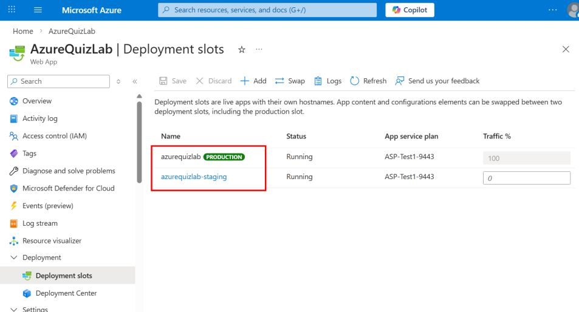
------------------------------------------------------------------------

## Étape 7 --- Vérifier les URLs

Production : https://monapp.azurewebsites.net\
Staging : https://monapp-staging.azurewebsites.net

------------------------------------------------------------------------

# 🟢 Partie 5 --- Configurer le déploiement

## Étape 8 --- Connecter GitHub au slot staging

Deployment Center → GitHub → main branch

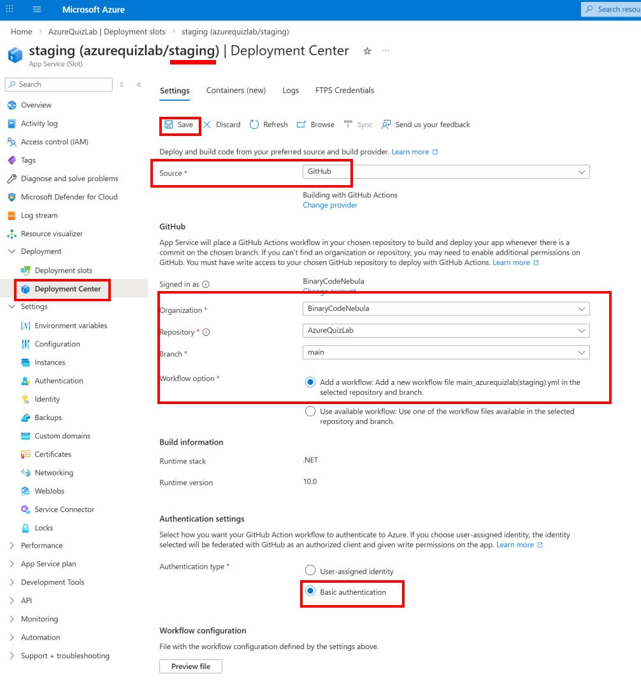

Sur github, aller dans Actions, un nouveau workflow est apparu.
Désactiver le précédent workflow qui déployait sur le slot de production

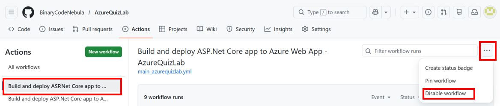
------------------------------------------------------------------------

# 🟢 Partie 6 --- Configurer la base de données staging

## Étape 9 --- Modifier la connection string du slot staging

Environment variables → Connection strings

👉 Remplacer par la connection string de la base staging

Laisser coché "Deployment slot setting"

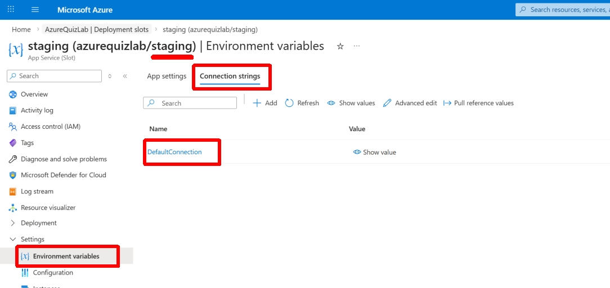

------------------------------------------------------------------------

# 🟢 Partie 7 --- Déployer une nouvelle version

## Étape 10 --- Modifier le code

``` html
<h1>Version 1.0</h1>
```

➡️ devient :

``` html
<h1>Version 2.0</h1>
```

👉 Commit sur GitHub

------------------------------------------------------------------------

## Étape 11 --- Vérifier le staging

https://monapp-staging.azurewebsites.net

👉 Vérifier : - Staging = Version 2.0 - Production = Version 1.0

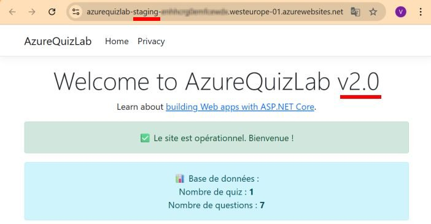

------------------------------------------------------------------------

# 🟢 Partie 8 --- Swap

## Étape 12 --- Lancer le swap

Deployment slots → Swap

Configurer : - Source : staging - Target : production

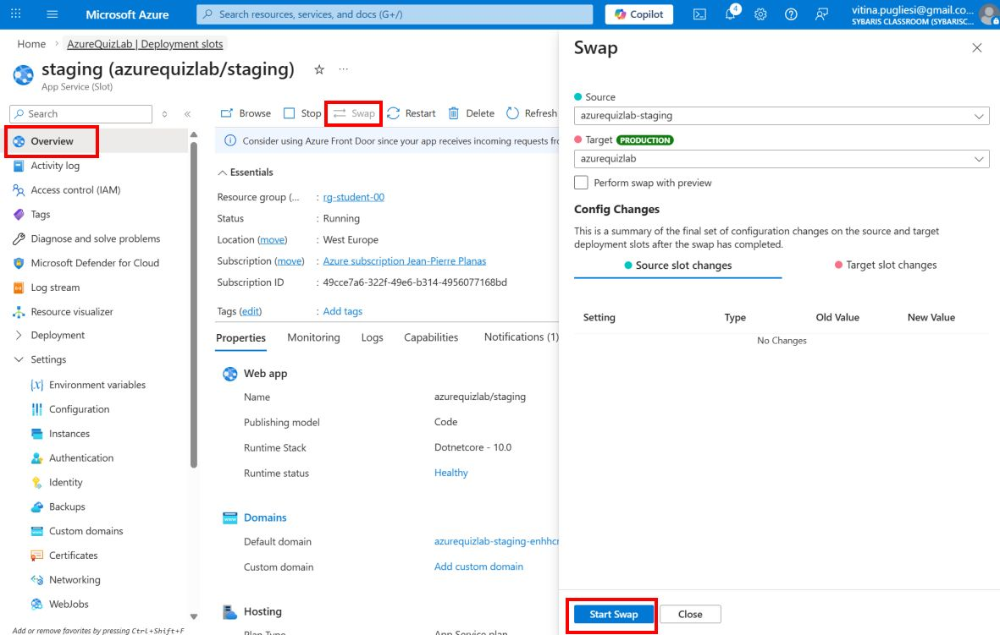

------------------------------------------------------------------------

## Étape 13 --- Vérifier le résultat

Production : Version 2.0\
Staging : Version 1.0

------------------------------------------------------------------------

# 🟢 Partie 9 --- Rollback et nettoyage

## Étape 14 --- Effectuer un rollback

Deployment slots → Swap

Configurer : - Source : production - Target : staging

👉 Production revient en Version 1.0

------------------------------------------------------------------------

## Étape 15 --- Supprimer le slot staging

Deployment slots → staging → Delete

------------------------------------------------------------------------

## Étape 16 --- Revenir en pricing Free

App Service Plan → Scale down → Free (F1)

------------------------------------------------------------------------

## Étape 17 --- Supprimer la base de donnée pour le staging

App Service Plan → Azure SQL Database

Sélectionner la base de données et faire **delete**

------------------------------------------------------------------------

## Étape 18 --- Github Actions

- Désactiver le workflow staging
- Réactiver le workflow production
- Dans Azure reconfigurer le deploiement

------------------------------------------------------------------------

## Étape 19 --- Activer la policy (Que pour le formateur)

Exécuter le script suivant pour retirer le pricing tier P0V3

```bash
SUBSCRIPTION_ID=$(az account show --query id -o tsv)
az policy assignment update --name "Limit-AppServicePlan-SKUs-Assignment" --scope "/subscriptions/$SUBSCRIPTION_ID" --params '{ "allowedSKUs": { "value": ["F1","B1"] } }'
```

------------------------------------------------------------------------

## ⚠️ Important

-   Les deployment slots ne sont pas supportés en Free
-   Il faut supprimer les slots avant de changer le pricing tier

------------------------------------------------------------------------

# 🧠 À retenir

-   Ne pas déployer directement en production
-   Utiliser un slot staging pour tester
-   Le swap permet un déploiement sans interruption
-   Certaines configurations restent liées à leur slot
-   Le rollback se fait via un swap inverse
