# 🧪 TP1 --- Déployer une Web App .NET sur Azure avec CI/CD GitHub

## 🎯 Objectifs

Dans ce TP vous allez :

- Créer un repository GitHub
- Créer une application ASP.NET Core
- Déployer une Web App sur Azure App Service
- Mettre en place un déploiement automatique avec GitHub Actions

## Prérequis

- Compte GitHub
- Accès au tenant Azure fourni (fourni par le formateur)
- Visual Studio
- .NET 10.0 SDK

## Prérequis formateur
- Inviter l'étudiant dans **Entra ID** en guest via son adresse mail
- Créer un resource group par étudiant
- Donner les droits suivants : 
  - Resource Group → Contributor  
  - Subscription → Reader

---

# 🟢 Partie 1 — Préparer le projet

## Étape 1 — Créer un repository GitHub

Créer un repository nommé **AzureQuizLab**.

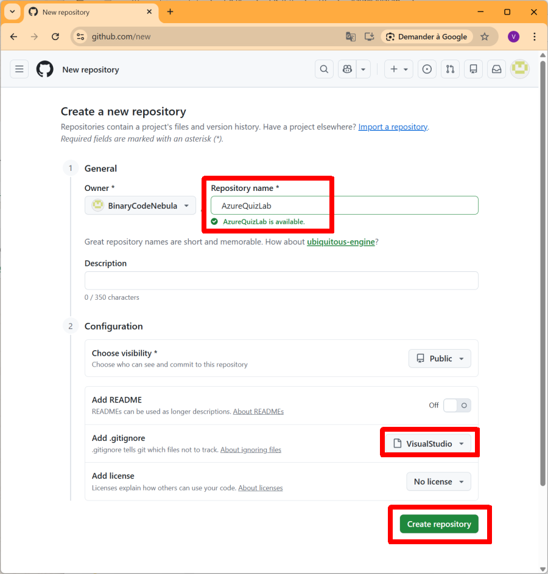

---

## Étape 2 — Cloner le repository + Créer l'application Web + Commit et Push

- Cloner le repository sur votre machine (ex : Visual Studio).
- Créer une application avec Visual Studio
  - ASP.NET Core Web App (Razor Pages)  
  - Framework : **.NET 10**
- Ajouter les fichiers au repository.

```
git add .
git commit -m "Initial project"
git push
```
---

# 🟢 Partie 2 — Créer la Web App Azure

## Étape 3 — Ouvrir App Services

Dans Azure Portal, sélectionner :**App Services**

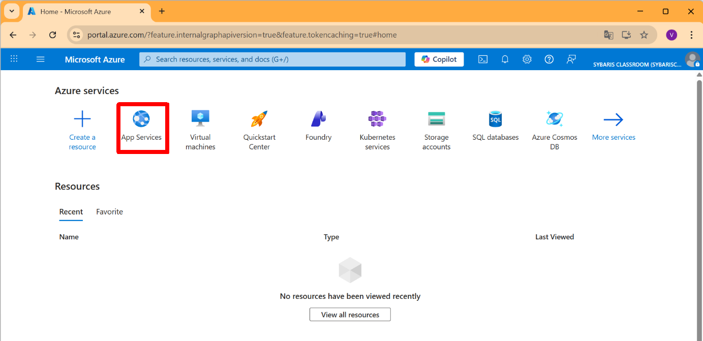

---

## Étape 4 — Créer une Web App

Cliquer sur : **Create → Web App**

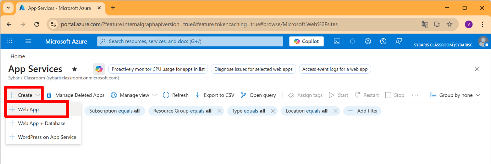

Resource Group : **RG-Student-XX**  
Name : **AzureQuizLab**  
Runtime : **.NET 10**  
OS : **Linux**  
Region : **West Europe**  
Pricing Plan : **Free**
Cliquer sur : **Review + Create**

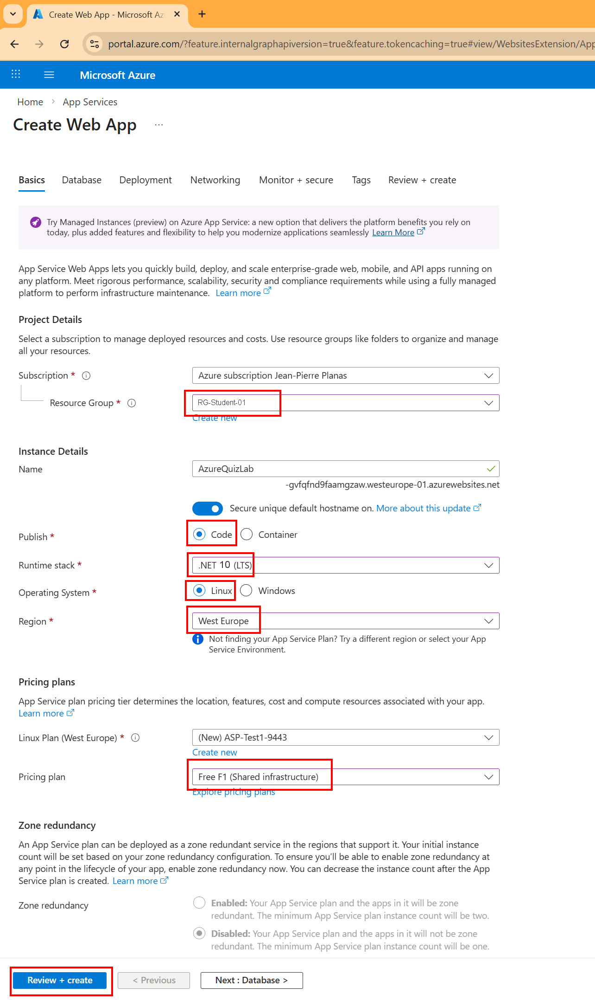

Cliquer sur : **Create**

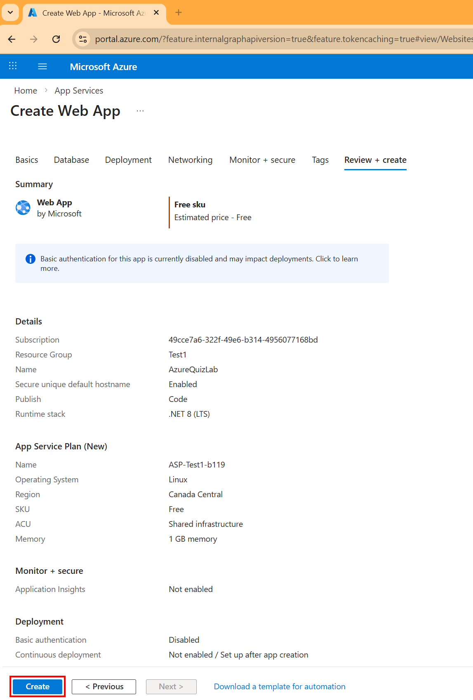

Cliquer sur **Go to resource**.

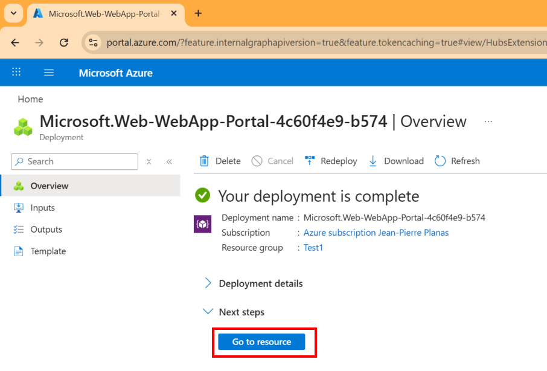

---

# 🟢 Partie 3 — Configurer le déploiement

## Étape 5 — Configurer la Web App

Cliquer sur : **Settings → Configuration**
Cocher : **SCM Basic Auth Publishing Credentials**
Cliquer sur : **Apply**

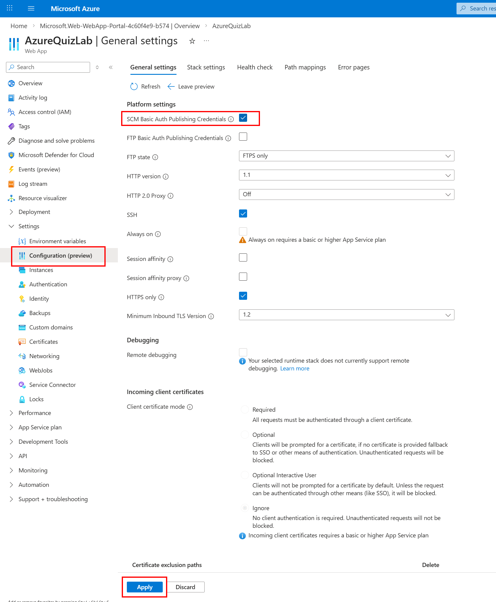


---

## Étape 6 — Configurer le CI/CD depuis Azure

Ouvrir **Deployment Center**.
Choisir comme source : **GitHub**
Cliquer sur : **Authorize**

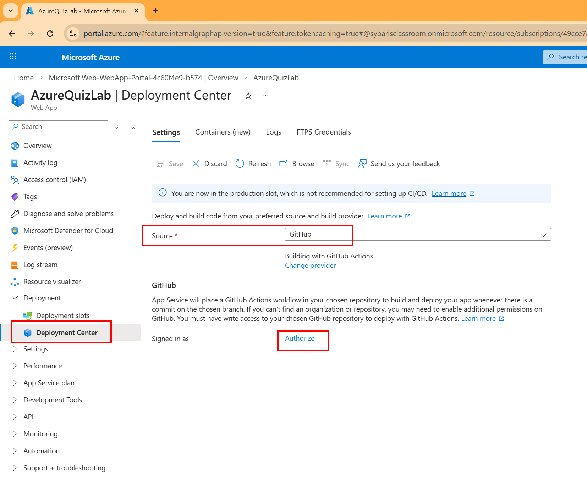

Sélectionner :
- Organization
- Repository
- Branch
- Add a workflow
- Authentication Type → **Basic authentication**
Cliquer sur : **Save**

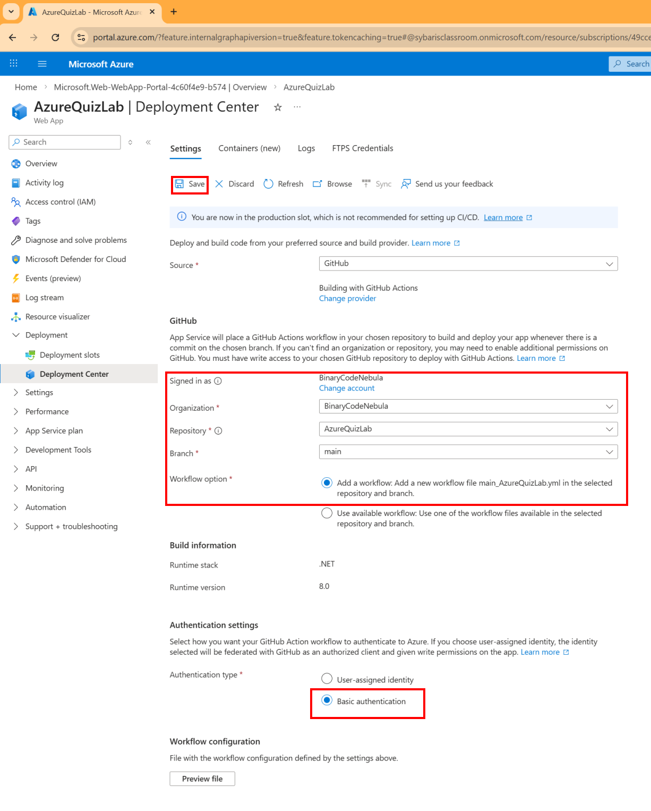

---

## Étape 7 — Vérifier le workflow / GitHub Actions

Vérifier que le workflow (GitHub Actions) a bien été créé sur votre repository GitHub

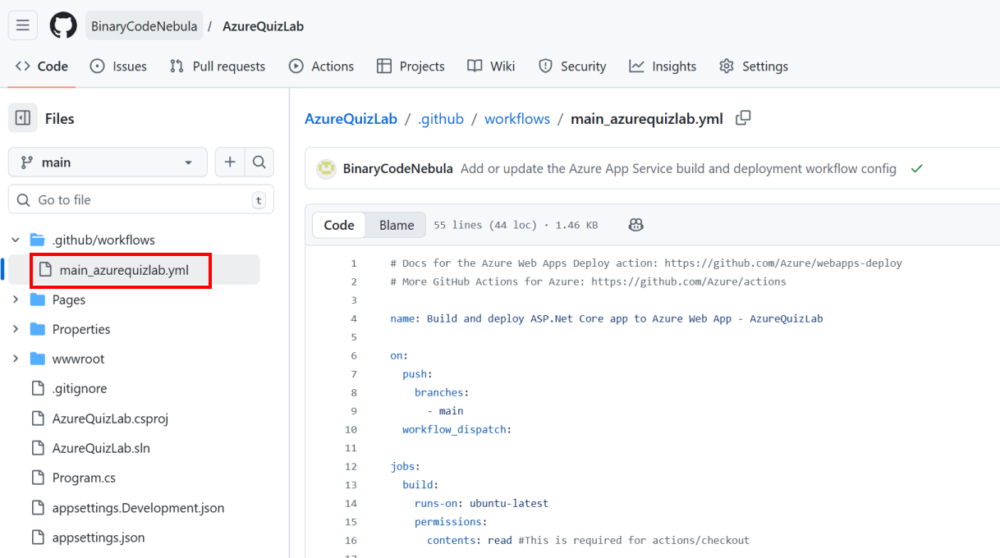

Vérifier que le workflow (GitHub Actions) a bien été exécuté

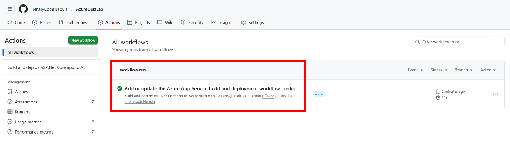

---

# 🟢 Partie 4 — Vérifier et tester

## Étape 8 — Vérifiez votre site

Depuis l’overview de la Web App, cliquer sur l'URL

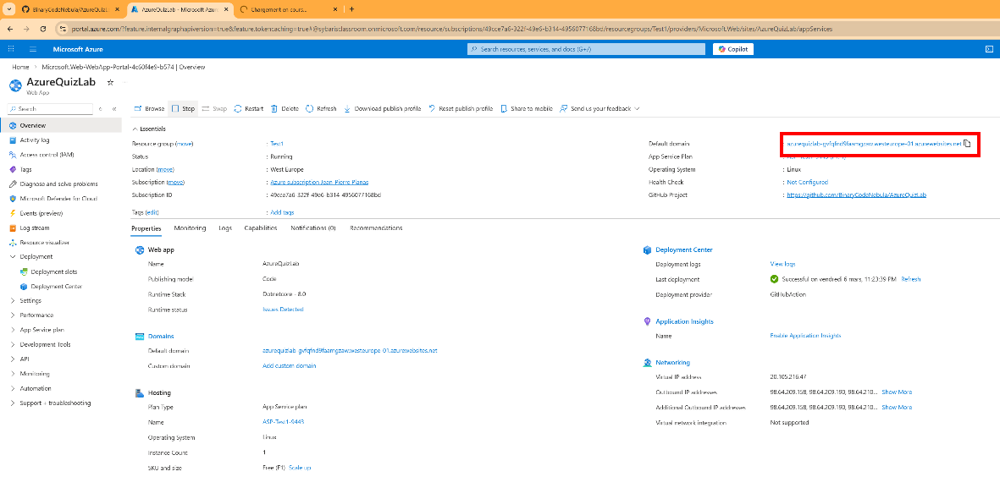

Vérifier que votre Web App se lance

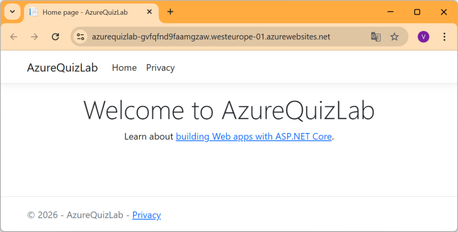

---

## Étape 9 — Tester le CI/CD

Modifier ensuite la page d’accueil de votre application et ajouter le texte **v1.0**
Commit → Push → attendre le déploiement → Rafraîchir le site

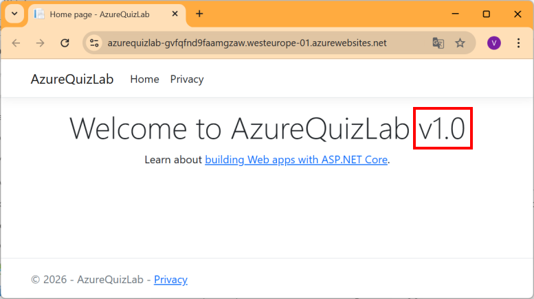


