# 🧪 TP 3 --- Azure Functions (AzureQuizLab)

## 🎯 Objectifs

À la fin de ce TP, vous serez capable de :

- Créer et configurer une **Azure Function**
- Comprendre les **triggers (HTTP, Queue, Timer)**
- Mettre en place une **architecture asynchrone avec Queue**
- Utiliser **ILogger** pour les logs
- Configurer et utiliser un **Storage Account**
- Accéder à une **base Azure SQL** depuis une Function

---

## 🧩 Scénario

Dans l’application **AzureQuizLab**, lorsqu’un utilisateur soumet un quiz :

1. Une requête HTTP est envoyée à une Azure Function
2. Un message est placé dans une queue
3. Une autre Azure Function traite ce message de manière asynchrone. L'idée est qu'un traitement long (par exemple génération d'un pptx depuis une quiz)
4. Un log est enregistré en base de données

---

## Prérequis

- Visual Studio avec le workload Azure
- Installer "Azure functions Core Tools" https://learn.microsoft.com/en-us/azure/azure-functions/functions-run-local    
- Avoir réalisé les précédents TP

## Prérequis formateur

- Pour que les participants puissent créer le storage account, il faut au préalable faire ceci.
```bash
# Storage (Queues, blobs, etc.)
az provider register --namespace Microsoft.Storage

# App Service / Azure Functions
az provider register --namespace Microsoft.Web

# Azure SQL
az provider register --namespace Microsoft.Sql

# Application Insights + Log Analytics
az provider register --namespace Microsoft.OperationalInsights
```
Sinon, a la création du storage account, un message indique aux participants qu'il ne peut pas enregistrer le provider Microsoft.Storage.
Une autre alternative, est de donner le role Contributor au niveau de la souscription. Mais cela implique qu'il sera contributor sur tous les RG

---

# 🟢 Partie 1 — Création du projet

## Étape 1 — Création du projet

Sous Visual Studio, dans votre solution **AzureQuizLab** créer un projet **Azure Functions**.

Nommer le nouveau projet **AzureQuizLab.Functions**

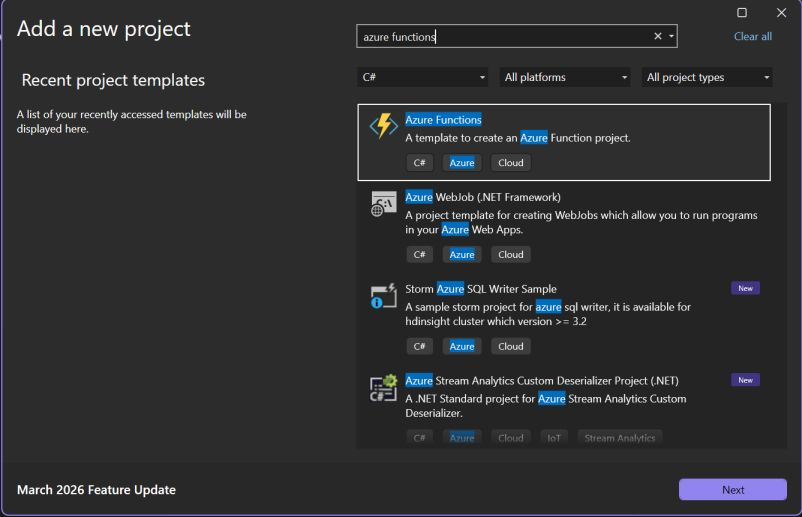

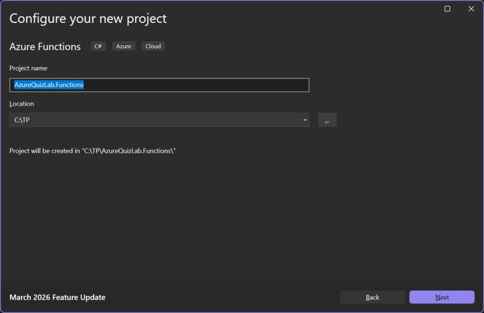

## Étape 2 — Configuration

Choisir :

- Functions workers : .NET 10.0 Isolated
- Function : HTTP Trigger
- Cocher : Use Azurite

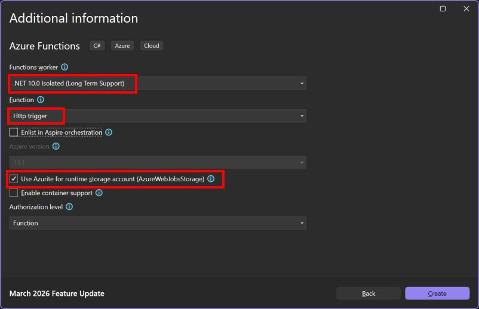

---

# 🟢 Partie 2 — HTTP Function (SubmitQuiz)

## Étape 3 — Renommer la Function

Renommer la function en :

```csharp
public class SubmitQuiz
...
[Function("SubmitQuiz")]
```

## Étape 4 — Ajouter un log

Remplacer le code de la fonction par celui ci

```csharp
        _logger.LogInformation("Quiz soumis");
        return new OkObjectResult("Quiz soumis!");
```

## Étape 5 — Test

Lancer le projet et appeler l’URL fournie dans le navigateur.

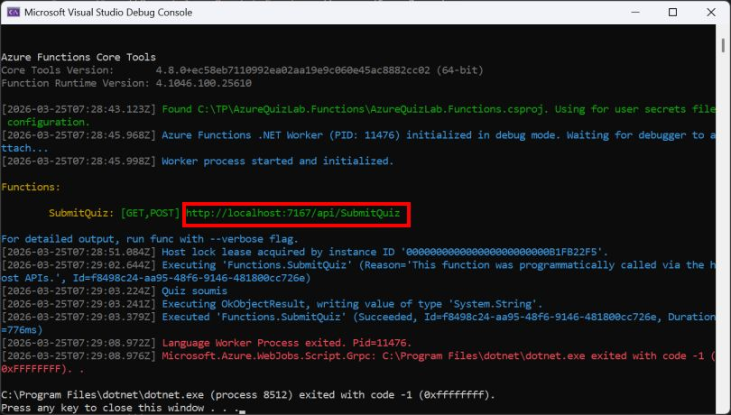

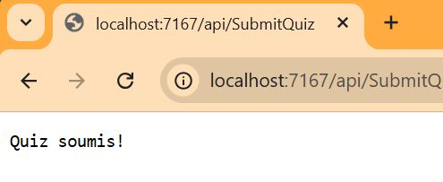

## Étape 6 — Envoyer un message dans une Queue

Dans cette étape on va implémenter l'envoi d'un message dans une queue. Le code va être implémenté ici, et nous créons la Queue dans la Partie 4.

Rajouter le package nuget suivant : 

```bash
dotnet add package Azure.Storage.Queues
```

Et remplacer le code par celui ci qui envoie un message dans la queue

```csharp
public class SubmitQuiz
{
    private readonly ILogger<SubmitQuiz> _logger;
    private readonly QueueClient _queueClient;

    public SubmitQuiz(ILogger<SubmitQuiz> logger)
    {
        _logger = logger;
        string connectionString = Environment.GetEnvironmentVariable("AzureWebJobsStorage");
        _queueClient = new QueueClient(connectionString, "quiz-queue", new QueueClientOptions
        {
            MessageEncoding = QueueMessageEncoding.Base64 // Important, sinon à la lecture du message, le message partira en queue poison
        });
        _queueClient.CreateIfNotExists();
    }

    [Function("SubmitQuiz")]
    public IActionResult Run([HttpTrigger(AuthorizationLevel.Function, "get", "post")] HttpRequest req)
    {
        _logger.LogInformation("SubmitQuiz function triggered");

        // Création d’un objet quiz simulé
        var quiz = new
        {
            userId = "123",
            quizId = "456",
            score = 80,
            submittedAt = DateTime.UtcNow
        };

        // Sérialisation JSON
        string message = JsonSerializer.Serialize(quiz);

        // Envoi du message
        _queueClient.SendMessage(message);

        _logger.LogInformation("Quiz soumis");
        return new OkObjectResult("Quiz soumis!");
    }
}
```

---

# 🟢 Partie 3 — Storage Account

## 📦 Pourquoi créer un Storage Account ?

Une Azure Function nécessite **obligatoirement** un Storage Account pour fonctionner.

Même si vous ne manipulez pas directement de fichiers ou de données, Azure utilise ce stockage en arrière-plan pour :

- gérer les **triggers** (comme les queues ou timers)  
- stocker des **logs techniques**  
- assurer le **suivi des exécutions**  
- permettre le **scaling automatique**  

👉 Dans ce TP, le Storage Account servira également à héberger la **queue (`quiz-queue`)**, qui permettra de découpler le traitement du quiz.

💡 À retenir :  
> Une Azure Function = du code + un Storage Account (indispensable)

## Étape 7 — Création

Dans Azure Portal, créer un **Storage Account** :

- Utilisez votre **Resource group** :  (ex : `RG-Student-00`)
- Donnez un nom unique pour **Storage account name** (ex : `azurequizlab00`)  
  ⚠️ Le nom doit être globalement unique et en minuscules
- Sélectionnez la région **West Europe**
- Pour les **Performance** choisir **Standard**
- Pour **Redundancy** choisir **Locally-redundant storage (LRS)**

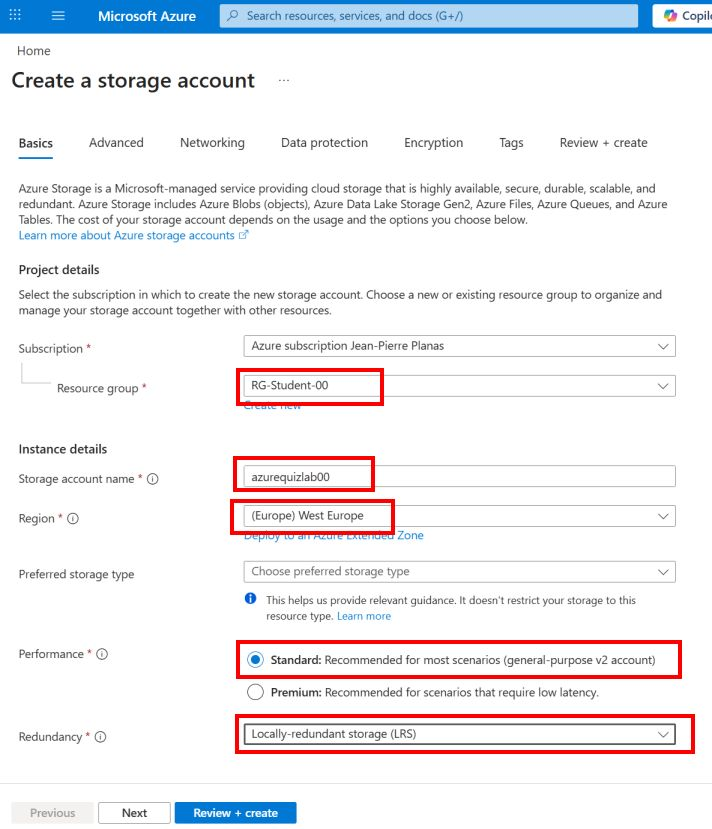

## Étape 8 — Récupérer la connection string du Storage Account.

🔑 Récupérer la **connection string du Storage Account**

Dans le **Storage Account** que vous venez de créer :
- Aller dans **Access keys**
- Copier la **Connection string** (key1)

👉 Cette valeur sera utilisée pour configurer :

```json
AzureWebJobsStorage
```

💡 Cette connection string permet à l’Azure Function d’accéder au stockage interne et à la queue (quiz-queue)

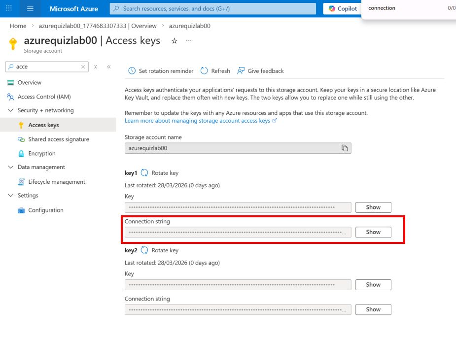

---

# 🟢 Partie 4 — Mise en place de la Queue avec Visual Studio

## Étape 9 — Utiliser la connection string

👉 Reprendre la connection string récupérée précédemment

Dans `local.settings.json`, remplacer :

```json
"AzureWebJobsStorage": "UseDevelopmentStorage=true"
```

par :

```json
"AzureWebJobsStorage": "<connection_string_storage>"
```

⚠️ Cela permet d'utiliser le **vrai Storage Account Azure**

---

## Étape 10 — Exécuter la Function

- Poser un point d'arrêt sur la création de la queue et sur l'envoi du message dans la queue pour bien vérifier que ce code est exécuté
- Lancer le projet en debug
- Dans la fenêtre console qui s'ouvre, une URL qui commence par `http://localhost` apparaît
- Appeler cette URL dans un navigateur
- Vérifier que vous passez par les points d'arrêt
- Exécuter le code jusqu'à la fin
- Retirer les points d'arrêt

👉 À ce moment :

- la queue est créée automatiquement
- un message est ajouté

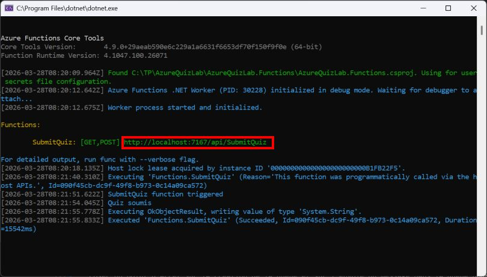

---

# 🟢 Partie 5 — Visualisation avec Storage Browser

## Étape 11 — Vérification de la création de la queue et de la réception du message

- Azure Portal → Storage Browser 
- Sélectionner votre Storage Account
- Sélectionner Queues

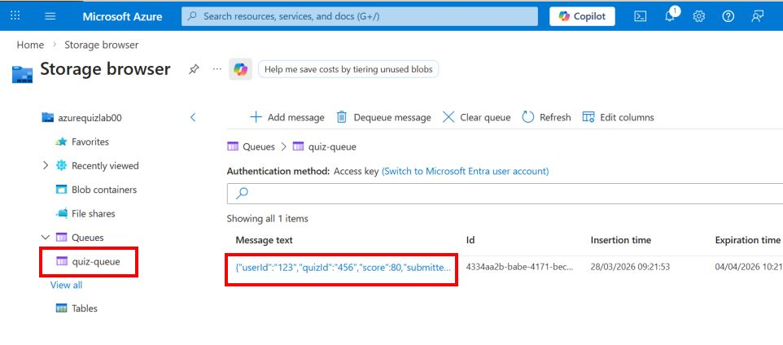

---

# 🟢 Partie 6 — Queue Function (ProcessQuiz)

## Étape 12 — Ajouter une Function

Dans Visual Studio :

- Add → New Azure Function

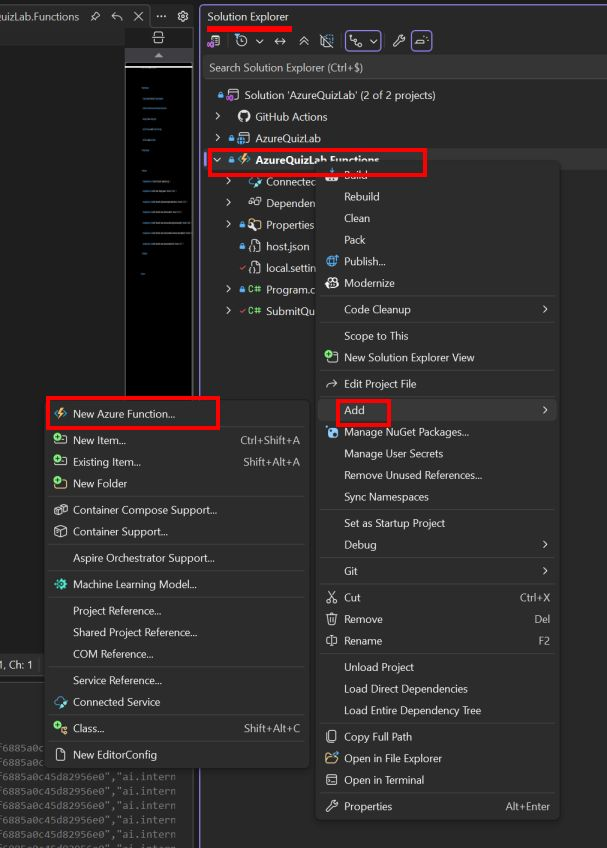

- Renseigner **Process Quiz.cs** pour le nom de l'**Azure Function**

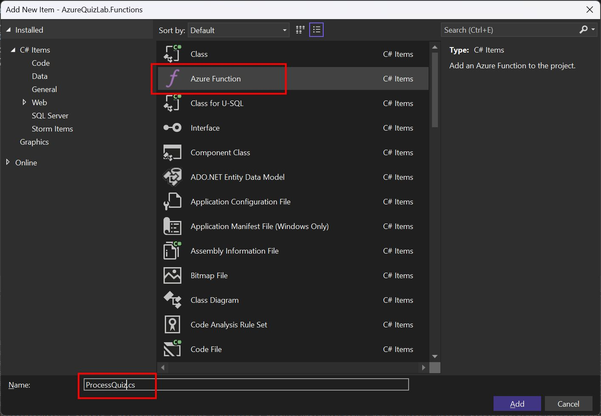

- Choisir **Queue Trigger** et renseigner les champs :
- **Connection string setting name** : `AzureWebJobsStorage`
- **Queue name** : `quiz-queue`
- Ne pas cocher **Configure Queue trigger connection**

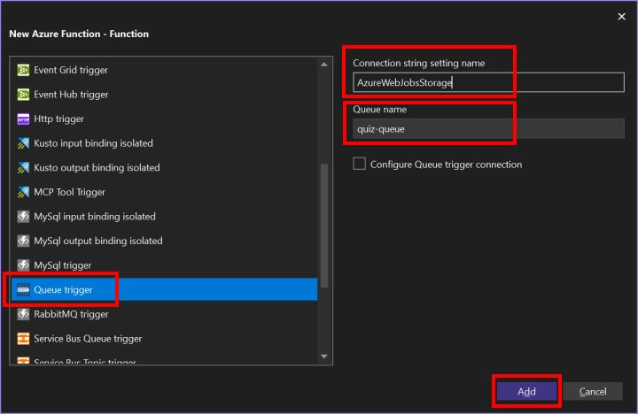

---

## Étape 13 — Vérifier l'implémentation

- Noter que le code fait déjà un log.

```csharp
    [Function(nameof(ProcessQuiz))]
    public void Run([QueueTrigger("quiz-queue", Connection = "AzureWebJobsStorage")] QueueMessage message)
    {
        _logger.LogInformation("C# Queue trigger function processed: {messageText}", message.MessageText);
    }
```

- Poser un point d'arrêt dans cette méthode pour vérifier qu'elle est bien appelée
- Relancer l’application
- Appeler `SubmitQuiz`
- Rajouter une Exception dans la méthode 

```csharp
    [Function(nameof(ProcessQuiz))]
    public void Run([QueueTrigger("quiz-queue", Connection = "AzureWebJobsStorage")] QueueMessage message)
    {
        _logger.LogInformation("C# Queue trigger function processed: {messageText}", message.MessageText);
        throw new Exception("Simulated error to test retry and poison queue handling.");
    }
```

- Relancer l’application sans débogueur
- Appeler `SubmitQuiz`
- Vérifier que vous avez le message

```bash
Message has reached MaxDequeueCount of 5. Moving message to queue 'quiz-queue-poison'.
```

- Vérifier que vous avez une queue poison qui s'est créée, et que le message est dedans.

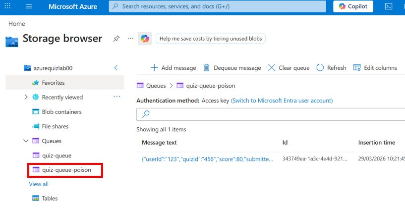

- Retirer l'exception qui a été rajoutée pour vérifier la création de la queue poison
- Relancer l’application
- Appeler `SubmitQuiz`
- Vérifier que le message part bien dans la queue et qu'il est consommé

---

# 🟢 Partie 7 — Accès Azure SQL dans l'Azure Function

## Étape 14 — Connection string

👉 La connection string permet à votre Azure Function de se connecter à la base Azure SQL.

- Dans le fichier `local.settings.json`
- Ajouter la connection string Azure SQL.

```json
{
  "Values": {
    "SqlConnectionString": "Server=tcp:sql-quizlab-xx.database.windows.net,1433;Initial Catalog=AzureQuizLabDB;User ID=sqladmin;Password=VotreMotDePasse;Encrypt=True;TrustServerCertificate=False;Connection Timeout=30;"
  }
}
```

## Étape 15 — Code SQL

- Dans **ProcessQuiz** et dans la méthode **Run** rajouter le code suivant 
```csharp
        var connectionString = Environment.GetEnvironmentVariable("SqlConnectionString");
        using (SqlConnection conn = new SqlConnection(connectionString))
        {
            conn.Open();
            var cmd = new SqlCommand("INSERT INTO Logs (Message, LogDate) VALUES (@msg, GETDATE())", conn);
            cmd.Parameters.AddWithValue("@msg", message.MessageText);
            cmd.ExecuteNonQuery();
        }
        _logger.LogInformation("Ecriture en base effectuée");
```

## Étape 16 — Test

- Vérifier que les données sont insérées dans la table Logs

---

# 🟢 Partie 8 — Déploiement Azure

## 🎯 Objectif

Déployer l’Azure Function dans Azure, configurer les paramètres, puis vérifier son fonctionnement.

---

## Étape 17 — Création de la Function App

Dans Azure Portal :

- Rechercher **Function App**
- Cliquer sur **Create**

Configurer :
- **Hosting Plan** : `Consumption`
- **Resource Group** : utiliser votre RG (ex : `RG-Student-00`)
- **Function App name** : nom unique `azurequizlab-functions-xx` (ex : `azurequizlab-functions-00`)
- **Operating System** : choisir **Windows**
- **Runtime stack** : choisir **.NET**
- **Version** : choisir **.NET 10 (LTS)** ou version compatible
- **Region** : sélectionner **West Europe**

Puis cliquer sur **Review + Create** puis sur **Create**

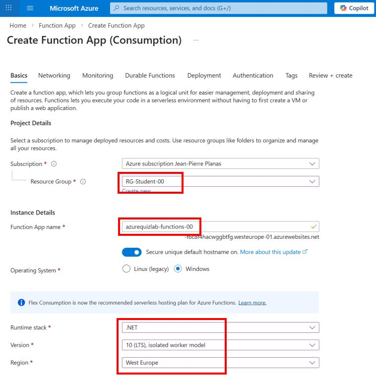

---

## 🚀 Étape 18 — Déploiement manuel avec Visual Studio

Dans Visual Studio :

- Clic droit sur le projet **AzureQuizLab.Functions**
- Cliquer sur **Publish**

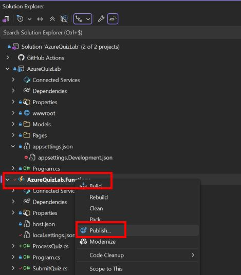

---

### 🔧 Nouveau profile de déploiement

- Cliquer sur **New profile**

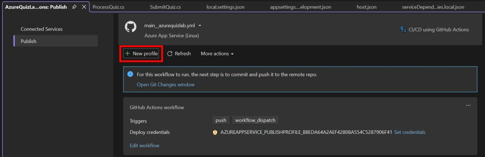

---

### 🔧 Choix de la cible

- Sélectionner **Azure**
- Cliquer sur **Next**

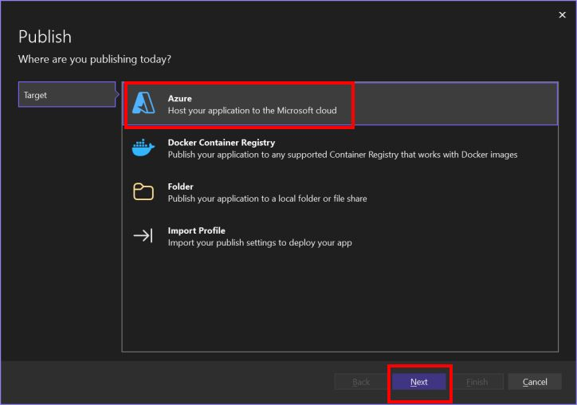

---

### 🔧 Choix du type de service

- Sélectionner **Azure Function App**
- Cliquer sur **Next**

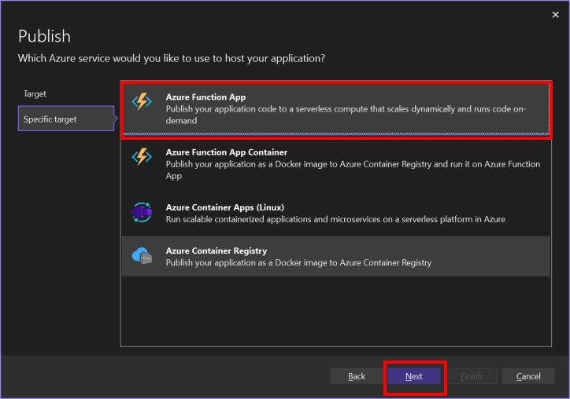

---

### 🔧 Connexion au compte Azure

Si nécessaire :

- Cliquer sur **Open Account Settings**
- Se reconnecter avec votre compte Azure
- Puis cliquer sur **Next**

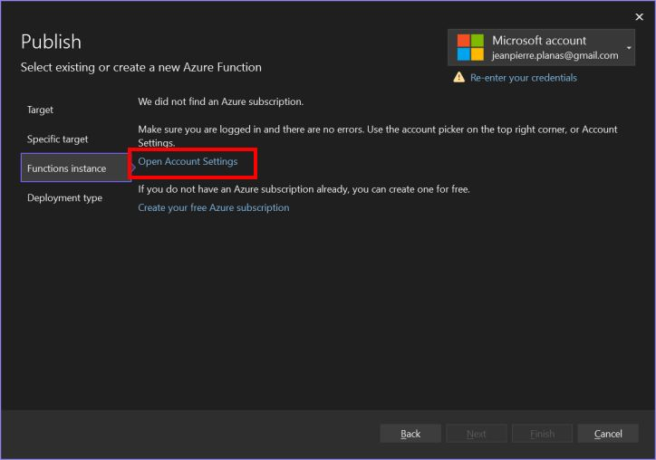

---

### 🔧 Sélection de la Function App

- Choisir votre **Subscription**
- Sélectionner votre Function App (ex : `azurequizlab-functions-00`)
- Cliquer sur **Next**

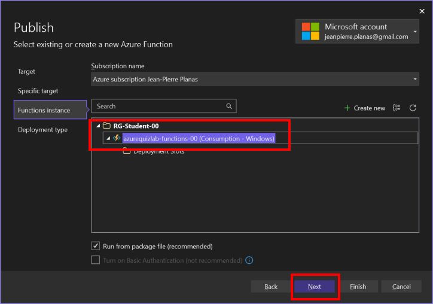

---

### 🔧 Création du profil de publication

👉 Visual Studio crée automatiquement un profil de publication
- Cliquer sur **Close**

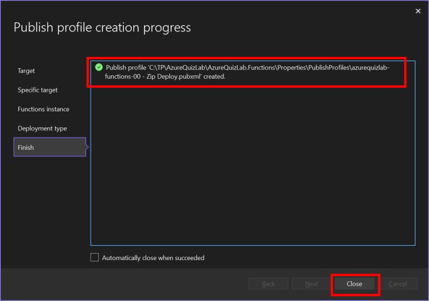

---

### 🚀 Lancer le déploiement

- Cliquer sur **Publish**

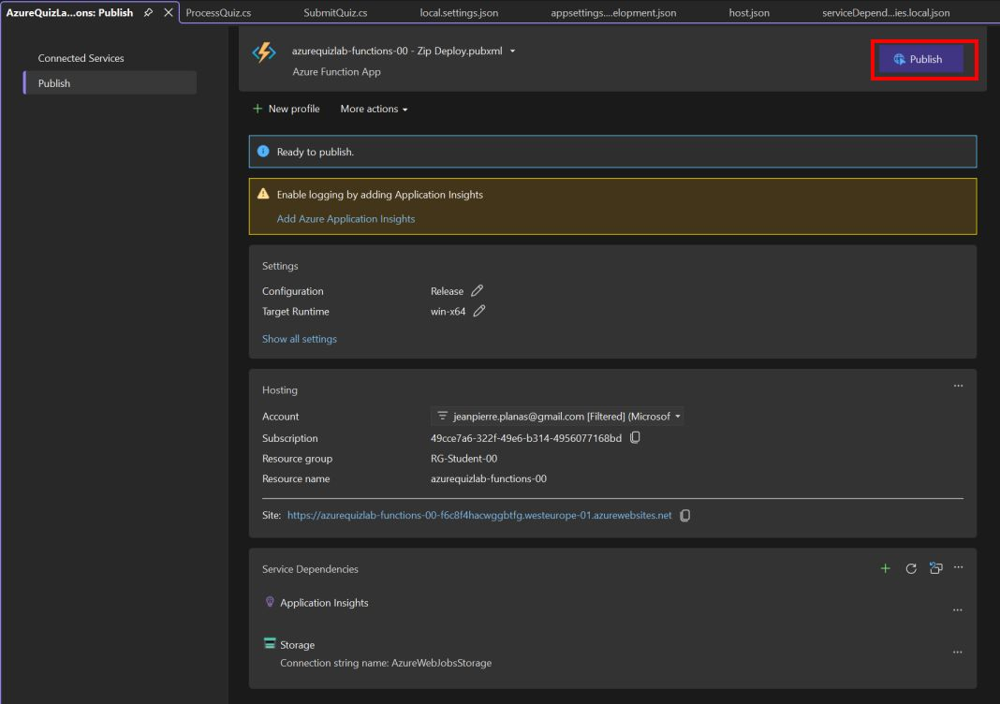

---

### ✅ Vérifier le déploiement

👉 Une fois terminé :

- Un message **Publish succeeded** apparaît
- Aller sur Azure → Function App → 
- Sélectionnez votre Function App
- Deployment → Deployment Center → Logs
- Un log devrait apparaître avec le déploiement manuel

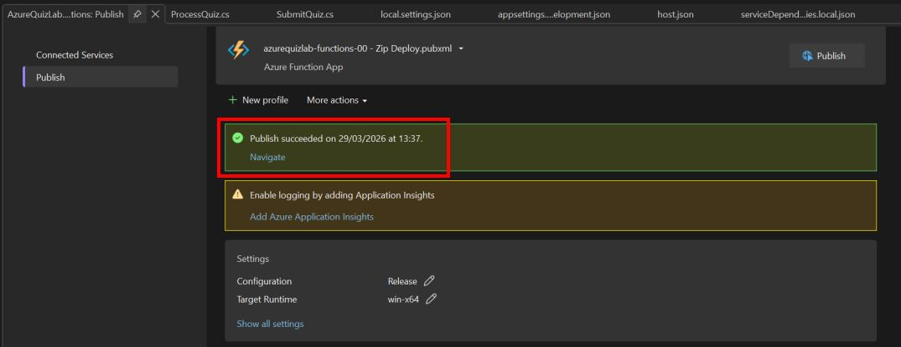

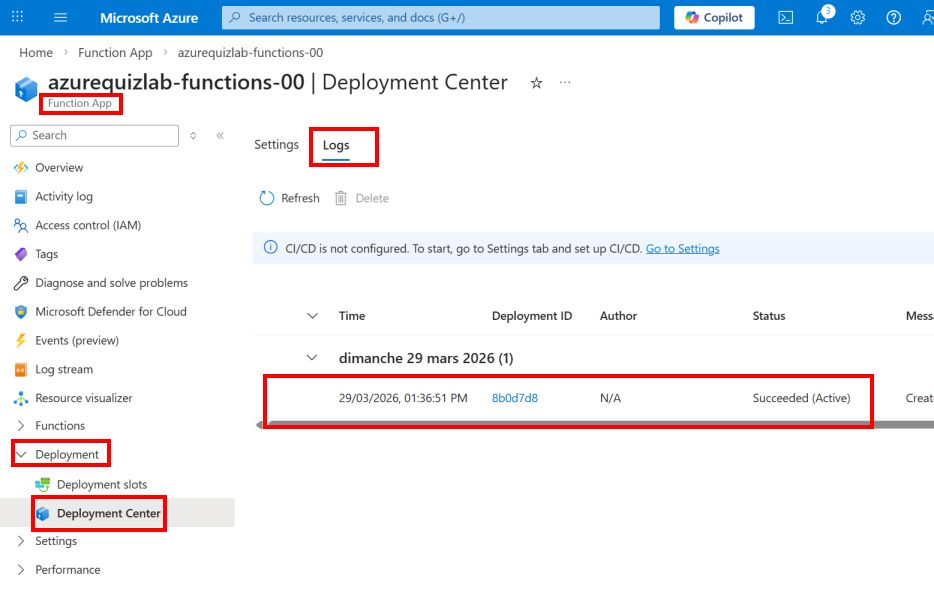

---

## ⚙️ Étape 19 — Configuration Azure (App Settings)

Après le déploiement, il est nécessaire de configurer les variables d’environnement dans Azure.

---

### 🔧 Accéder à la configuration

Dans Azure Portal :

- Aller dans votre **Function App**
- Menu **Settings** et **Environment variables**

### ➕ Ajouter les variables

Dans l’onglet **App settings**, ajouter :

| Nom | Valeur |
|-----|------|
| AzureWebJobsStorage | (connection string du Storage Account) |
| SqlConnectionString | (connection string Azure SQL) |

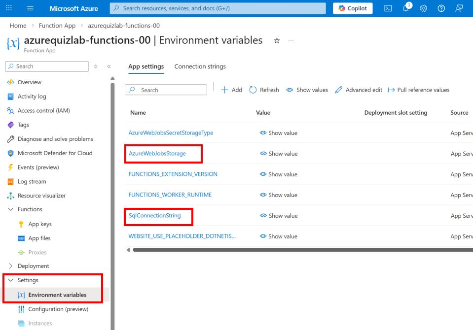

### 💡 Explication

- **AzureWebJobsStorage** : utilisé par les Azure Functions (queue, logs…)
- **SqlConnectionString** : utilisé dans votre code pour accéder à la base SQL

---

## 🧪 Étape 20 — Test de la Function sur Azure

---

### 🔗 Récupérer l’URL

Dans Azure Portal :

- Aller dans votre **Function App**
- Cliquer sur **Functions → SubmitQuiz**
- Cliquer sur **Get Function URL**

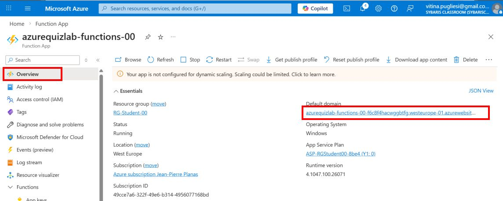

---

### 🔗 Récupérer la clé

Par défaut, la Function `SubmitQuiz` est sécurisée avec le niveau :

```csharp
AuthorizationLevel.Function
```

👉 Cela signifie qu’une clé d’accès est obligatoire pour appeler l’API.

- Cliquer sur **Functions → App keys**
- Copier une des 2 clés

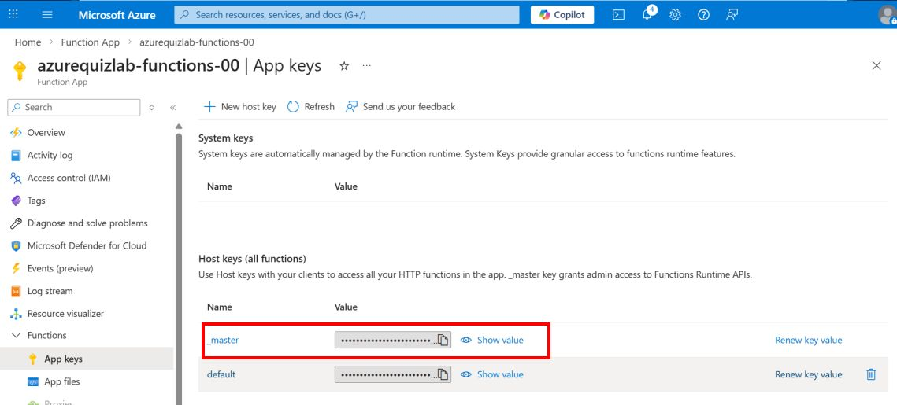

---

### 🌐 Appeler la Function

👉 Lancer un navigateur et appeler l’URL suivante : 

http://<url function app>/api/SubmitQuiz?code=<app key>

---

### ✅ Vérifications attendues

Après l’appel :

- ✔ un message est envoyé dans la queue  
- ✔ la function **ProcessQuiz** est déclenchée  
- ✔ un log est inséré en base SQL  

---

## Étape 21 — Consulter les logs (Optionnel)

- Function App → **Log stream**
- Installer App Insights (Non détaillé ici, mais recommandé pour la production)
- Switch sur Filesystem Logs

👉 Observer :

- exécution de `SubmitQuiz`
- exécution de `ProcessQuiz`

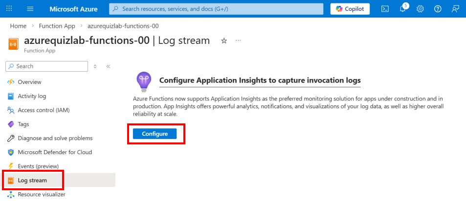

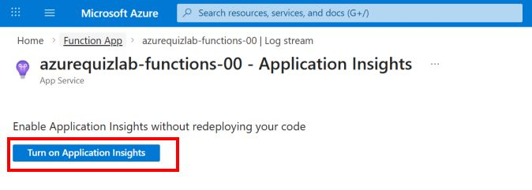

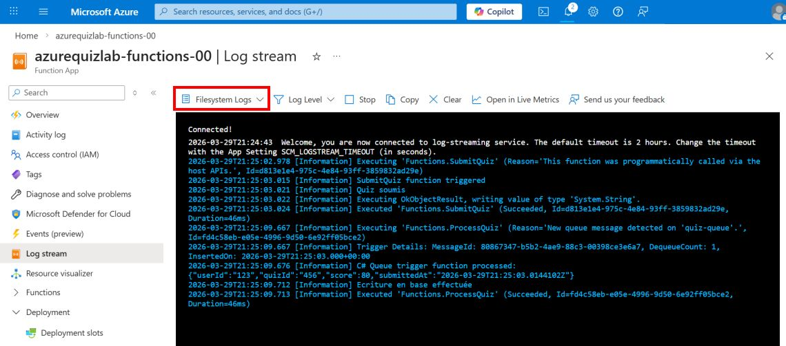

---

# 🟢 Partie 9 — Déploiement automatique (Azure Functions)

## 🎯 Objectif

- Déployer automatiquement les Azure Functions via GitHub Actions
- Ne pas impacter le déploiement de la WebApp existante
- Sécuriser les credentials

---

## Étape 22 — Vérifier les fichiers sensibles

Dans votre projet :

👉 Vérifier que le fichier suivant est bien ignoré :

```gitignore
local.settings.json
```

👉 Ce fichier contient des informations sensibles :

- connection string SQL
- `AzureWebJobsStorage`

❌ Ne jamais le versionner

---

## Étape 23 — Commit du projet

Le projet Azure Functions étant dans le même repository :

```bash
git add .
git commit -m "Ajout Azure Functions"
git push
```

---

## Étape 24 — Configurer le déploiement depuis Azure

Dans Azure Portal :

- Aller dans votre **Function App**
- Menu **Deployment Center**
- Choisir :
  - **Source** : `GitHub`
  - Sélectionner votre repository et organization
  - **Branche** : `main`
  - **Workflow Option** : `Add a workflow`
  - **Authentication type** : `Basic authentication`
- Cliquer sur **Save**  

👉 Azure va automatiquement créer un workflow GitHub dédié au déploiement de la Function App.

💡 Vérifier que le workflow généré cible bien le projet Azure Functions afin de ne pas impacter le déploiement de la WebApp existante.

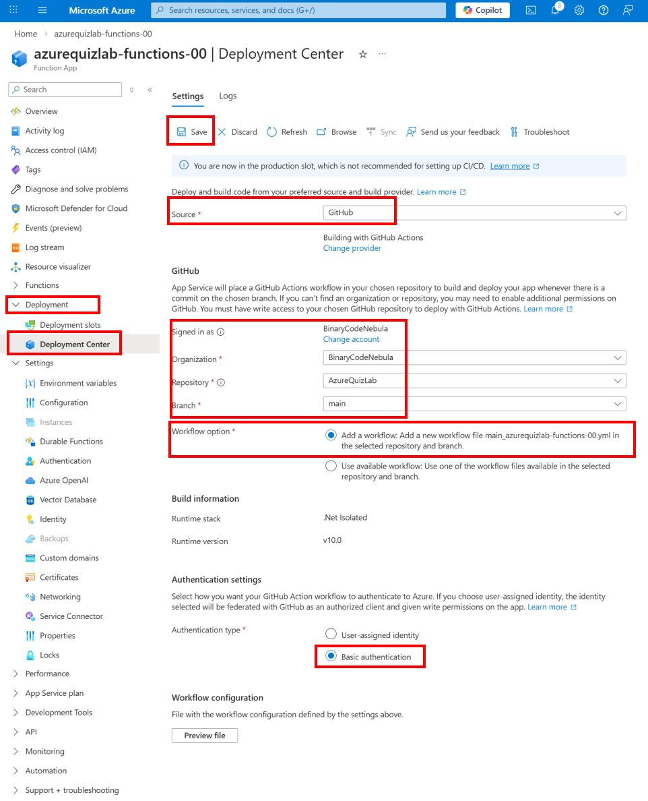

---

## Étape 25 — Modifier le workflow GitHub Actions des Azure Functions

Dans votre repository GitHub :

- Aller dans l’onglet **Actions**
- Ouvrir le workflow créé par Azure

Le workflow généré automatiquement par Azure doit être ajusté pour cibler uniquement le projet Azure Functions.

---

### 1️⃣ Ajouter un filtre sur les fichiers modifiés

👉 Objectif : éviter de déclencher le déploiement des Functions lorsque seule la WebApp est modifiée.

Modifier la section :

```yaml
on:
  push:
    branches:
      - main
```
➡️ par : 
```yaml
on:
  push:
    branches:
      - main
    paths:
      - 'AzureQuizLab.Functions/**'
```

---

👉 Objectif : ne plus builder toute la solution.

Modifier :

```yaml
AZURE_FUNCTIONAPP_PACKAGE_PATH: '.'
```
➡️ par :
```yaml
AZURE_FUNCTIONAPP_PACKAGE_PATH: 'AzureQuizLab.Functions'
```

---

3️⃣ Utiliser dotnet publish au lieu de dotnet build et ciblé sur les Azure Functions

👉 Objectif : générer un package prêt pour le déploiement.

Remplacer :

```yaml
dotnet build --configuration Release --output ./output
```
➡️ par :
```yaml
dotnet publish AzureQuizLab.Functions.csproj -c Release -o ./output
```

---

4️⃣ Renommer le workflow

👉 Objectif : améliorer la lisibilité dans GitHub Actions.

Modifier :

```yaml
name: Build and deploy dotnet core app to Azure Function App - azurequizlab-functions-00
```
➡️ par :
```yaml
name: Build and deploy Azure Functions
```

💡 Résultat attendu :
- Le workflow ne se déclenche que pour les modifications liées aux Functions
- Seul le projet Azure Functions est buildé et déployé

---

## Étape 26 — Modifier le workflow GitHub Actions de la WebApp

Dans votre repository GitHub :

- Aller dans l’onglet **Actions**
- Ouvrir le workflow de la **WebApp**

Le workflow doit être ajusté pour cibler uniquement le projet WebApp et éviter d’être déclenché lors des modifications des Azure Functions.

---

### 1️⃣ Ajouter un filtre sur les fichiers modifiés

👉 Objectif : éviter de déclencher le déploiement de la WebApp lorsque seules les Functions sont modifiées.

Modifier la section :

```yaml
on:
  push:
    branches:
      - main
```

➡️ par :

```yaml
on:
  push:
    branches:
      - main
    paths:
      - 'AzureQuizLab.WebApp/**'
```

---

### 2️⃣ Cibler le projet WebApp lors du build

👉 Objectif : ne plus builder toute la solution.

Remplacer :

```yaml
- name: Build with dotnet
  run: dotnet build --configuration Release
```

➡️ par :

```yaml
- name: Build with dotnet
  run: dotnet build AzureQuizLab.WebApp/AzureQuizLab.csproj --configuration Release
```

---

### 3️⃣ Cibler le projet lors du publish

👉 Objectif : publier uniquement la WebApp.

Remplacer :

```yaml
- name: dotnet publish
  run: dotnet publish -c Release -o ${{env.DOTNET_ROOT}}/myapp
```

➡️ par :

```yaml
- name: dotnet publish
  run: dotnet publish AzureQuizLab.WebApp/AzureQuizLab.csproj -c Release -o ${{env.DOTNET_ROOT}}/myapp
```

---

### 4️⃣ Renommer le workflow

👉 Objectif : améliorer la lisibilité dans GitHub Actions.

Modifier :

```yaml
name: Build and deploy ASP.Net Core app to Azure Web App - AzureQuizLab
```

➡️ par :

```yaml
name: Build and deploy WebApp
```

---

### 💡 Résultat attendu

- Le workflow ne se déclenche que pour les modifications liées à la WebApp  
- Seul le projet WebApp est buildé et déployé  
- Les pipelines WebApp et Azure Functions sont indépendants  

---

💡 À retenir :  
> Dans un mono-repo, chaque application doit avoir un pipeline ciblé pour éviter les déploiements inutiles

---

## Étape 27 — Tester le déploiement automatique

Effectuer une modification dans un des projets (WebApp, puis Azure Functions), puis faire un commit et un push.

---

Ensuite :

- Aller dans **GitHub → Actions**
- Vérifier que le workflow correspondant se déclenche (WebApp ou Functions selon le projet modifié)
- Attendre la fin du job
- Vérifier dans Azure que la nouvelle version est bien déployée

---

💡 Résultat attendu :

- Seul le workflow correspondant au projet modifié est exécuté
- Le déploiement est automatique et sans intervention manuelle

---

# 🟢 Partie 10 — Timer Function

## 🎯 Objectif

Ajouter une nouvelle Azure Function de type **Timer Trigger** dans le projet **AzureQuizLab.Functions** depuis Visual Studio, puis la déployer sur Azure.

---

## Étape 28 — Ajouter la Function

Dans Visual Studio :

- Clic droit sur le projet **AzureQuizLab.Functions**
- **Add → New Azure Function**
- Nommer le fichier `CleanupQuizData.cs`
- Choisir **Timer trigger**
- Renseigner le **Schedule** :

```text
0 */5 * * * *
```

👉 Cette expression CRON exécute la fonction toutes les 5 minutes.


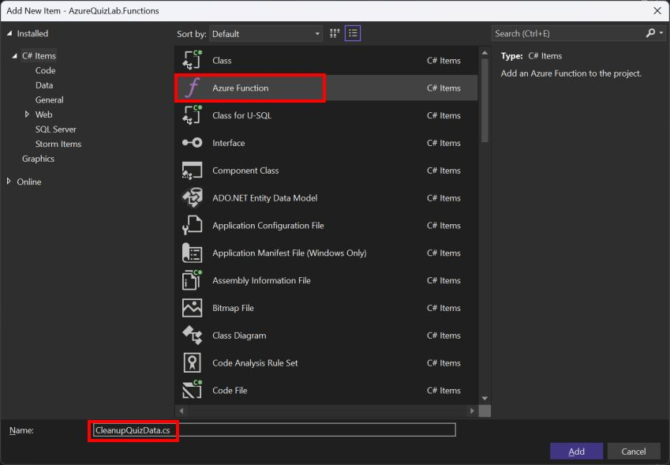

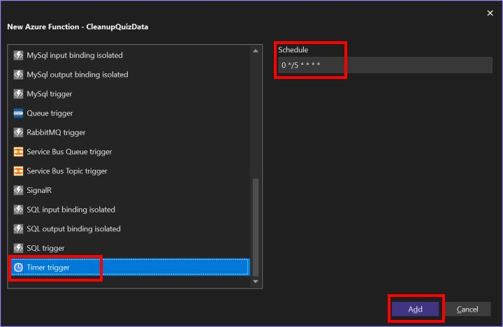

---

## Étape 29 — Implémenter le log

Remplacer le corps de la méthode générée par :

```csharp
[Function("CleanupQuizData")]
public void Run([TimerTrigger("0 */5 * * * *")] TimerInfo myTimer)
{
        _logger.LogInformation("C# Timer trigger function executed at: {executionTime}", DateTime.Now);

        var connectionString = Environment.GetEnvironmentVariable("SqlConnectionString");

        using (SqlConnection conn = new SqlConnection(connectionString))
        {
            conn.Open();

            var cmd = new SqlCommand("INSERT INTO Logs (Message, LogDate) VALUES (@msg, GETDATE())", conn);

            cmd.Parameters.AddWithValue("@msg", "C# Timer trigger function executed");
            cmd.ExecuteNonQuery();
        }

        _logger.LogInformation("Ecriture en base effectuée");
}
```

---

## Étape 30 — Tester en local

- Lancer le projet en debug
- Dans la console Azure Functions, vérifier que `CleanupQuizData` apparaît dans la liste des fonctions enregistrées
- Attendre la prochaine échéance CRON (ou modifier temporairement le schedule à `*/10 * * * * *` pour un déclenchement toutes les 10 secondes)
- Vérifier que le message de log s'affiche dans la console

---

## Étape 31 — Déployer sur Azure

- **Commiter** et pousser le code
- Vérifier que le workflow GitHub Actions dédié aux Azure Functions se déclenche et réussit

---

## Étape 32 — Vérifier l'exécution dans Azure

Dans Azure Portal :

- Aller dans votre **Function App**
- Cliquer sur **Functions → CleanupQuizData**
- Ouvrir **Monitor**
- Vérifier que des exécutions apparaissent avec le statut **Success** toutes les 5 minutes

💡 Résultat attendu :
- la fonction se déclenche automatiquement toutes les 5 minutes
- le log est visible dans Monitor

---

## Étape 33 — Désactiver la Function CleanupQuizData

👉 Pour éviter des exécutions inutiles et **réduire les coûts**, il est possible de désactiver une Function sans la supprimer.

Dans Azure Portal :

- Aller dans votre **Function App**
- Dans la partie **Overview → Functions** cliquer sur le lien de la function `CleanupQuizData`
- Cliquer sur **Disable**

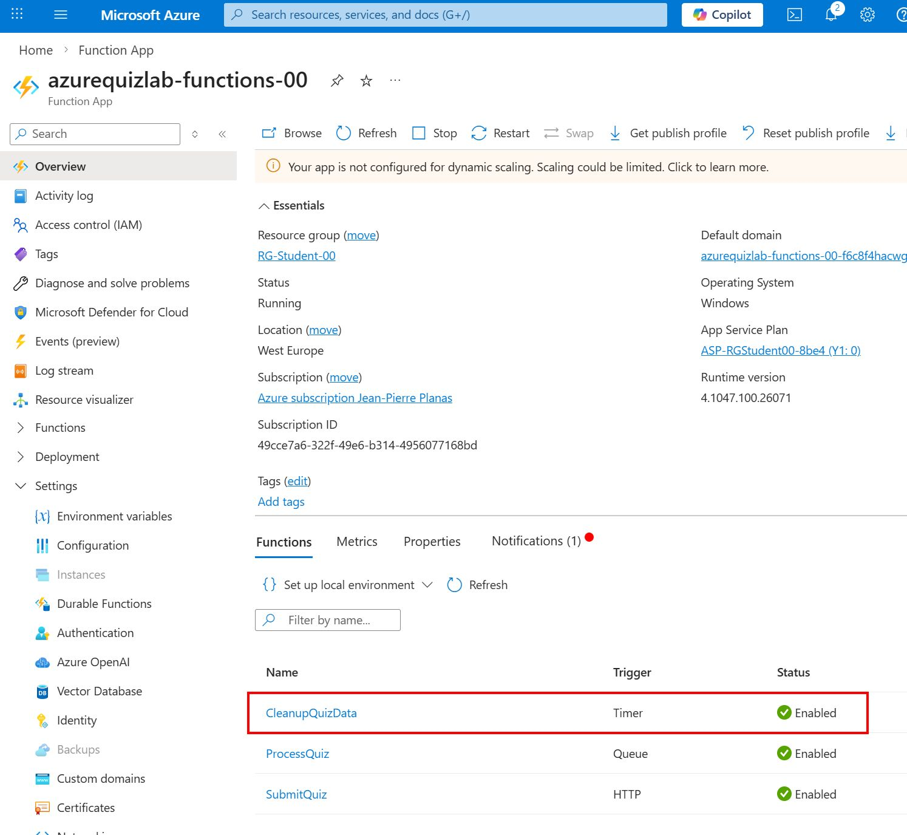

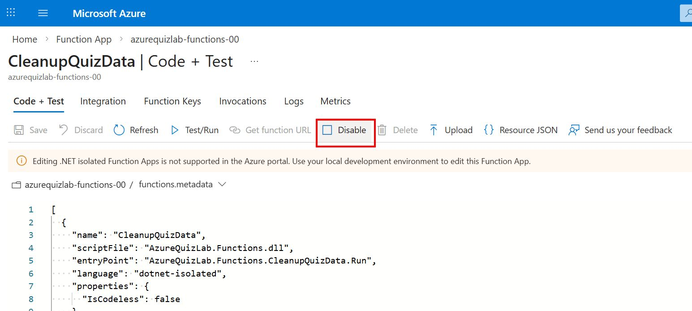

💡 La fonction passe en statut **Disabled** : elle ne se déclenchera plus automatiquement tant qu'elle reste désactivée.

> Pour la réactiver ultérieurement, cliquer sur **Enable** depuis le même écran.

⚠️ Désactiver une fonction Timer est recommandé dans les environnements de développement ou hors production pour éviter des exécutions et des écritures en base inutiles.

---

# 🧠 À retenir

- Azure Functions nécessite un **Storage Account**
- HTTP → entrée utilisateur
- Queue → découplage
- Queue Function → traitement
- Timer → automatisation
- Timer Function → penser à **désactiver** hors production pour limiter les coûts


