# 🧪 TP4 — Sécuriser AzureQuizLab avec Managed Identity et Key Vault

## 🎯 Objectifs

À la fin de ce TP, vous serez capable de :

- Comprendre le principe des Managed Identities
- Activer une Managed Identity sur une Web App
- Créer et configurer un coffre-fort de secrets Azure Key Vault
- Supprimer les secrets en clair des variables d’environnement
- Donner à une Web App l’accès à un Key Vault
- Utiliser un secret Key Vault depuis une Web App
- Se connecter à Azure SQL sans login / mot de passe grâce à Azure AD

---

## 🧩 Scénario

Actuellement, l’application AzureQuizLab utilise :

- une connection string SQL stockée en clair
- éventuellement une connection string Storage stockée en clair
- des secrets visibles dans les variables d’environnement Azure

👉 L’objectif est de remplacer cela par une architecture plus sécurisée :

1. La Web App utilise une Managed Identity
2. Les secrets sont stockés dans un Key Vault
3. La Web App lit les secrets directement depuis le Key Vault
4. La Web App se connecte à Azure SQL via Azure AD sans mot de passe

💡 Résultat attendu :

- plus aucun mot de passe SQL dans le code ou les variables d’environnement
- les secrets sont centralisés dans un Key Vault
- l’identité de la Web App est utilisée automatiquement

---

## Prérequis

- Avoir réalisé les précédents TP1 et TP2
- Avoir une Web App AzureQuizLab fonctionnelle qui se connecte à la base de données Azure SQL

## Prérequis formateur

- Pour que les participants puissent créer le Key Vault, il faut au préalable faire ceci
```bash
# Key Vault
az provider register --namespace Microsoft.KeyVault
```
Sinon, a la création du Key Vault, un message indique aux participants qu'il ne peut pas enregistrer le provider Microsoft.KeyVault.

De plus les participants doivent avoir les droits pour créer un Key Vault et assigner des rôles IAM

```bash
# Donner le rôle d'administrateur d'accès utilisateur sur le resource group
az role assignment create \
  --assignee "<email>" \
  --role "User Access Administrator" \
  --scope "/subscriptions/<subscription-id>/resourceGroups/RG-Student-<student-number>"
# Pour trouver les emails des utilisateurs dans Azure AD :
az ad user list --query "[].{mail:mail, id:id}" -o table

# Pour trouver l'id de la subscription :
az account show --query id -o tsv
```

---

# 🟢 Partie 1 — Comprendre l’architecture cible

## 📦 Architecture actuelle

Aujourd’hui, votre application utilise probablement une variable comme :

```json
"SqlConnectionString": "Server=tcp:sql-quizlab-xx.database.windows.net,1433;Initial Catalog=AzureQuizLabDB;User ID=sqladmin;Password=VotreMotDePasse;Encrypt=True;"
```

Cette approche pose plusieurs problèmes :

- le mot de passe est visible
- le secret est dupliqué
- il faut changer le mot de passe partout si on le modifie
- n’importe quelle personne ayant accès aux App Settings peut voir le mot de passe

---

## 📦 Architecture cible

La nouvelle architecture sera :

```text
Web App
   ↓
Managed Identity
   ↓
Key Vault
   ↓
Secret SQL Server Name
Secret Database Name
```

Puis, pour Azure SQL :

```text
Web App
   ↓
Managed Identity
   ↓
Azure SQL via Azure AD
```

💡 Il n’y aura plus de login SQL ni de mot de passe SQL.

---

# 🟢 Partie 2 — Création du Key Vault

## Étape 1 — Créer un Key Vault

Dans Azure Portal :

- Rechercher Key Vault
- Cliquer sur Create
- Utiliser votre Resource Group
- Donner un nom unique (ex : `azurequizlab-kv-00`)
- Région : France Central
- Pricing tier : Standard

Puis cliquer sur Review + Create puis Create.

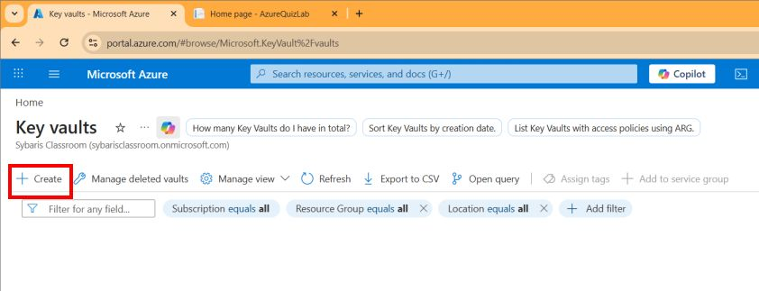

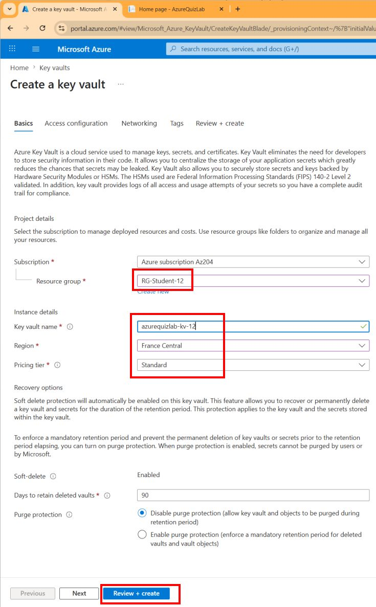

---

## Étape 2 — Ajouter des secrets

Dans le Key Vault :

- Aller dans Secrets
- Cliquer sur Generate / Import
- Ajouter les secrets suivants :

| Nom du secret | Valeur |
|------|------|
| SqlServerName | `sql-AzureQuiz-00` |
| SqlDatabaseName | `AzureQuizLabDB` |

⚠️ Erreur la première fois (voir image5)

La première fois, vous voyez une erreur indiquant que vous n’avez pas les droits pour créer des données dans le Key Vault.

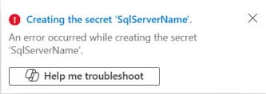

Cela signifie que :

- vous avez accès au coffre
- mais vous n’avez pas encore les droits nécessaires pour gérer les secrets

### Donner les droits RBAC sur le Key Vault

Dans le Key Vault :

- Aller dans Access control (IAM)
- Cliquer sur Add → Add role assignment
- Rechercher le rôle `Key Vault Administrator`
- Sélectionner votre compte utilisateur Azure
- Valider

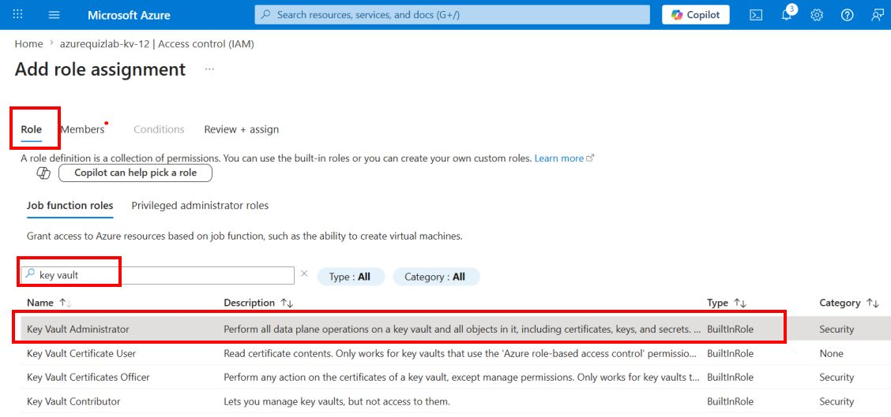

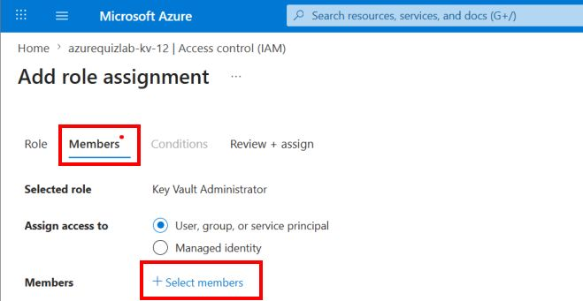

Attendre quelques secondes, puis revenir dans l’onglet Secrets et recommencer la création des secrets.

Vous devriez maintenant avoir ces 2 secrets.

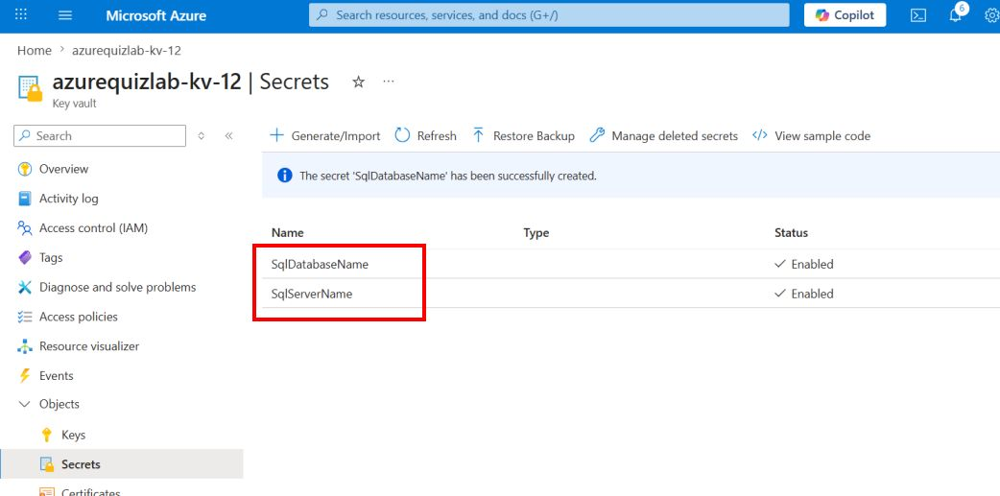

### Comprendre les rôles

- Le rôle `Reader` permet uniquement de voir le Key Vault
- Le rôle `Key Vault Secrets User` permet de lire les secrets
- Le rôle `Key Vault Administrator` permet de créer, modifier et supprimer les secrets

👉 Recommencer la création des secrets uniquement après l’attribution de ce rôle

💡 Ici, nous stockons uniquement les informations nécessaires à la connexion.

Nous n’avons plus besoin de stocker de login SQL ni de mot de passe SQL.

---

## Étape 3 — Ajouter éventuellement un secret Storage

Si vous souhaitez également sécuriser votre Storage Account :

Ajouter un secret :

| Nom du secret | Valeur |
|------|------|
| StorageConnectionString | connection string du Storage Account |

👉 Cela sera utile plus tard si votre application manipule directement des blobs, queues ou fichiers.

---

# 🟢 Partie 3 — Activer la Managed Identity

## Étape 4 — Activer la Managed Identity sur la Web App

Dans Azure Portal :

- Aller dans votre Web App AzureQuizLab
- Menu Settings → Identity
- Onglet System assigned
- Passer le statut à On
- Cliquer sur Save

💡 Azure crée automatiquement une identité liée à votre Web App.

Cette identité pourra être utilisée pour accéder à d’autres services Azure sans mot de passe.

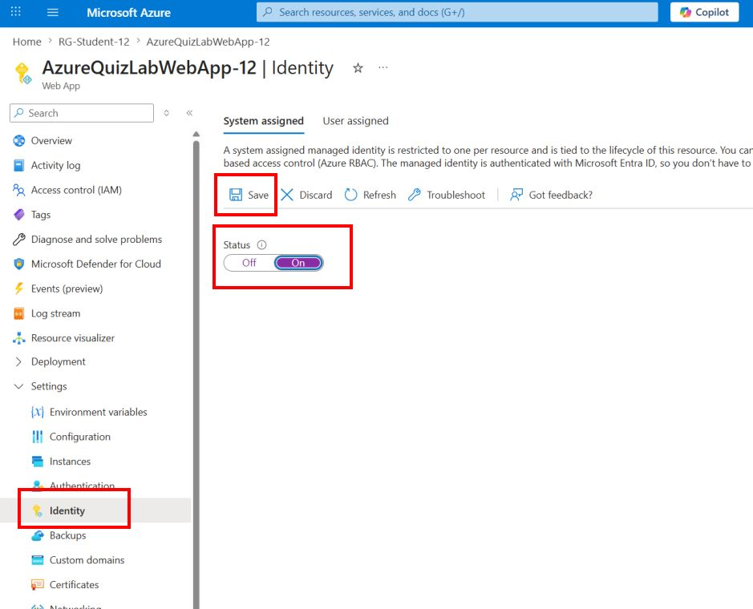

---

## Étape 5 — Vérifier l’identité créée

Une fois la Managed Identity activée :

- Vérifier que le champ Object (principal) ID apparaît

👉 Cette identité est propre à votre Web App.

Si vous supprimez la Web App, cette identité sera également supprimée.

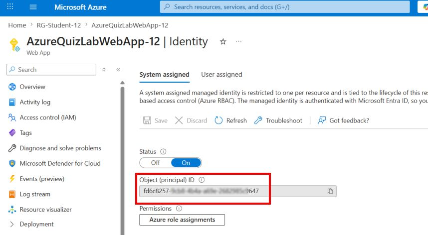

---

# 🟢 Partie 4 — Donner accès au Key Vault

## Étape 6 — Ajouter un rôle sur le Key Vault

Dans votre Key Vault :

- Aller dans Access control (IAM)
- Cliquer sur Add role assignment
- Choisir le rôle :

```text
Key Vault Secrets User
```

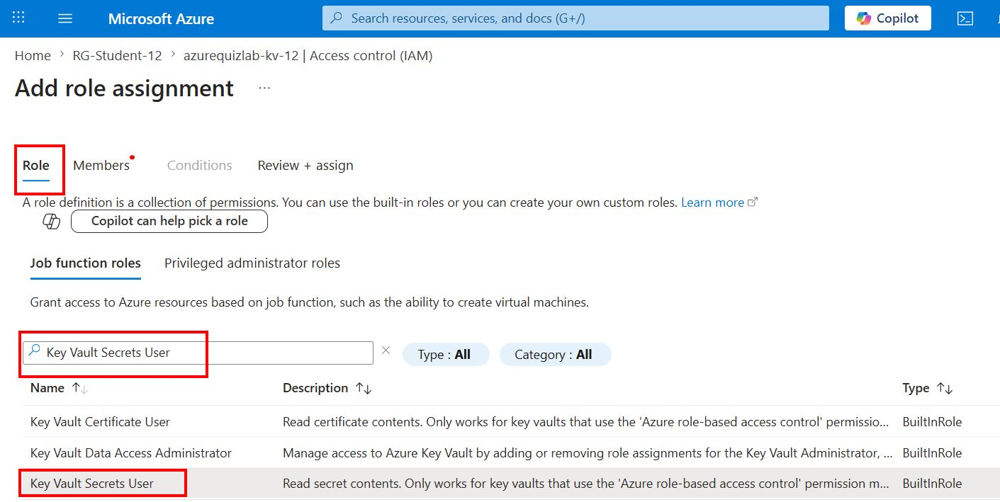

- Dans Assign access to, choisir :

```text
Managed identity
```

- Sélectionner votre Web App
- Valider

💡 Cela permet à la Web App de lire les secrets du Key Vault.

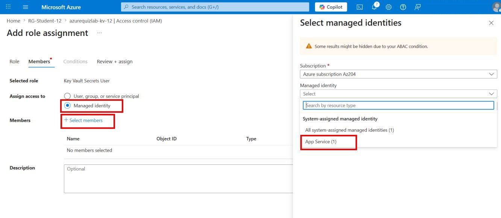

---

## Étape 7 — Vérifier les permissions

Dans le Key Vault :

- Aller dans Access control (IAM)
- Vérifier que votre Web App apparaît bien avec le rôle :

```text
Key Vault Secrets User
```
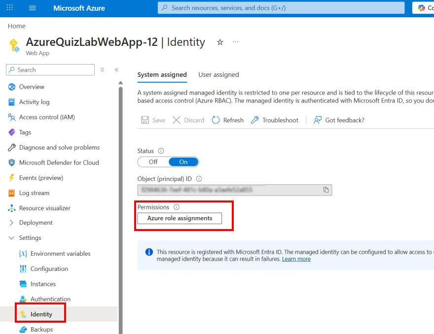

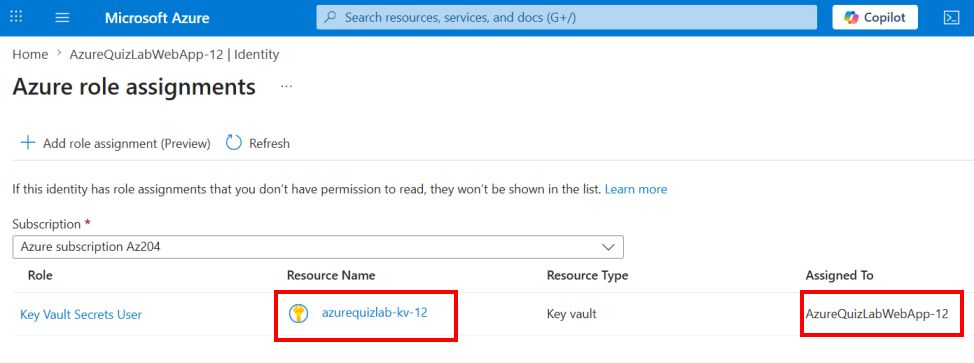

---

# 🟢 Partie 5 — Utiliser Key Vault depuis la Web App

## Étape 8 — Ajouter une référence Key Vault dans les App Settings

Dans la Web App :

- Aller dans Settings → Environment Variables
- Ajouter une variable :

| Nom | Valeur |
|------|------|
| SqlServerName | `@Microsoft.KeyVault(SecretUri=https://<nom-keyvault>.vault.azure.net/secrets/SqlServerName/)` |
| SqlDatabaseName | `@Microsoft.KeyVault(SecretUri=https://<nom-keyvault>.vault.azure.net/secrets/SqlDatabaseName/)` |

Exemple :

```text
@Microsoft.KeyVault(SecretUri=https://azurequizlab-kv-00.vault.azure.net/secrets/SqlServerName/)
```

💡 Azure remplacera automatiquement cette valeur par le contenu réel du secret.

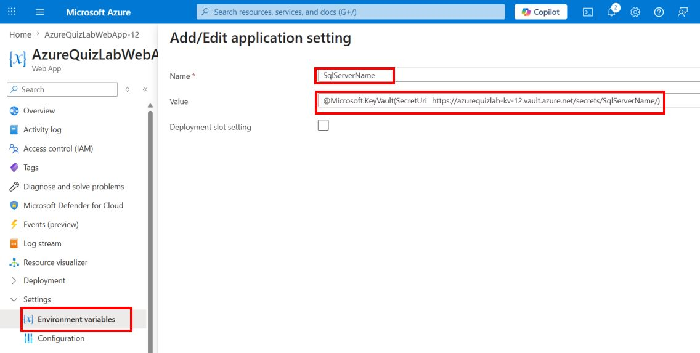

---

## Étape 9 — Vérifier la résolution du secret

Après quelques secondes :

- Revenir sur les variables d’environnement
- Vérifier qu’un indicateur vert apparaît
- Vérifier qu’Azure indique que la référence Key Vault est correctement résolue

👉 Si la référence n’est pas résolue :

- vérifier le nom du Key Vault
- vérifier le nom du secret
- vérifier les permissions IAM
- attendre quelques secondes et rafraîchir la page

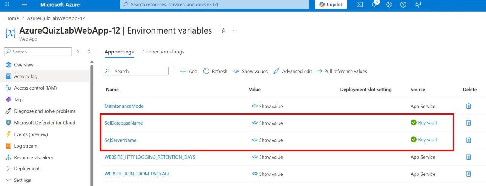

---

# 🟢 Partie 6 — Modifier le code C#

## Étape 10 — Ajouter les packages NuGet

Dans votre projet WebApp, ajouter les packages suivants :

```bash
dotnet add package Azure.Identity
dotnet add package Microsoft.Data.SqlClient
dotnet add package Microsoft.Data.SqlClient.Extensions.Azure 
```
---

## Étape 11 — Adapter la configuration de connexion SQL

Nous allons conserver `DefaultConnection`, mais remplacer dynamiquement le nom du serveur SQL et le nom de la base par les valeurs de `SqlServerName` et `SqlDatabaseName`.

Cela permet :

- de conserver une connection string complète en local avec login / mot de passe
- de remplacer uniquement le serveur et la base
- de préparer plus facilement le passage vers Azure AD et Managed Identity dans Azure

Remplacer le code existant 
```csharp
            builder.Services.AddDbContext<QuizDbContext>(options =>
                options.UseSqlServer(
                    builder.Configuration.GetConnectionString("DefaultConnection"),
                    sqlOptions => sqlOptions.EnableRetryOnFailure()
                ));
```

par :

```csharp
builder.Services.AddDbContext<QuizDbContext>(options =>
{
    var connectionString = builder.Configuration.GetConnectionString("DefaultConnection");

    // Lecture depuis appsettings.Development.json en local
    // ou depuis les variables d'environnement Azure App Service
    var sqlServerName = builder.Configuration["SqlServerName"];
    var sqlDatabaseName = builder.Configuration["SqlDatabaseName"];

    // On part toujours de la DefaultConnection existante
    var sqlConnectionStringBuilder = new SqlConnectionStringBuilder(connectionString);

    // Si SqlServerName est renseigné, on remplace le nom du serveur
    if (!string.IsNullOrWhiteSpace(sqlServerName))
    {
        sqlConnectionStringBuilder.DataSource = $"{sqlServerName}.database.windows.net";
    }

    // Si SqlDatabaseName est renseigné, on remplace le nom de la base
    if (!string.IsNullOrWhiteSpace(sqlDatabaseName))
    {
        sqlConnectionStringBuilder.InitialCatalog = sqlDatabaseName;
    }

    options.UseSqlServer(
        sqlConnectionStringBuilder.ConnectionString,
        sqlOptions => sqlOptions.EnableRetryOnFailure());
});
```

💡 Ainsi, la connection string d’origine reste présente, mais certaines parties peuvent être remplacées dynamiquement.

---

## Étape 12 — Vérifier localement que la connection string est reconstruite

Dans `appsettings.Development.json`, ajouter :

```json
{
  "SqlServerName": "sql-AzureQuiz-00",
  "SqlDatabaseName": "AzureQuizLabDB"
}
```

Modifier `DefaultConnection` pour retirer les valeurs pour le serveur SQL et le nom de la base. La valeur de `DefaultConnection` n’a plus de nom de serveur ni de nom de base, mais contient toujours le login SQL et le mot de passe SQL pour les tests en local.

```json
{
  "SqlServerName": "sql-AzureQuiz-00",
  "SqlDatabaseName": "AzureQuizLabDB",
    "ConnectionStrings": {
    "DefaultConnection": "User Id=ZZZ;Password=AAA;"
  },
}
```

💡 Ici :

- La connection string ne contient plus le nom du serveur SQL
- La connection ne contient plus le nom de la base de données SQL
- mais SqlServerName et SqlDatabaseName contiennent les bonnes valeurs
- Ne pas toucher le reste de la connection string, notamment le login SQL et le mot de passe SQL qui doivent rester présents en local pour les tests

Lancer ensuite l’application localement.

Si tout fonctionne, cela signifie que :

- le nom du serveur SQL a bien été remplacé
- le nom de la base a bien été remplacé
- la connection string finale est bien reconstruite dynamiquement

Le login SQL et le mot de passe restent ceux présents dans `DefaultConnection`.

---

## Étape 13 — Préparer la configuration Azure pour la Managed Identity

Dans Azure App Service, aller dans Settings → Environment Variables → Connection strings.

Modifier la variable `DefaultConnection` par cette valeur exactement :

```text
Authentication=Active Directory Default;
```

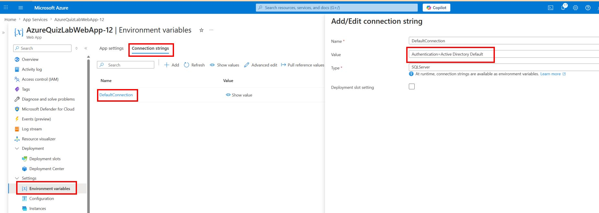

💡 Ici :

- il n’y a plus de User ID
- il n’y a plus de Password
- Authentication=Active Directory Default permet d’utiliser automatiquement Azure AD, et donc la Managed Identity, pour s’authentifier à Azure SQL

Déployer la Web App.

---

# 🟢 Partie 7 — Utiliser Azure AD même en local via az login

## Étape 14 — Créer l’utilisateur Managed Identity dans la base

Demander à votre formateur (si vous n'êtes pas sur votre propre abonnement/souscription Azure) de créer un utilisateur Azure AD lié à votre Managed Identity dans la base de données Azure SQL.

Se connecter à la base Azure SQL avec SQL Server Management Studio ou avec le Query Editor Azure, mais avec le compte administrateur SQL qui est lié à Azure AD.

### Configuration pour les tests en local

Pour les tests en local, exécuter la requête suivante en remplacant `ton.email@domain.com` par votre email Azure (celui utilisé pour vous connecter à Azure Portal et qui a les droits sur la Managed Identity) :

```sql
CREATE USER [ton.email@domain.com] FROM EXTERNAL PROVIDER;
ALTER ROLE db_datareader ADD MEMBER [ton.email@domain.com];
ALTER ROLE db_datawriter ADD MEMBER [ton.email@domain.com];
```

💡 Cela fonctionne localement car vous vous connectez avec `az login` en utilisant votre compte personnel Azure AD.

### Configuration pour Azure (Managed Identity)

Pour que la Web App fonctionne correctement dans Azure (avec la Managed Identity), exécuter également cette requête en remplacant `AzureQuizLabWebApp-00` par le nom réel de votre Web App :

```sql
CREATE USER [AzureQuizLabWebApp-00] FROM EXTERNAL PROVIDER;
ALTER ROLE db_datareader ADD MEMBER [AzureQuizLabWebApp-00];
ALTER ROLE db_datawriter ADD MEMBER [AzureQuizLabWebApp-00];
```

💡 Cette requête crée un utilisateur basé sur le nom de votre Web App, ce qui correspond à l'identité Managed Identity que vous avez créée précédemment.

### Configurer appsettings.Development.json

Modifier ensuite `appsettings.Development.json` pour utiliser la même connection string que dans Azure, c’est à dire sans login SQL ni mot de passe SQL, et avec Authentication=Active Directory Default.

```json
{
  "SqlServerName": "sql-AzureQuiz-00",
  "SqlDatabaseName": "AzureQuizLabDB",
    "ConnectionStrings": {
    "DefaultConnection": "Authentication=Active Directory Default;"
  },
}
```
Connecter votre session locale à Azure avec votre compte avec cette commande dans le terminal :

```bash
az login
```

Relancer l’application localement et vérifier que la connexion à Azure SQL fonctionne correctement même en local.
Déployer ensuite la Web App sur Azure et vérifier que la Managed Identity peut se connecter à Azure SQL sans erreur.---

# 🧠 À retenir

- Une Managed Identity remplace un login / mot de passe
- Un Key Vault centralise les secrets
- Une Web App peut lire automatiquement les secrets du Key Vault
- Azure SQL peut être utilisé sans login SQL
- Les secrets ne doivent jamais être stockés en clair dans le code ou dans Git

