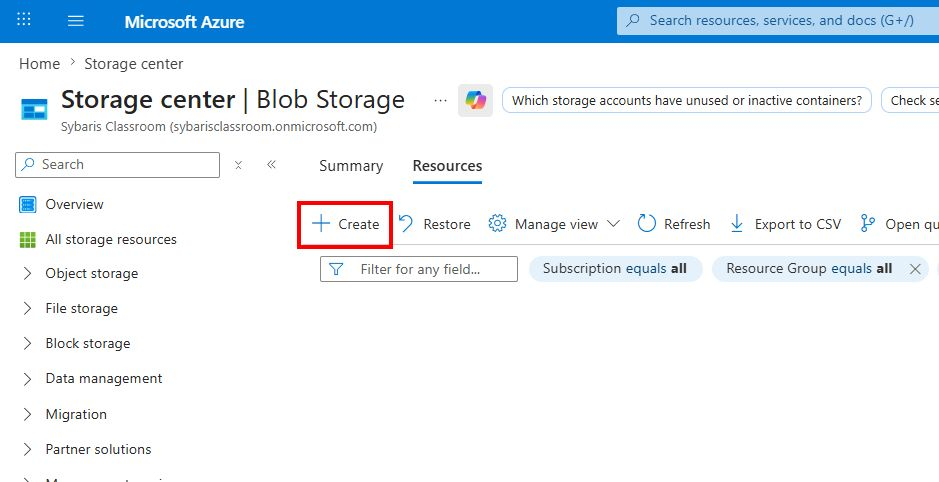
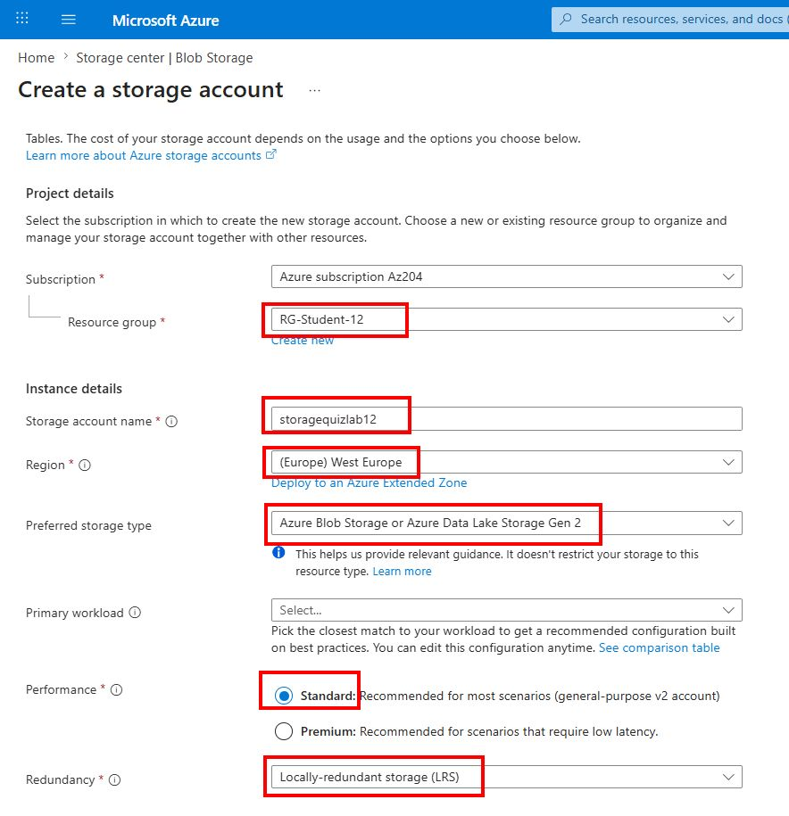
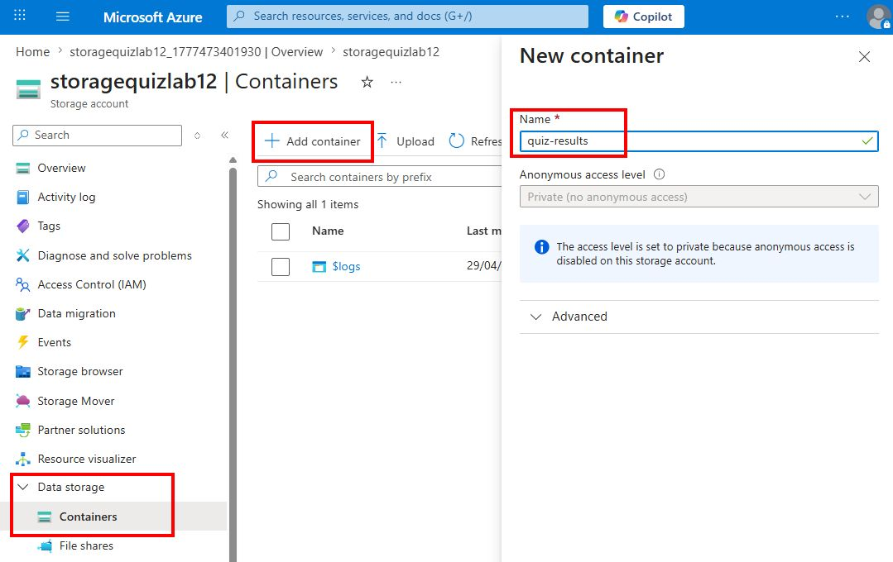
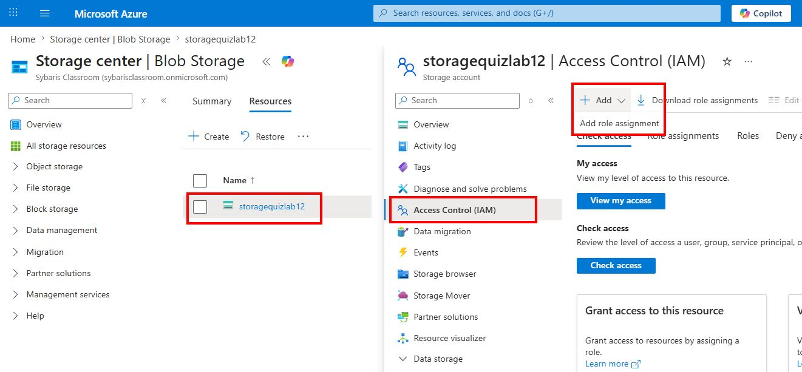
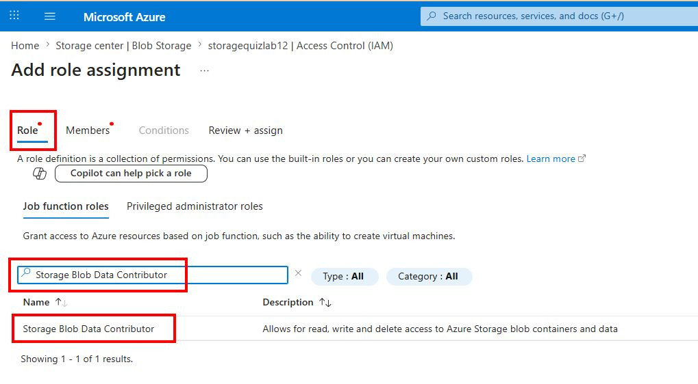
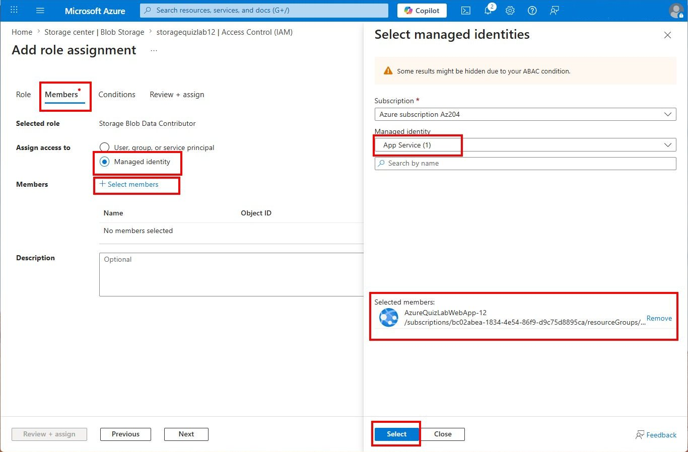
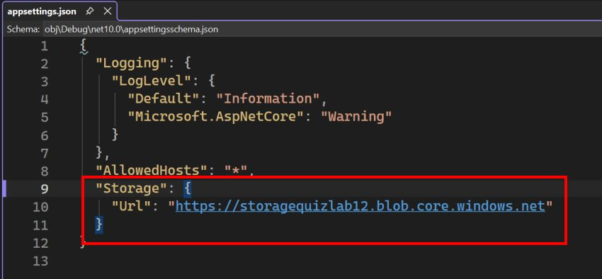

# 🧪 TP5 — Azure Blob Storage (Upload / Download)

## 🎯 Objectifs pédagogiques

À la fin de ce TP, vous serez capable de :

- Créer et utiliser Azure Blob Storage
- Uploader un fichier depuis une application Web
- Télécharger et afficher un fichier depuis Azure
- Utiliser une Managed Identity pour accéder au stockage (sans clé ni mot de passe)

---

## 🧠 Concept clé

Azure Blob Storage est un service de stockage d’objets :

- Idéal pour fichiers, JSON, images
- Pas de schéma
- Très scalable

---

## 🧩 Scénario

Lorsqu’un utilisateur termine un quiz :

- Le résultat est sauvegardé sous forme de fichier JSON dans Azure
- L’utilisateur peut consulter les fichiers existants et les télécharger

---

## ⚙️ Étape 1 — Créer le Storage Account

Dans Azure :

1. Aller dans **Storage accounts** puis cliquer sur **Create**.
2. Renseigner :
    - **Resource group** : le resource group qui vous a été assigné
    - **Storage account name** : `storagequizlabxx` : nom globalement unique, en minuscules, sans tiret ni espace
    - **Region** : `West Europe`
    - **Instance details / Preferred storage type** : Azure Blob Storage or Azure Data Lake Storage Gen2
    - **Performance** :  Standard
    - **Redundancy** : LRS
3. Cliquer sur **Review + create** puis **Create**.




4. Une fois la ressource créée, ouvrir le Storage Account puis :
    - Aller dans **Data storage > Containers**
    - Cliquer **+ Add Container**
    - Nom du container :

```
quiz-results
```



---

## ⚙️ Étape 2 — Donner les droits à la Web App et à votre compte local

Dans le Storage Account :

1. Aller dans **Access control (IAM)**
2. Ajouter le rôle :

```
Storage Blob Data Contributor
```

3. Assigner ce rôle à la Managed Identity de votre Web App





4. Assigner aussi ce rôle à votre utilisateur Azure (compte connecté en local via `az login`)

Attention, je ne remet pas les copies d'écran pour cette étape, mais il faut aussi assigner le rôle `Storage Blob Data Contributor` à votre compte utilisateur Azure (celui que vous utilisez pour vous connecter en local via `az login`). Il s'agit d'étapes similaires à celles montrées ci-dessus, mais au lieu de sélectionner la Managed Identity de la Web App, vous sélectionnez votre compte utilisateur Azure.

> 💡 Pourquoi ? En local, l'application utilise `AzureCliCredential` avec votre identité Azure CLI. Sans ce rôle RBAC sur votre compte, vous obtiendrez une erreur `403 AuthorizationPermissionMismatch`.

---

## ⚙️ Étape 3 — Ajouter les packages NuGet

Dans votre projet :

- Azure.Storage.Blobs
- Azure.Identity (Si pas déjà ajouté dans le TP précédent)

---

## ⚙️ Étape 4 — Créer le service Blob

Créer une classe `BlobService.cs` :

```csharp
using Azure.Core;
using Azure.Identity;
using Azure.Storage.Blobs;

namespace AzureQuizLab.Services;

public class BlobService
{
    private readonly BlobContainerClient _container;

    public BlobService(IConfiguration config, IHostEnvironment env)
    {
        TokenCredential credential = env.IsDevelopment()
            ? new AzureCliCredential()
            : new ManagedIdentityCredential();

        var serviceClient = new BlobServiceClient(
            new Uri(config["Storage:Url"]!),
            credential);

        _container = serviceClient.GetBlobContainerClient("quiz-results");
        _container.CreateIfNotExists();
    }

    public async Task<string> UploadAsync(string content)
    {
        var name = $"result-{Guid.NewGuid()}.json";
        var blob = _container.GetBlobClient(name);

        await blob.UploadAsync(BinaryData.FromString(content));

        return name;
    }

    public async Task<List<string>> ListAsync()
    {
        var result = new List<string>();

        await foreach (var blob in _container.GetBlobsAsync())
        {
            result.Add(blob.Name);
        }

        return result;
    }

    public async Task<string> DownloadAsync(string name)
    {
        var blob = _container.GetBlobClient(name);

        var content = await blob.DownloadContentAsync();

        return content.Value.Content.ToString();
    }
}
```

---

## ⚙️ Étape 5 — Configurer l'URL du Storage Account

Dans `appsettings.json`, ajouter en remplaçant l’URL par celle de votre Storage Account :

```json
"Storage": {
  "Url": "https://storagequizlabxx.blob.core.windows.net/"
}
```

> 💡 L'URL se trouve dans le portail Azure, dans le Storage Account → **Endpoints → Blob service**.



---

## ⚙️ Étape 6 — Enregistrer le service

Dans `Program.cs` :

```csharp
builder.Services.AddScoped<BlobService>();
```

---

## ⚙️ Étape 7 — Créer l’interface utilisateur

Ajouter une page Razor (Add/Razor Page) `Pages/BlobStorage.cshtml`:

```html
@page
@model AzureQuizLab.Pages.BlobStorageModel

<h2>Blob Storage Demo</h2>

<form method="post" asp-page-handler="Upload">
    <button type="submit">Upload un résultat</button>
</form>

<form method="get">
    <button type="submit">Charger les fichiers</button>
</form>

<form method="post" asp-page-handler="Download">
    <select asp-for="SelectedFile">
        @foreach (var file in Model.Files)
        {
            <option value="@file">@file</option>
        }
    </select>

    <button type="submit">Download</button>
</form>

<pre>@Model.Content</pre>
```

---

## ⚙️ Étape 8 — Code derrière

Modifier `Pages/BlobStorage.cshtml.cs` :

```csharp
using AzureQuizLab.Services;
using Microsoft.AspNetCore.Mvc;
using Microsoft.AspNetCore.Mvc.RazorPages;
using System.Text.Json;

namespace AzureQuizLab.Pages;

public class BlobStorageModel : PageModel
{
    private readonly BlobService _blobService;

    public BlobStorageModel(BlobService blobService)
    {
        _blobService = blobService;
    }

    public List<string> Files { get; set; } = new();

    [BindProperty]
    public string? SelectedFile { get; set; }

    public string? Content { get; set; }

    public async Task OnGetAsync()
    {
        Files = await _blobService.ListAsync();
    }

    public async Task<IActionResult> OnPostUploadAsync()
    {
        var json = JsonSerializer.Serialize(new
        {
            user = "jp",
            score = Random.Shared.Next(0, 10),
            date = DateTime.UtcNow
        });

        await _blobService.UploadAsync(json);
        Files = await _blobService.ListAsync();
        return Page();
    }

    public async Task<IActionResult> OnPostDownloadAsync()
    {
        Files = await _blobService.ListAsync();

        if (string.IsNullOrWhiteSpace(SelectedFile))
        {
            Content = "Aucun fichier sélectionné.";
            return Page();
        }

        Content = await _blobService.DownloadAsync(SelectedFile);
        return Page();
    }
}
```

---

## 🧪 Étape 9 — Test

1. Naviguer vers `/BlobStorage`
2. Cliquer sur **Upload un résultat**
3. Vérifier dans le portail Azure que le fichier JSON est créé dans le container `quiz-results`
4. Sélectionner le fichier dans la liste
5. Cliquer sur **Download**
6. Vérifier le contenu JSON affiché

---

## 🔐 Sécurité

Aucune clé ni chaîne de connexion n’est utilisée.

L’authentification se fait via :

- Managed Identity
- Azure CLI (en local)

En local, l'application utilise `AzureCliCredential`.

En résumé pour le debug local :

- vérifier que `Storage:Url` pointe vers l'endpoint Blob exact du Storage Account
- exécuter `az login` puis vérifier la bonne souscription avec `az account show`
- vérifier que votre utilisateur Azure a le rôle `Storage Blob Data Contributor` sur le Storage Account

---

## 🎓 Points importants

- Blob = stockage de fichiers
- Container = dossier logique
- Blob = fichier
- Accès sécurisé sans mot de passe

---

## ❓ Questions

1. Pourquoi ne pas utiliser SQL ?
2. Blob est-il public par défaut ?
3. Que se passe-t-il sans rôle RBAC ?
4. Pourquoi utiliser Managed Identity ?


