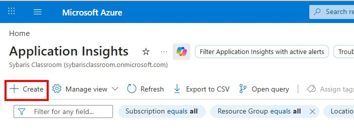
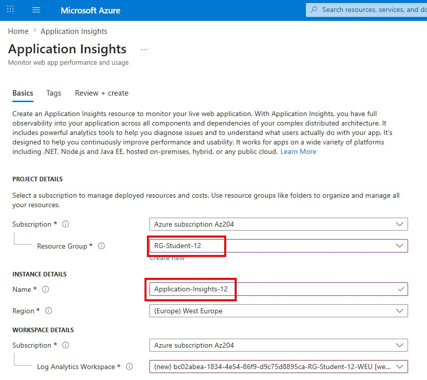
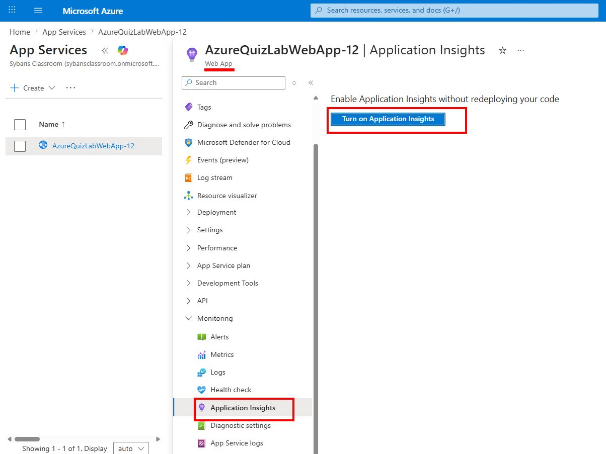
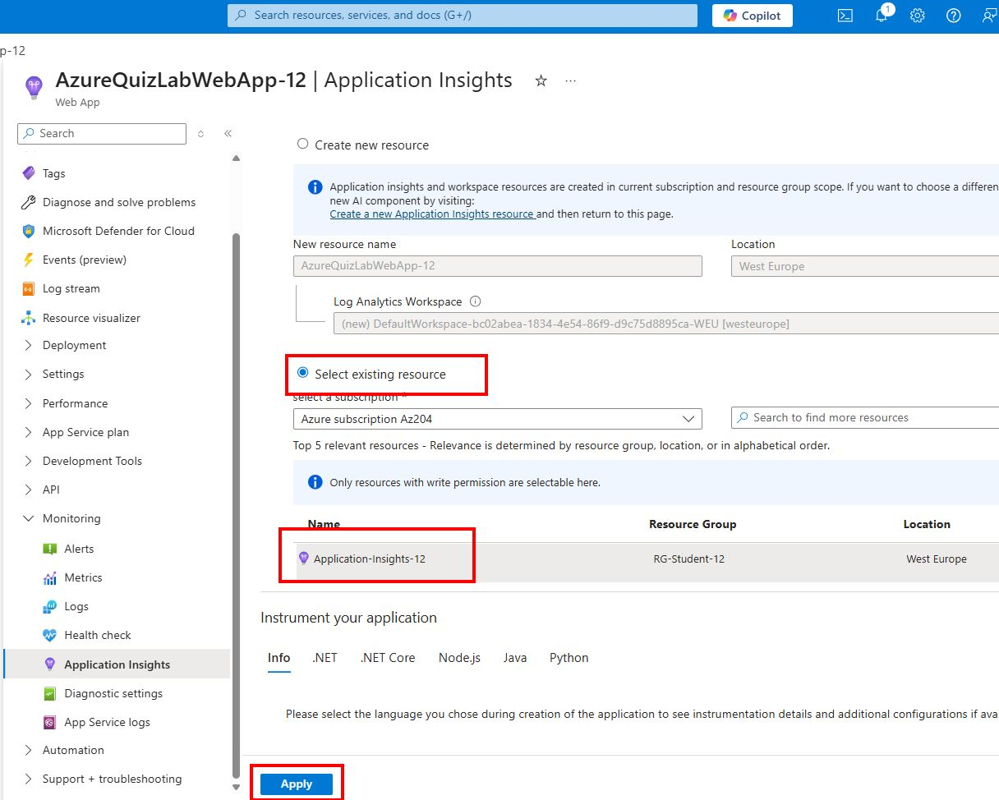
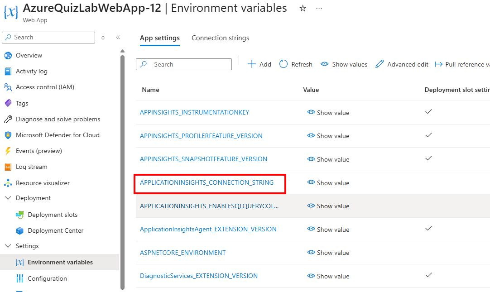

# 🧪 TP – Monitoring Azure

## 🎯 Objectifs

À la fin de ce TP, vous serez capable de :

- Comprendre les différences entre logs, traces et métriques
- Utiliser Azure Application Insights pour analyser une application
- Diagnostiquer un problème de performance et une erreur

---

## 🧱 Partie 1 – Préparation du code

### Étape 1 – Vérifier la configuration du logging

Dans certains TPs precedents, la ligne suivante a ete ajoutee dans `Program.cs` :

```csharp
builder.Logging.ClearProviders();
```

Pour ce TP, il faut la commenter :

```csharp
// builder.Logging.ClearProviders();
```

Pourquoi ?

- `ClearProviders()` supprime les providers de logging enregistres dans l'application
- Application Insights s'appuie sur son provider de logs pour recuperer les traces `ILogger`
- Si tous les providers sont effaces, les logs applicatifs peuvent ne plus etre envoyes correctement vers Application Insights

L'objectif ici est de conserver l'injection standard du logging afin que les appels a `ILogger` remontent bien dans Azure.

---

### Étape 2 – Ajouter du logging

Créer une page technique `Pages/Logs.cshtml` :

```cshtml
@page "/logs"
@model LogsModel
OK
```

Puis `Pages/Logs.cshtml.cs` :

```csharp
using Microsoft.AspNetCore.Mvc.RazorPages;

public class LogsModel : PageModel
{
    private readonly ILogger<LogsModel> _logger;

    public LogsModel(ILogger<LogsModel> logger)
    {
        _logger = logger;
    }

    public void OnGet()
    {
        _logger.LogInformation("Acces a Quiz");
        _logger.LogWarning("Comportement inattendu");
        _logger.LogError("Erreur simulee");
    }
}

```

---

### Étape 3 – Ajouter une route erreur

Créer `Pages/Boom.cshtml` :

```cshtml
@page "/boom"
@model BoomModel
OK
```

Puis `Pages/Boom.cshtml.cs` :

```csharp
using Microsoft.AspNetCore.Mvc.RazorPages;

public class BoomModel : PageModel
{
    public void OnGet()
    {
        throw new Exception("Erreur volontaire !");
    }
}
```

---

### Étape 4 – Ajouter une route lente

Créer `Pages/Slow.cshtml` :

```cshtml
@page "/slow"
@model SlowModel
OK
```

Puis `Pages/Slow.cshtml.cs` :

```csharp
using Microsoft.AspNetCore.Mvc.RazorPages;

public class SlowModel : PageModel
{
    public void OnGet()
    {
        Thread.Sleep(3000);
    }
}
```

---

## 🚀 Partie 2 – Déploiement

- Commit
- Push
- Déploiement automatique (GitHub Actions ou autre)

---

## ☁️ Partie 3 – Activation Application Insights

Dans le portail Azure :

1. Créer d'abord une ressource **Application Insights**
    - Aller dans **Create a resource** → **Application Insights**
    - **Resource Group** : utiliser votre RG (ex : `RG-Student-00`)
    - **Name** : `Application-Insights-xx` 




2. Associer cette ressource a la Web App
    - Aller dans **Web App** → **Application Insights** → **Activer**
    - Choisir **Select existing resource** 
    - Selectionner l'Application Insights creee a l'etape 1




3. Vérifier la présence de :

APPLICATIONINSIGHTS_CONNECTION_STRING


---

## 🔍 Partie 4 – Générer du trafic

Dans votre navigateur :

- /logs
- /slow
- /boom

Faire plusieurs appels

---

## 📊 Partie 5 – Live Metrics

Dans Application Insights :

- Aller dans **Live Metrics**
- Observer :
  - nombre de requêtes
  - erreurs
  - temps de réponse
- Générer du trafic et observer les changements en temps réel  

---

## 🧠 Partie 6 – Analyse avec KQL

### Logs :

```kql
traces
| order by timestamp desc
```

### Exceptions :

```kql
exceptions
| order by timestamp desc
```

### Requêtes lentes :

```kql
requests
| order by duration desc
```

### Logs métier :

```kql
traces
| where message contains 'Quiz'
```

---

## 📈 Partie 7 – Métriques

Dans la Web App → Metrics :

Ajouter :

- Requests
- Response time
- CPU

Identifier les pics liés à /slow

---

## 🛠️ Partie 8 – Diagnostic

Question :

Pourquoi l'application est-elle lente ?

👉 Indices :
- Route /slow
- Temps de réponse élevé
- Visible dans Application Insights

---

## 📜 Partie 9 – Logs App Service

Dans la Web App :

- Activer Application Logging
- Utiliser Log Stream

---

## 🎁 Bonus – Alertes

Créer une alerte :

- Condition : erreurs > 5
- Action : email

---

## 🧠 À retenir

- ILogger → logs applicatifs
- Application Insights → observabilité applicative et globale

