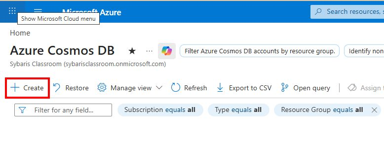
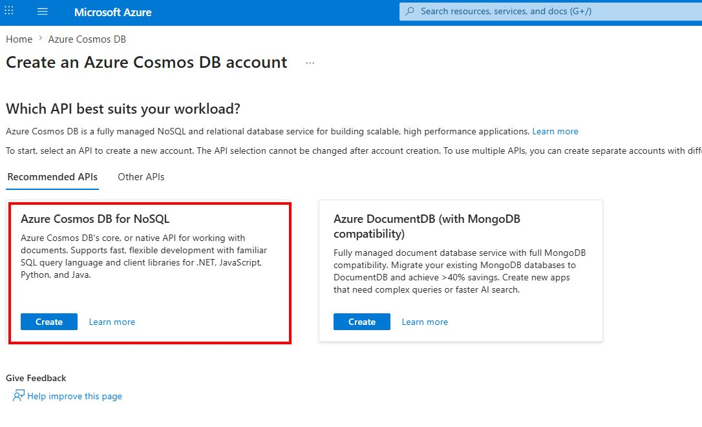
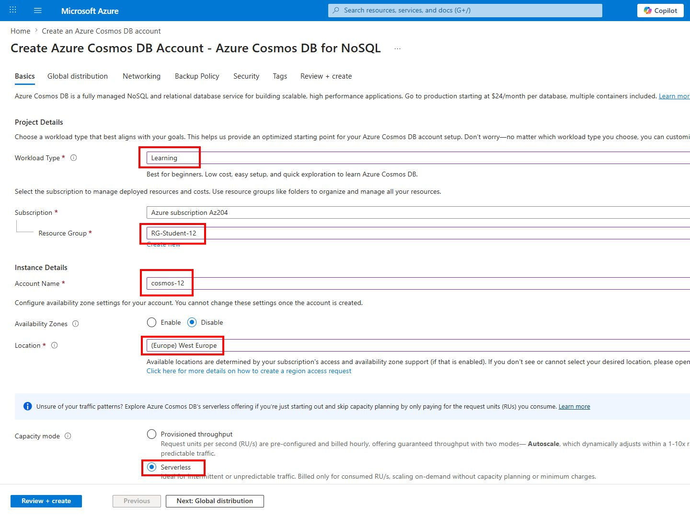
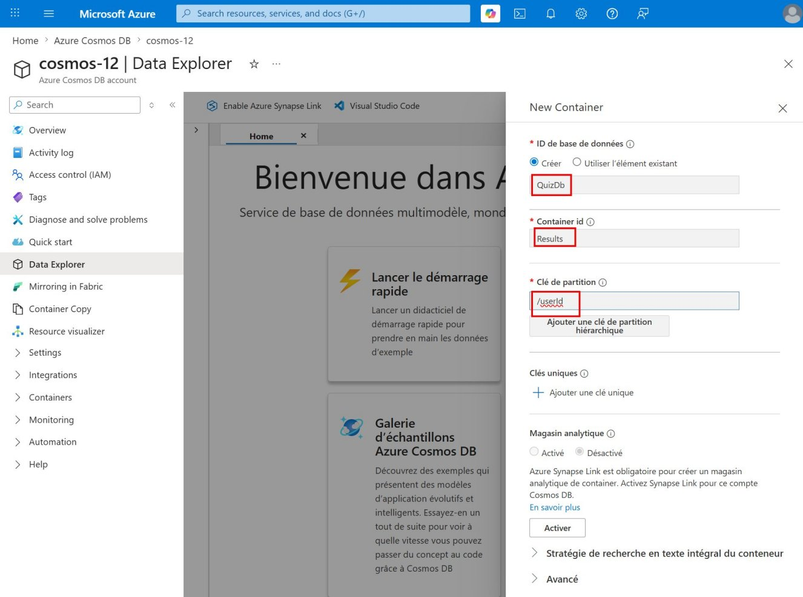
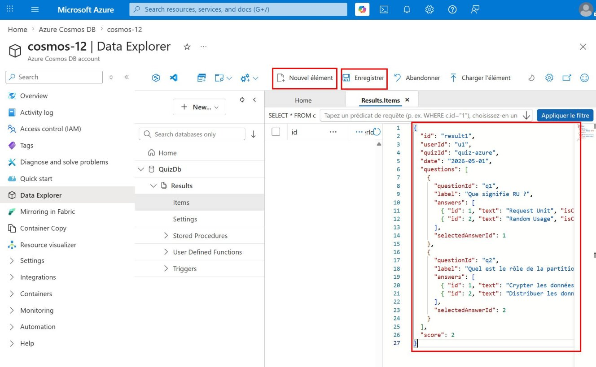
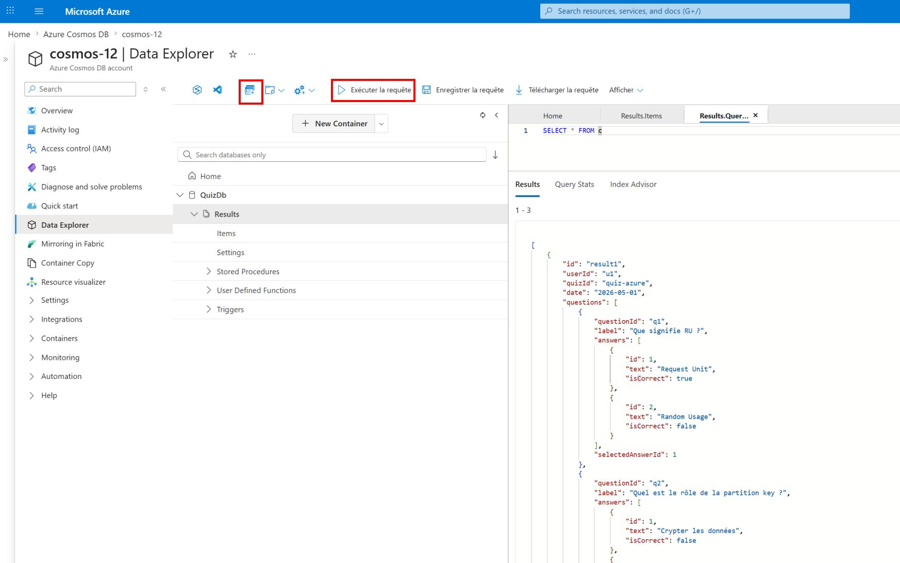
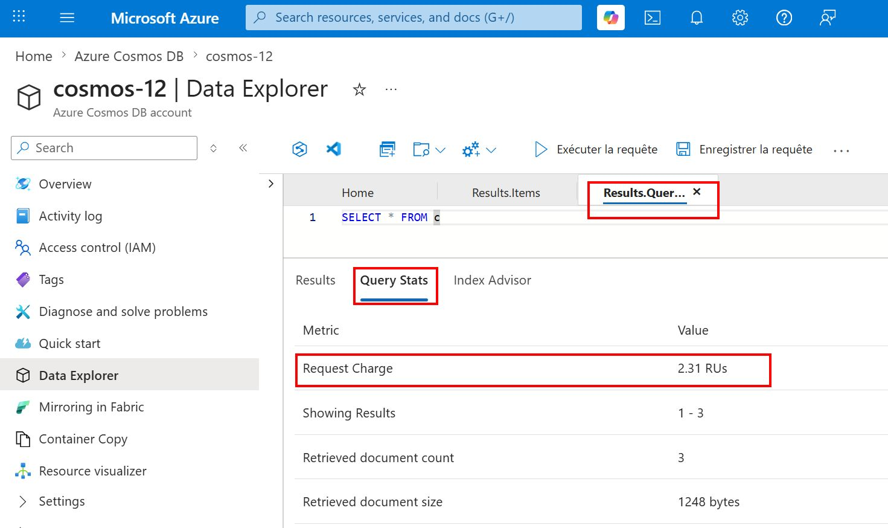
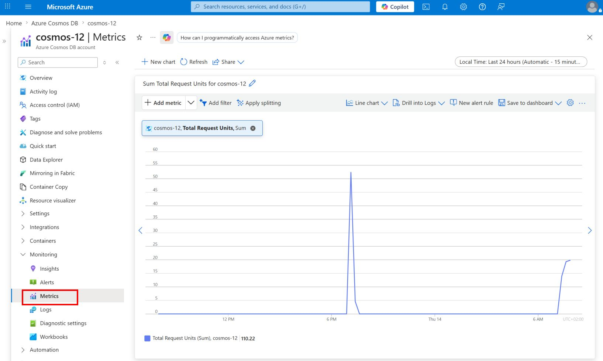
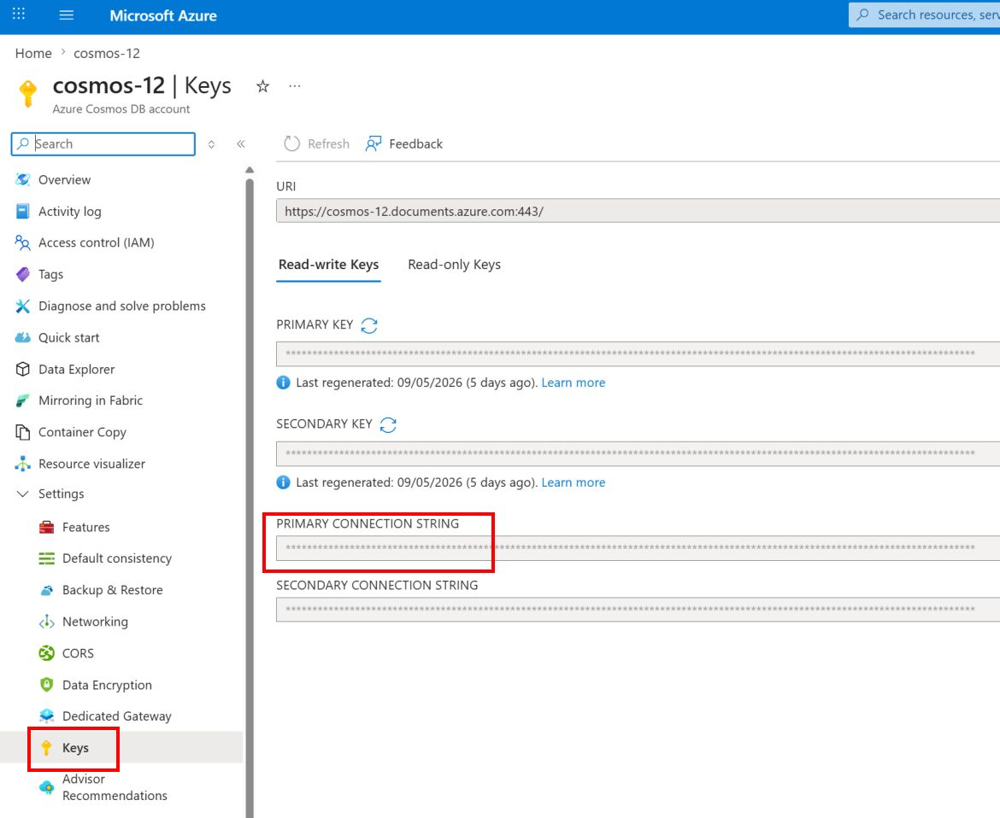
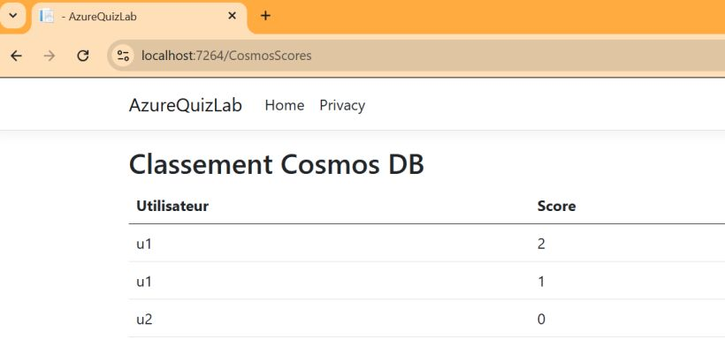

# 🧪 TP7 — Azure Cosmos DB for NoSQL

## 🎯 Objectifs pédagogiques

À la fin de ce TP, vous serez capable de :

- créer un compte Azure Cosmos DB for NoSQL
- manipuler des documents JSON hiérarchiques
- exécuter des requêtes SQL sur des documents Cosmos DB
- comprendre le rôle des RU (Request Units)
- comprendre l'importance de la partition key
- exploiter un résultat Cosmos DB dans la webapp AzureQuizLab

---

## 🧩 Scénario

Jusqu'ici, l'application AzureQuizLab s'appuyait surtout sur SQL et sur le stockage Blob.

Dans ce TP, vous allez stocker des résultats de quiz dans Azure Cosmos DB sous forme de documents JSON, puis interroger ces données.

En fin de TP, vous ajouterez une page Razor minimale qui affiche dans la webapp le classement issu de la requête de l'étape 10.

---

## Prérequis

- Avoir un Resource Group Azure disponible
- Avoir accès au portail Azure
- Avoir une webapp AzureQuizLab fonctionnelle issue des TP précédents

---

## Prérequis formateur

- Pour que les participants puissent créer leur compte Azure Cosmos DB
```bash
# Key Vault
az provider register --namespace Microsoft.DocumentDB
```
Sinon, à la création, un message indique aux participants : "Resource provider(s): Microsoft.DocumentDB are not registered for subscription".

---

## 🧠 Concepts clés

- Un document Cosmos DB est un objet JSON complet
- Les tableaux et objets imbriqués sont stockés naturellement dans le document
- Les RU mesurent le coût d'une opération de lecture, écriture ou requête
- La partition key influence la distribution des données et le coût des requêtes

---

## 🟦 Partie 1 — Créer et alimenter Cosmos DB

### Étape 1 — Créer le compte Cosmos DB

Dans le portail Azure :

1. Rechercher :

```text
Azure Cosmos DB
```

2. Cliquer sur **Create**
3. Choisir :

```text
Azure Cosmos DB for NoSQL
```

4. Cliquer sur **Create**
5. Renseigner :

| Champ | Valeur |
|---|---|
| Workload Type | Learning |
| Resource Group | Votre Resource Group |
| Account Name | cosmos-XX |
| Location | France Central |
| Capacity mode | Serverless |

en remplaçant `XX` par votre numéro d'étudiant

6. Cliquer sur **Review + Create**
7. Cliquer sur **Create**





---

### Étape 2 — Créer la database et le container

Ouvrir votre compte Cosmos DB puis :

1. Aller dans **Data Explorer**
2. Cliquer sur **New Container**
3. Renseigner :

| Champ | Valeur |
|---|---|
| Database id | QuizDb |
| Container id | Results |
| Partition key | /userId |

4. Cliquer sur **OK**

> 💡 Le choix de `/userId` comme partition key permet de regrouper les résultats d'un même utilisateur dans une même partition logique.



---

### Étape 3 — Insérer des documents JSON

Dans **Data Explorer** :

1. Sélectionner le container :

```text
Results
```

2. Cliquer sur :

```text
New Item
```

3. Ajouter le premier document :

```json
{
  "id": "result1",
  "userId": "u1",
  "quizId": "quiz-azure",
  "date": "2026-05-01",
  "questions": [
    {
      "questionId": "q1",
      "label": "Que signifie RU ?",
      "answers": [
        { "id": 1, "text": "Request Unit", "isCorrect": true },
        { "id": 2, "text": "Random Usage", "isCorrect": false }
      ],
      "selectedAnswerId": 1
    },
    {
      "questionId": "q2",
      "label": "Quel est le rôle de la partition key ?",
      "answers": [
        { "id": 1, "text": "Crypter les données", "isCorrect": false },
        { "id": 2, "text": "Distribuer les données", "isCorrect": true }
      ],
      "selectedAnswerId": 2
    }
  ],
  "score": 2
}
```

4. Cliquer sur **Save**



5. Ajouter le deuxième document :

```json
{
  "id": "result2",
  "userId": "u2",
  "quizId": "quiz-azure",
  "date": "2026-05-02",
  "questions": [
    {
      "questionId": "q1",
      "label": "Que signifie RU ?",
      "answers": [
        { "id": 1, "text": "Request Unit", "isCorrect": true },
        { "id": 2, "text": "Random Usage", "isCorrect": false }
      ],
      "selectedAnswerId": 2
    },
    {
      "questionId": "q2",
      "label": "Quel est le rôle de la partition key ?",
      "answers": [
        { "id": 1, "text": "Crypter les données", "isCorrect": false },
        { "id": 2, "text": "Distribuer les données", "isCorrect": true }
      ],
      "selectedAnswerId": 1
    }
  ],
  "score": 0
}
```

6. Ajouter le troisième document :

```json
{
  "id": "result3",
  "userId": "u1",
  "quizId": "quiz-azure",
  "date": "2026-05-03",
  "questions": [
    {
      "questionId": "q1",
      "label": "Que signifie RU ?",
      "answers": [
        { "id": 1, "text": "Request Unit", "isCorrect": true },
        { "id": 2, "text": "Random Usage", "isCorrect": false }
      ],
      "selectedAnswerId": 1
    },
    {
      "questionId": "q2",
      "label": "Quel est le rôle de la partition key ?",
      "answers": [
        { "id": 1, "text": "Crypter les données", "isCorrect": false },
        { "id": 2, "text": "Distribuer les données", "isCorrect": true }
      ],
      "selectedAnswerId": 1
    }
  ],
  "score": 1
}
```

> 💡 Chaque document doit contenir un `id` unique et la propriété `userId`, car elle correspond à la partition key du container.

---

## 🟩 Partie 2 — Interroger les documents

### Étape 4 — Lister tous les documents

Dans **Data Explorer** :

1. Cliquer sur **New SQL Query**
2. Exécuter :

```sql
SELECT * FROM c
```

Le `c` dans `FROM c` est simplement un alias représentant les documents du container.
Ce n’est pas le nom du container.

3. Cliquer sur **Execute Query**

Vérifier :

- que les 3 documents sont affichés
- que le nombre de documents retournés correspond à ce qui a été inséré

Après l'exécution de la requête :

1. Cliquer sur l'onglet **Query Stats**
2. Repérer la valeur **Request Charge**

Cette valeur correspond au coût de la requête en **RU (Request Units)**.

Exemple observé :
- `Request Charge : 2.31 RUs`



---

### Étape 5 — Filtrer sur la partition key

Exécuter :

```sql
SELECT * FROM c WHERE c.userId = "u1"
```

Vérifier :

- que seuls les documents de l'utilisateur `u1` sont affichés
- qu'avec les exemples ci-dessus, 2 documents sont retournés

Comparer la consommation de RU avec la requête précédente.

> 💡 Comparer la consommation de RU avec la requête précédente : Dans Cosmos DB, filtrer sur la partition key permet généralement d’améliorer les performances et de limiter les RU consommés, surtout lorsque la volumétrie devient importante.

---

### Étape 6 — Accéder aux données hiérarchiques

Exécuter :

```sql
SELECT c.userId, c.questions
FROM c
```

Vérifier :

- que la colonne `questions` contient un tableau JSON
- que chaque document contient plusieurs questions

---

### Étape 7 — Requêter un tableau JSON

Exécuter :

```sql
SELECT c.userId, q.label
FROM c
JOIN q IN c.questions
```

Vérifier :

- que plusieurs lignes sont retournées
- qu'une ligne correspond à une question d'un document

---

### Étape 8 — Observer l’impact des filtres sur les RU

Exécuter :

```sql
SELECT * FROM c WHERE c.score > 0
```

Comparer les RU avec :

```sql
SELECT * FROM c WHERE c.userId = "u1"
```

À observer :

- `userId` correspond à la partition key
- `score` n’est pas la partition key
- sur un petit volume de données, les RU peuvent être proches, voire identiques
- sur un gros volume, les requêtes utilisant la partition key sont généralement plus efficaces

---

### Étape 9 — Analyser le modèle document

Ouvrir un document JSON et identifier :

- l'identifiant du quiz
- le score
- la réponse sélectionnée à chaque question
- les objets imbriqués
- les tableaux `questions` et `answers`

---

### Étape 10 — Trier les scores

Exécuter :

```sql
SELECT c.userId, c.score
FROM c
ORDER BY c.score DESC
```

Vérifier :

- que les scores sont triés du plus grand au plus petit
- qu'avec les exemples ci-dessus, le score `2` apparaît avant `1`, puis `0`

---

### Étape 11 — Observer les métriques Azure

Dans votre compte Cosmos DB :

1. Ouvrir le menu **Metrics**
2. Dans **Metric**, sélectionner :
   - `Total Request Units`
   ou
   - `Normalized RU Consumption`

3. Attendre quelques secondes si nécessaire

Vérifier :

- que des points apparaissent sur le graphique
- que les requêtes exécutées dans Data Explorer génèrent une consommation de RU

> 💡 Les métriques peuvent mettre quelques minutes avant d’apparaître après l’exécution des requêtes.



---

## 🟨 Partie 3 — Lier Cosmos DB à la webapp

### Étape 12 — Afficher le classement Cosmos dans la webapp

Objectif : ajouter une page Razor minimale qui exécute la requête de l'étape 10 et affiche le classement dans AzureQuizLab.

Dans la webapp des TP précédents, par exemple dans `TP5/src/AzureQuizLab.WebApp` :

1. Ajouter le package NuGet :

```bash
dotnet add package Microsoft.Azure.Cosmos
dotnet add package Newtonsoft.Json
```

2. Ajouter la configuration suivante dans `appsettings.Development.json` :

```json
"Cosmos": {
  "ConnectionString": "AccountEndpoint=https://<votre-compte>.documents.azure.com:443/;AccountKey=<votre-cle>;",
  "DatabaseName": "QuizDb",
  "ContainerName": "Results"
}
```

> 💡 Vous trouverez cette chaîne de connexion dans **Cosmos DB > Keys**.

> ⚠️ Pour simplifier ce TP, la chaîne de connexion est stockée localement dans `appsettings.Development.json`.
>
> Dans une application réelle, il est recommandé d’utiliser :
> - Azure Key Vault
> - ou une Managed Identity avec RBAC Cosmos DB
>
> afin d’éviter le stockage des secrets dans les fichiers de configuration.



3. Créer `Pages/CosmosScores.cshtml` :

```cshtml
@page "/CosmosScores"
@model AzureQuizLab.Pages.CosmosScoresModel

<h2>Classement Cosmos DB</h2>

<table class="table">
    <thead>
        <tr>
            <th>Utilisateur</th>
            <th>Score</th>
        </tr>
    </thead>
    <tbody>
    @foreach (var score in Model.Scores)
    {
        <tr>
            <td>@score.UserId</td>
            <td>@score.Score</td>
        </tr>
    }
    </tbody>
</table>
```

4. Créer `Pages/CosmosScores.cshtml.cs` :

```csharp
using Microsoft.Azure.Cosmos;
using Microsoft.AspNetCore.Mvc.RazorPages;

namespace AzureQuizLab.Pages;

public class CosmosScoresModel : PageModel
{
    private readonly IConfiguration _configuration;

    public CosmosScoresModel(IConfiguration configuration)
    {
        _configuration = configuration;
    }

    public List<ScoreRow> Scores { get; set; } = new();

    public async Task OnGetAsync()
    {
        var connectionString = _configuration["Cosmos:ConnectionString"];
        var databaseName = _configuration["Cosmos:DatabaseName"];
        var containerName = _configuration["Cosmos:ContainerName"];

        var client = new CosmosClient(connectionString);
        var container = client.GetContainer(databaseName, containerName);

        var query = new QueryDefinition(
            "SELECT c.userId AS UserId, c.score AS Score FROM c ORDER BY c.score DESC");

        using var iterator = container.GetItemQueryIterator<ScoreRow>(query);

        while (iterator.HasMoreResults)
        {
            var response = await iterator.ReadNextAsync();
            Scores.AddRange(response);
        }
    }

    public class ScoreRow
    {
        public string UserId { get; set; } = string.Empty;

        public int Score { get; set; }
    }
}
```

5. Lancer la webapp et ouvrir :

```text
/CosmosScores
```

Ajoutez ce chemin à l'URL de votre application locale (par exemple : `https://localhost:5001/CosmosScores`).

Vérifier :

- que la page affiche les utilisateurs triés par score décroissant
- que les données affichées correspondent à la requête de l'étape 10

> 💡 Pour ce TP, on reste volontairement minimaliste : pas de service dédié, pas d'injection supplémentaire dans `Program.cs`, juste une page Razor qui lit Cosmos DB.
>
> Le but est de valider le scénario en local uniquement : aucun déploiement de la webapp sur Azure n'est demandé dans ce TP.


