# 🧪 TP8 — Containeriser AzureQuizLab.WebApp avec Docker, ACR et ACI

## 🎯 Objectifs pédagogiques

À la fin de ce TP, vous saurez :

- construire et exécuter une image Docker pour `AzureQuizLab.WebApp`,
- publier l’image dans Azure Container Registry (ACR),
- déployer le conteneur dans Azure Container Instances (ACI),
- configurer l’application avec des variables d’environnement,
- gérer la persistance avec Azure Files,

---

## 🧩 Scénario

L'équipe AzureQuizLab veut moderniser l'hébergement de sa webapp Razor Pages en la containerisant.

Dans ce TP, vous allez :

1. construire l’image localement,
2. la publier dans ACR,
3. la déployer dans ACI,
4. ajouter une persistance avec Azure Files.

Ce socle sera réutilisé directement dans le TP9.

---

## ✅ Prérequis

- Azure CLI disponible (local ou Cloud Shell)
- TP1, TP2, TP3
- Docker Desktop installé et démarré (https://www.docker.com/products/docker-desktop)
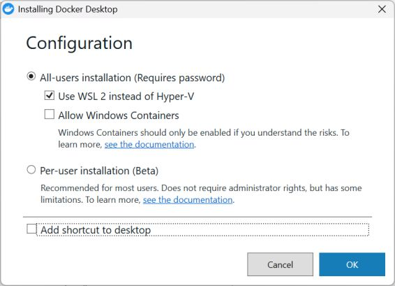

## 👩‍🏫 Prérequis formateur

À exécuter avant la session (compte Owner/Contributor de la souscription) pour éviter les erreurs de type resource provider non enregistré :

```bash
az provider register --namespace Microsoft.ContainerRegistry
az provider register --namespace Microsoft.ContainerInstance
```

---

## 🟦 Partie 1 — Containeriser AzureQuizLab.WebApp

### Étape 1 — Publier l'application .NET

Dans le dossier `AzureQuizLab.WebApp` :

```bash
dotnet publish -c Release -o publish
```

Vérifications :

- le dossier `publish` a bien été généré,
- le fichier `AzureQuizLab.dll` est présent dedans.

### Étape 2 — Créer le Dockerfile

Créer le fichier `Dockerfile` (sans extension) dans le dossier du projet avec le contenu suivant :

```dockerfile
FROM mcr.microsoft.com/dotnet/aspnet:10.0

WORKDIR /app

COPY publish .

EXPOSE 8080

ENV ASPNETCORE_URLS=http://+:8080

ENTRYPOINT ["dotnet", "AzureQuizLab.dll"]
```

### Étape 3 — Construire l’image

```bash
docker build -t azurequizlab-webapp:v1 .
```

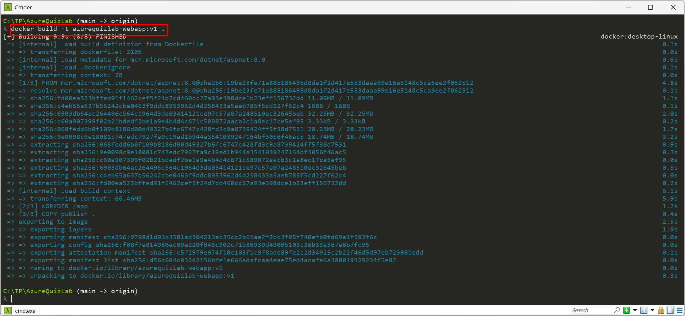


Vérification :

```bash
docker image ls azurequizlab-webapp
```

- l'image `azurequizlab-webapp:v1` apparaît localement.

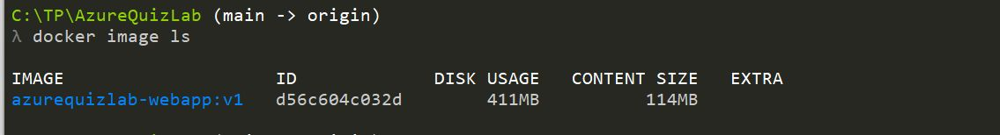

### Étape 4 — Exécuter le conteneur localement avec la connexion SQL

Exécuter la commande suivante pour lancer le conteneur avec les variables d’environnement SQL définies :

```cmd
docker run --rm -p 8080:8080 ^
-e ConnectionStrings__DefaultConnection="User ID=<login>;Password=<password>" ^
-e SqlServerName="sql-AzureQuiz-00" ^
-e SqlDatabaseName="AzureQuizLabDB" ^
azurequizlab-webapp:v1
```

Remplacer les valeurs selon votre contexte :

- `<login>` / `<password>` : identifiants SQL définis au TP2, Partie 2,
- `SqlServerName` : nom de votre serveur SQL (adaptez si différent de `sql-AzureQuiz-00`).

Si vous utilisez la base commune `sql-AzureQuiz-00`, le login est dbserveradmin. Pour le mot de passe, demandez à votre formateur.

Ces informations seront utilisées plusieurs fois dans les étapes suivantes, notez les.

Vérification :

- accès à `http://localhost:8080`,
- l’application se lance et se connecte à la base si les paramètres sont corrects.

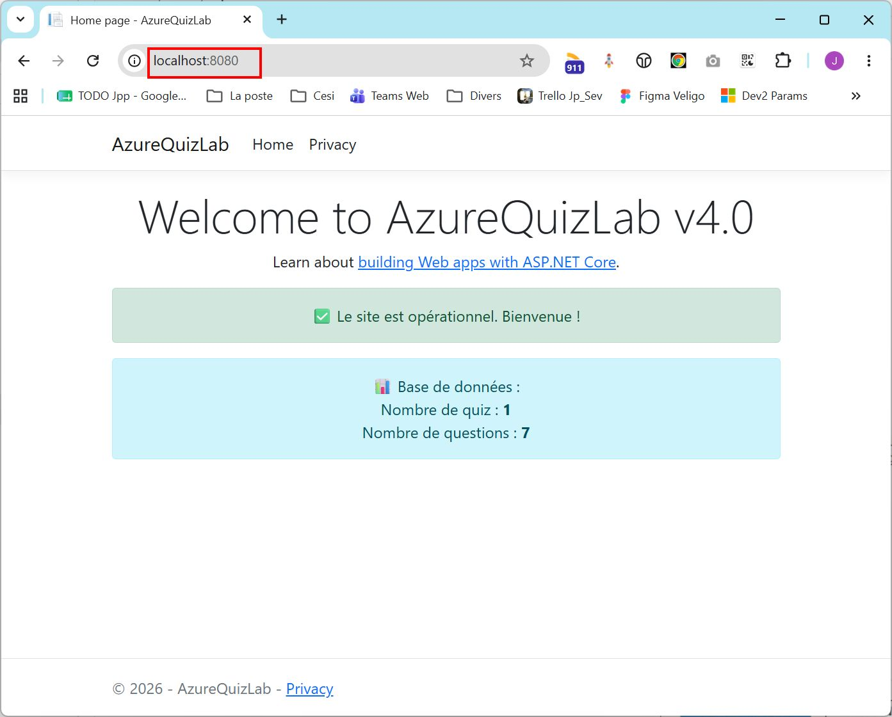

### Étape 5 — Mode debug en cas d'erreur(optionnel)

Si l'étape précédente réussie, passez à l'étape suivante. 

Sinon, en cas de besoin de diagnostic, ajouter `ASPNETCORE_ENVIRONMENT=Development` pour obtenir le détail de l’erreur :

```cmd
docker run --rm -p 8080:8080 ^
-e ASPNETCORE_ENVIRONMENT=Development ^
-e ConnectionStrings__DefaultConnection="User ID=<login>;Password=<password>" ^
-e SqlServerName="sql-AzureQuiz-00" ^
-e SqlDatabaseName="AzureQuizLabDB" ^
azurequizlab-webapp:v1
```

Utiliser ce mode uniquement pour le debug.

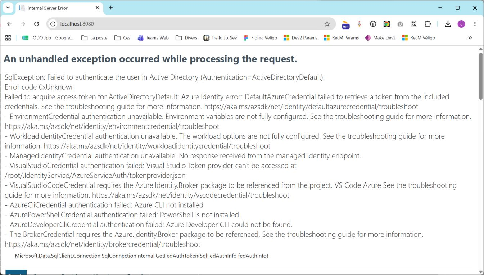

---

## 🟦 Partie 2 — Publier l’image dans ACR

### Étape 6 — Créer ACR via le portail azure

L'ACR (Azure Container Registry) est le registre privé Azure qui stocke et distribue les images Docker. L'ACI (Azure Container Instances) est le service Azure qui exécute ces conteneurs sans gérer de serveurs, et il sert ici à héberger la webapp après son déploiement.

Dans le Portail Azure :

1. Rechercher `Container Registries`
2. Cliquer sur `Create`
3. Saisir :

| Champ | Valeur |
|---|---|
| Subscription | Votre souscription |
| Resource Group | RG-Student-XX |
| Registry name | acrstudentXX |
| Location | France Central |
| Domain name label scope | Unsecure |
| Pricing Plan | Basic |

4. Cliquer sur `Review + create`
5. Cliquer sur `Create`

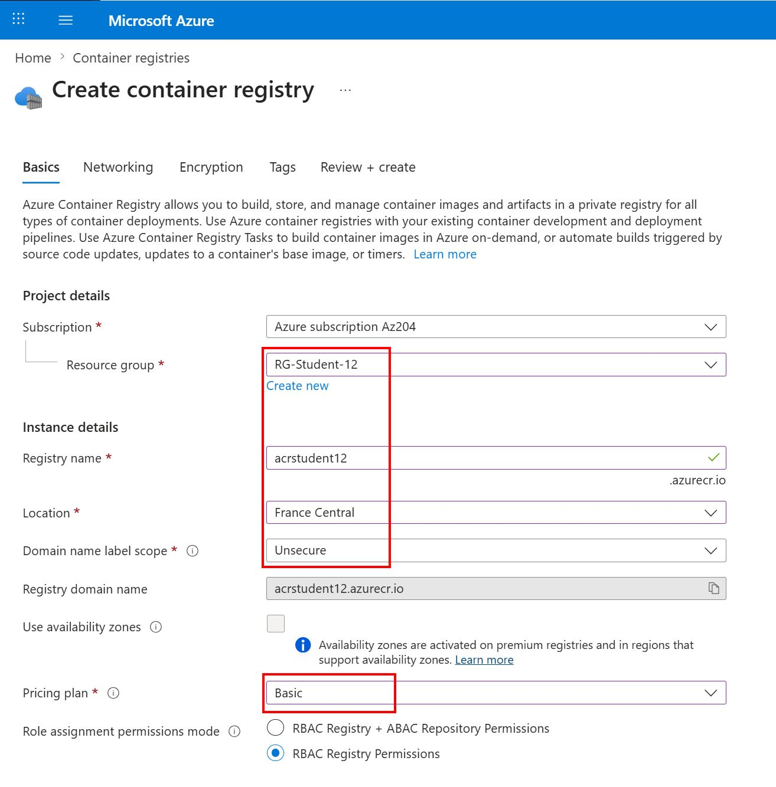

Cloud Shell (alternative) :

```bash
az acr create \
  --resource-group RG-Student-XX \
  --name acrstudentXX \
  --sku Basic
```

### Étape 7 — Authentification et push

```bash
az acr login --name acrstudentXX
docker tag azurequizlab-webapp:v1 acrstudentXX.azurecr.io/azurequizlab-webapp:v1
docker push acrstudentXX.azurecr.io/azurequizlab-webapp:v1
```

⚠️ Juste après la création d’un ACR, il peut y avoir un léger délai de propagation côté Azure. Dans ce cas, **Patientez quelques instants après la création de l’Azure Container Registry**

Il est donc possible que la commande suivante échoue temporairement :

```bash
az acr login --name acrstudentXX
```
Vous pouvez également diagnostiquer l’état du registre avec :

```bash
az acr check-health -n acrstudentXX --yes
az acr show --name acrstudentXX --query "{name:name, loginServer:loginServer, publicNetworkAccess:publicNetworkAccess}" -o table
```

Vérification :

Dans `Repositories` vérifier que `azurequizlab-webapp` > tag `v1` est visible.

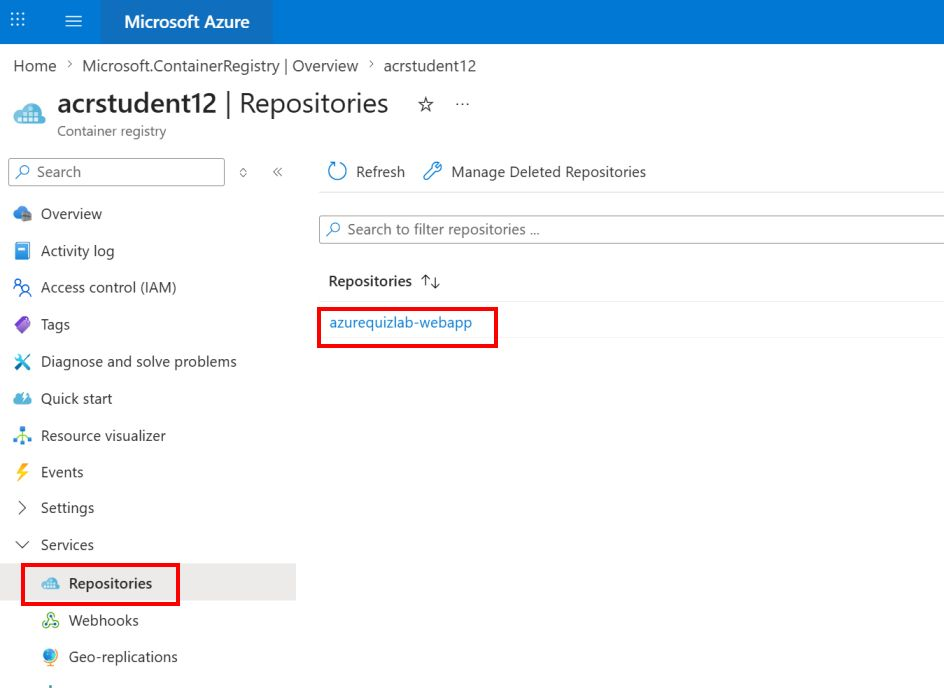

---

## 🟦 Partie 3 — Déployer dans Azure Container Instances (ACI)

### Étape 8 — Créer l’instance ACI

Dans le Portail Azure :

1. Rechercher `Container Instances`
2. Cliquer sur `Create`
3. Onglet `Basics` :
  - Resource Group : `RG-Student-XX`
  - Container name : `webapp-container`
  - Region : `France Central`
  - Image source : `Azure Container Registry`
  - Registry : `acrstudentXX`
  - Image : `azurequizlab-webapp`
  - Image tag : `v1`
4. Onglet `Networking` :
  - IP address type : `Public`
  - DNS name label : `webapp-studentXX`
  - Ports : `8080` `TCP`
5. Onglet `Advanced` > `Environment variables` :
  - `ASPNETCORE_URLS` = `http://+:8080`
  - `ASPNETCORE_ENVIRONMENT` = `Production`
  - `ConnectionStrings__DefaultConnection` = `User ID=<login>;Password=<password>`
  - `SqlServerName` = `sql-AzureQuiz-00` (ou votre serveur SQL)
  - `SqlDatabaseName` = `AzureQuizLabDB`
6. Cliquer sur `Review + create`, puis `Create`

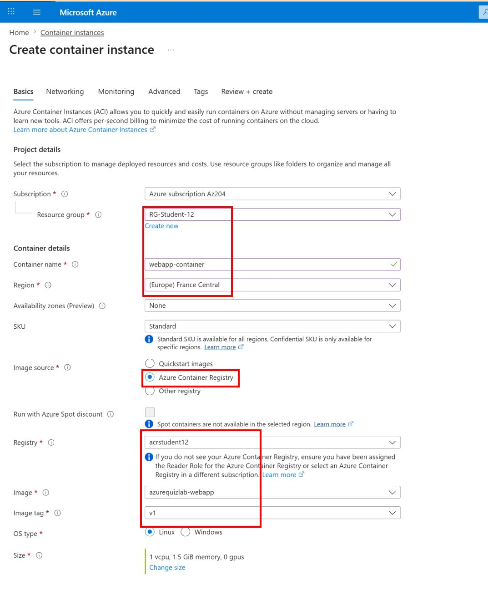

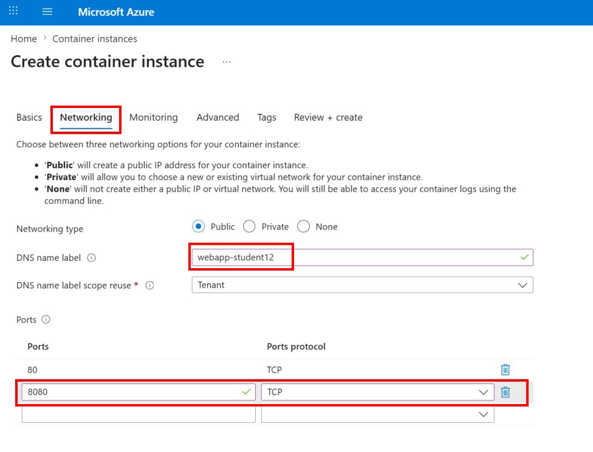

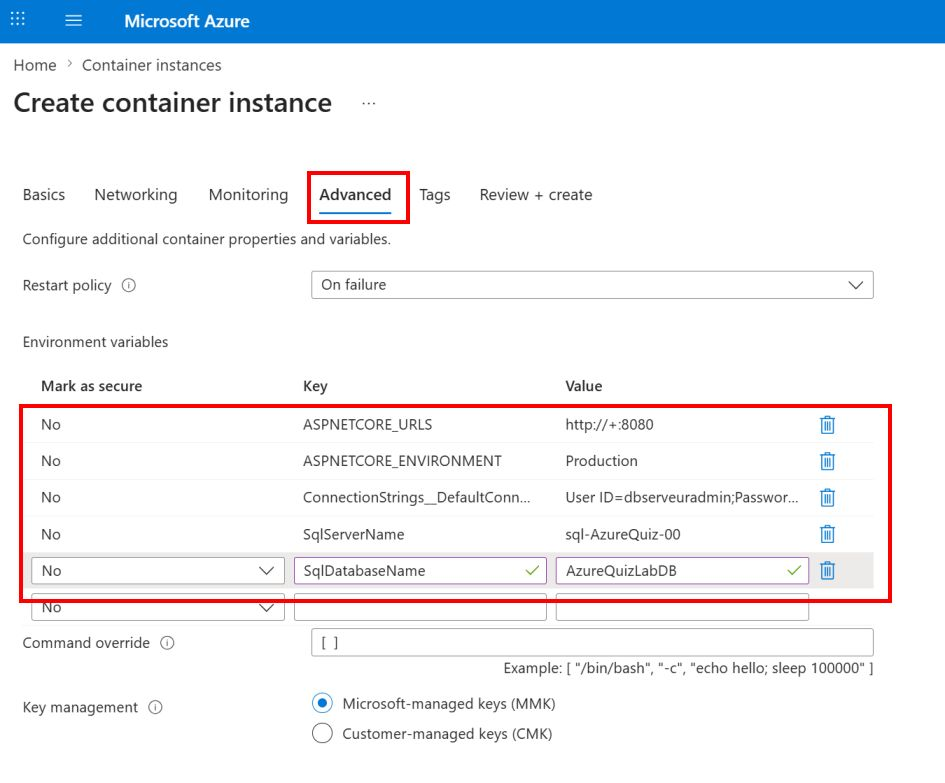

Alternative Cloud Shell après avoir activé et récupéré les credentials ACR (Cloud Shell) :

```bash
az acr update --name acrstudentXX --admin-enabled true
ACR_USER=$(az acr credential show -n acrstudentXX --query username -o tsv)
echo $ACR_USER
ACR_PASS=$(az acr credential show -n acrstudentXX --query "passwords[0].value" -o tsv)
echo $ACR_PASS

az container create \
  --resource-group RG-Student-XX \
  --name webapp-container \
  --location francecentral \
  --image acrstudentXX.azurecr.io/azurequizlab-webapp:v1 \
  --registry-login-server acrstudentXX.azurecr.io \
  --registry-username "$ACR_USER" \
  --registry-password "$ACR_PASS" \
  --ip-address Public \
  --dns-name-label webapp-studentXX \
  --ports 8080 \
  --os-type Linux --cpu 1 --memory 1 \
  --environment-variables \
    ASPNETCORE_URLS="http://+:8080" \
    ASPNETCORE_ENVIRONMENT=Production \
    ConnectionStrings__DefaultConnection="User ID=<login>;Password=<password>" \
    SqlServerName="sql-AzureQuiz-00" \
    SqlDatabaseName="AzureQuizLabDB"
```

Adapter `<login>`, `<password>` et `SqlServerName` avec vos valeurs définies au TP2.

Vérification :

- état `Running`

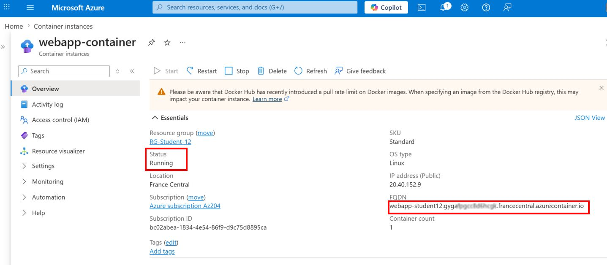

Récupérer le FQDN et tester l’accès à l’application sur le port 8080:

- URL fonctionnelle : `http://webapp-student12.francecentral.azurecontainer.io:8080`

### Étape 9 — Consulter les logs

```bash
az container logs \
  --resource-group RG-Student-XX \
  --name webapp-container
```

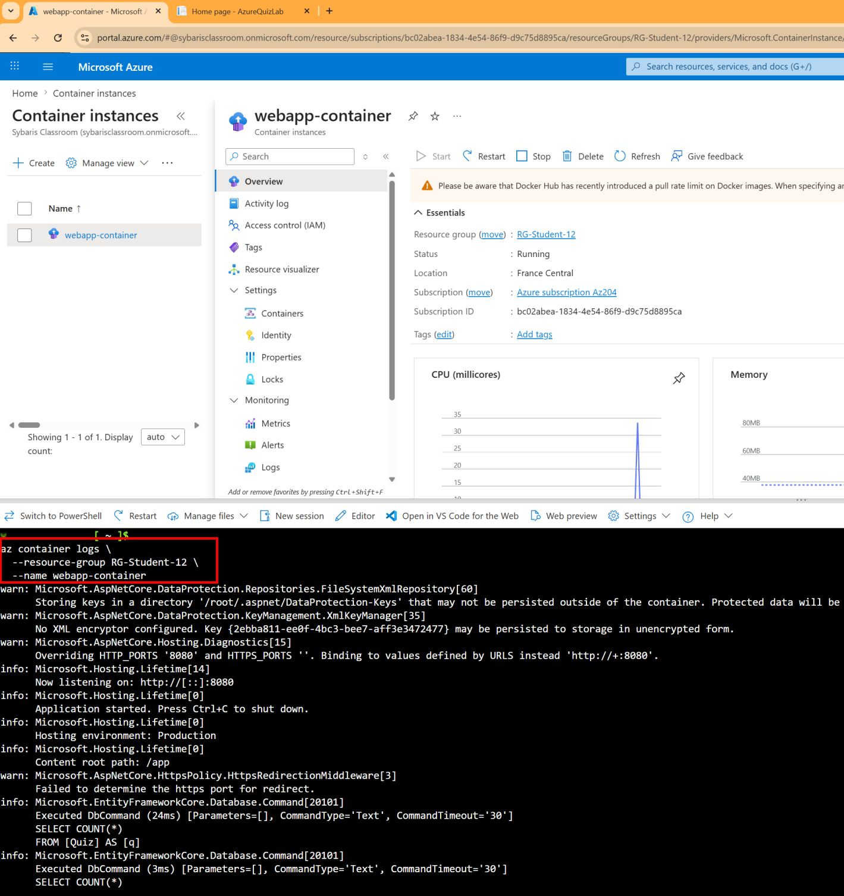

---

## 🟦 Partie 4 — Persistance avec Azure Files

### Étape 10 — Réutiliser le Storage Account du TP5 et créer le File Share

> ℹ️ Le compte de stockage `storagequizlabxx` a déjà été créé dans le TP5 pour Azure Blob Storage. On le réutilise ici pour Azure Files.

Récupérer la clé du compte de stockage :

```bash
STORAGE_KEY=$(az storage account keys list \
  --account-name storagequizlabxx \
  --resource-group RG-Student-XX \
  --query "[0].value" -o tsv)

az storage share create \
  --name quizfiles \
  --account-name storagequizlabxx \
  --account-key "$STORAGE_KEY"
```

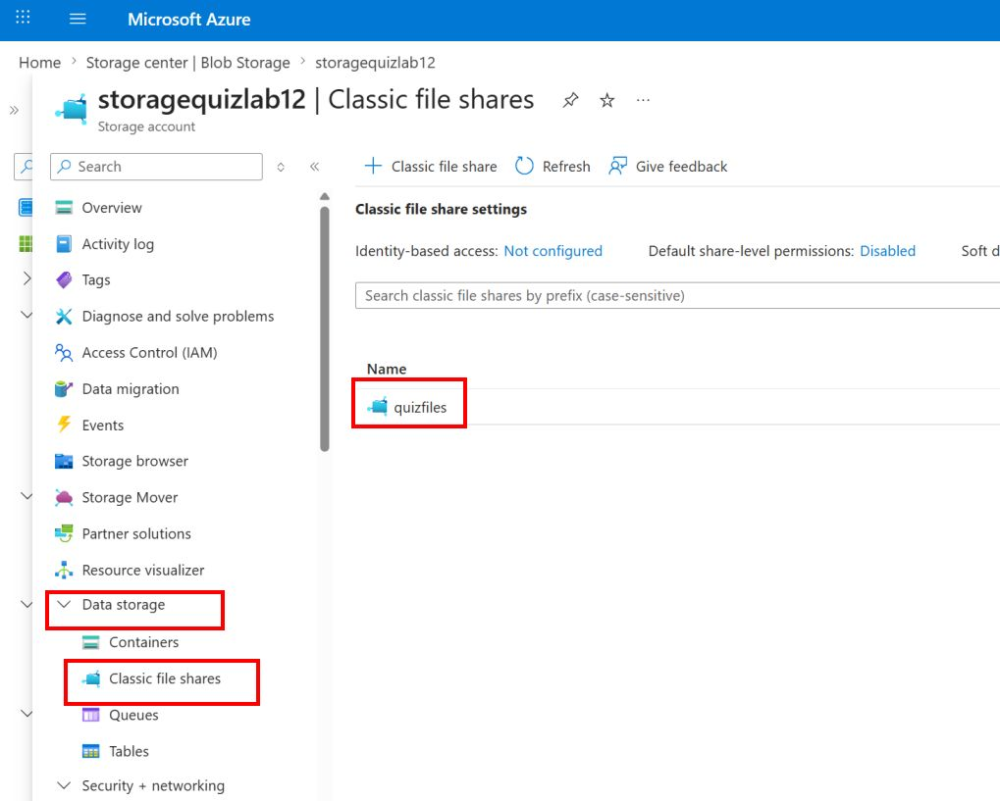

### Étape 11 — Recréer ACI avec montage Azure Files

Supprimer puis recréer le conteneur avec volume monté :

```bash
az container delete \
  --resource-group RG-Student-XX \
  --name webapp-container \
  --yes

az container create \
  --resource-group RG-Student-XX \
  --name webapp-container \
  --location francecentral \
  --image acrstudentXX.azurecr.io/azurequizlab-webapp:v1 \
  --registry-login-server acrstudentXX.azurecr.io \
  --registry-username "$ACR_USER" \
  --registry-password "$ACR_PASS" \
  --ip-address Public \
  --dns-name-label webapp-studentXX \
  --ports 8080 \
  --os-type Linux --cpu 1 --memory 1 \
  --environment-variables \
    ASPNETCORE_URLS="http://+:8080" \
    ASPNETCORE_ENVIRONMENT=Production \
    ConnectionStrings__DefaultConnection="User ID=<login>;Password=<password>" \
    SqlServerName="sql-AzureQuiz-00" \
    SqlDatabaseName="AzureQuizLabDB" \
  --azure-file-volume-account-name storagequizlabxx \
  --azure-file-volume-account-key "$STORAGE_KEY" \
  --azure-file-volume-share-name quizfiles \
  --azure-file-volume-mount-path /mnt/quizfiles
```

Vérification guidée (pas à pas) :

1. Vérifier que l'ACI est bien `Running` :

```bash
az container show \
  --resource-group RG-Student-XX \
  --name webapp-container \
  --query instanceView.state -o tsv
```

Résultat attendu : `Running`

2. Ouvrir un shell dans le conteneur :
Notez que cette commande ouvre un shell interactif dans le conteneur, vous permettant d’exécuter des commandes directement à l’intérieur de celui-ci. C’est très utile pour vérifier la configuration, les points de montage, et la persistance des données.

```bash
az container exec \
  --resource-group RG-Student-XX \
  --name webapp-container \
  --exec-command "/bin/sh"
```

3. Dans le shell du conteneur, vérifier le point de montage et créer un fichier test :
Cette série de commande va s'exécuter dans le shell du conteneur, et pas dans le Cloud Shell.

```sh
ls -la /mnt/quizfiles
echo "persist-test-$(date +%Y%m%d-%H%M%S)" > /mnt/quizfiles/persist.txt
cat /mnt/quizfiles/persist.txt
ls -la /mnt/quizfiles
```

4. Quitter le shell :

```sh
exit
```

5. Recréer le conteneur (supprimer puis relancer la commande `az container create` de l'étape 11) :

```bash
az container delete \
  --resource-group RG-Student-XX \
  --name webapp-container \
  --yes
```

Puis relancer exactement la commande `az container create` définie juste au-dessus dans cette étape.

6. Rouvrir un shell dans le nouveau conteneur :

```bash
az container exec \
  --resource-group RG-Student-XX \
  --name webapp-container \
  --exec-command "/bin/sh"
```

7. Vérifier la persistance du fichier :

```sh
cat /mnt/quizfiles/persist.txt
ls -la /mnt/quizfiles
```

Résultat attendu : le fichier `persist.txt` est toujours présent après recréation du conteneur.

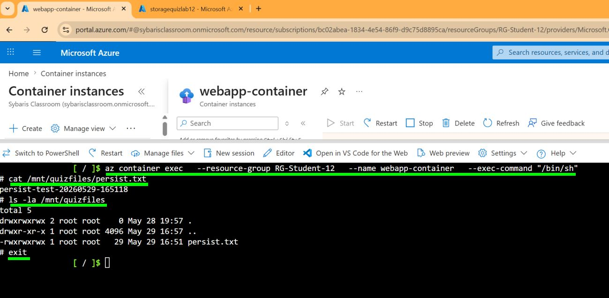

---

## 🟩 Validation de fin TP8

- image `v1` de la webapp disponible dans ACR,
- webapp accessible dans ACI,
- logs consultables,
- volume Azure Files monté et validé,
- artefacts prêts pour le TP9 (déploiement dans ACA).

---

## 📦 Artefacts à conserver pour TP9

- ACR : `acrstudentXX`
- Image v1 : `acrstudentXX.azurecr.io/azurequizlab-webapp:v1`
- DNS ACI : `webapp-studentXX`

---

## 🟨 Transition vers TP9

Le TP9 réutilise ces artefacts pour se concentrer sur :

- Azure Container Apps,
- autoscaling,
- révisions et rollback,
- secrets,
- Managed Identity,
- microservices et Dapr.