# 🧪 TP9 — Azure Container Apps : scaling et traffic splitting

## 🎯 Objectifs pédagogiques

À la fin de ce TP, vous saurez :

- déployer AzureQuizLab dans Azure Container Apps (ACA),
- configurer des health probes (liveness, readiness, startup),
- mettre en place l'autoscaling avec des règles HTTP,
- gérer les révisions et le traffic splitting (déploiement canary).

---

## ✅ Prérequis (réutilisation TP8)

Ce TP réutilise directement les artefacts créés dans le TP8 :

- ACR : `acrstudentXX`
- Image v1 : `acrstudentXX.azurecr.io/azurequizlab-webapp:v1`

## 👩‍🏫 Prérequis formateur

- provider `Microsoft.App` enregistré,
- extension CLI `containerapp` disponible,

```bash
az provider register --namespace Microsoft.App --wait
az provider register --namespace Microsoft.OperationalInsights --wait
az extension add --name containerapp --upgrade
```

---

## 🟦 Partie 1 — Créer l'environnement ACA

### Étape 1 — Créer un Container Apps Environment

> ℹ️ Le Container Apps Environment ne se crée pas directement depuis le portail. Il se crée soit via Cloud Shell, soit automatiquement lors de la création d'une Container App (étape 2).

Cloud Shell :

```bash
az containerapp env create \
  --name aca-env-studentXX \
  --resource-group RG-Student-XX \
  --location francecentral
```

Rechercher `Container Apps Environment`, ouvrir `aca-env-studentXX`

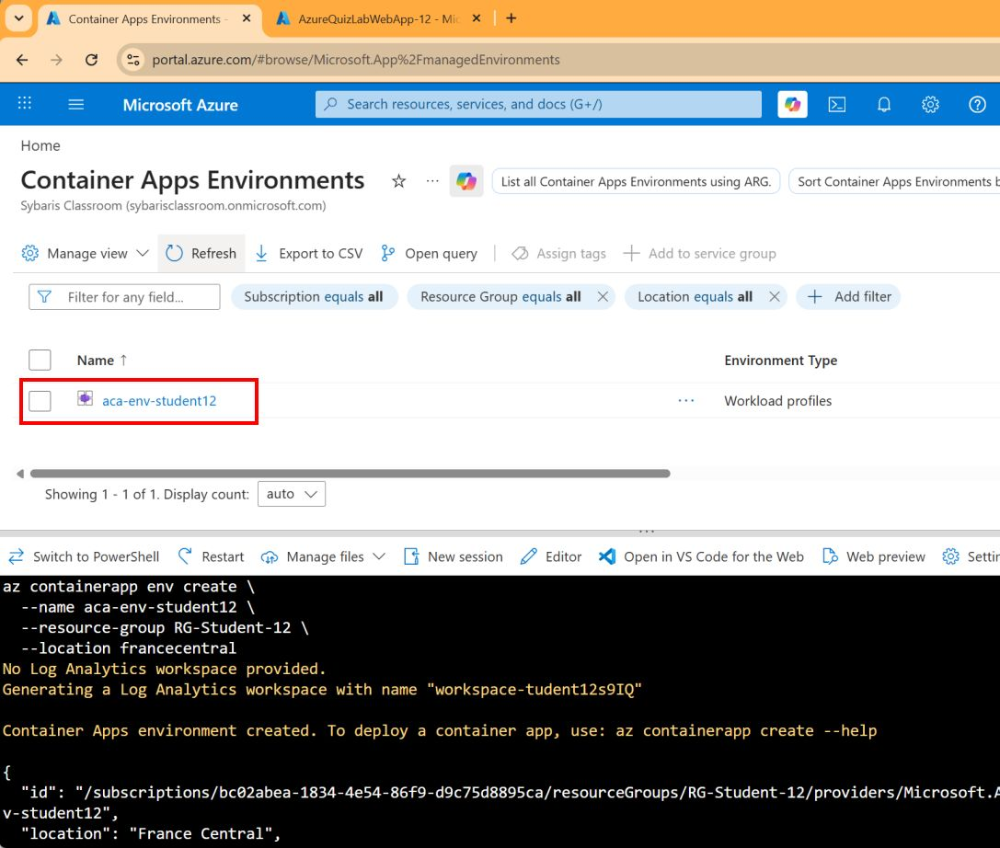

---

## 🟦 Partie 2 — Déployer azurequizlab-webapp depuis ACR

### Étape 2 — Créer la Container App

Dans le Portail Azure :

1. Créer une `Container App`
2. Nom : `webapp`
3. Container Apps Environment : le portail propose soit de créer un nouvel environnement, soit d'en sélectionner un existant. Si vous avez créé `aca-env-studentXX` à l'étape 1, le sélectionner ici. Sinon, le portail peut en créer un automatiquement, mais son nom sera auto-généré.
4. Resource group : `RG-Student-XX`
5. Location : `France Central`

> ℹ️ C'est l'avantage de créer l'environnement en ligne de commande à l'étape 1 : vous maîtrisez son nom.

6. Continuez sur l'onglet `Container` et configurez :
7. Image source : `Azure Container Registry`
8. Registry : sélectionner `acrstudentXX.azurecr.io` dans la liste
9. Image : `azurequizlab-webapp`
10. Image tag : `v1`
11. Ingress : `Enabled`, **External** (`Accepting traffic from anywhere`), `HTTP`, `Target port 8080`
12. Continuez sur l'onglet `Ingress` et configurez :
13. Cocher `Ingress` (si ce n'est pas déjà fait à l'étape précédente)
14. Cocher `Accepting traffic from anywhere`
15. Ingress type : `HTTP`
16. Target port : `8080`
17. Cliquer `Review + create` puis `Create`

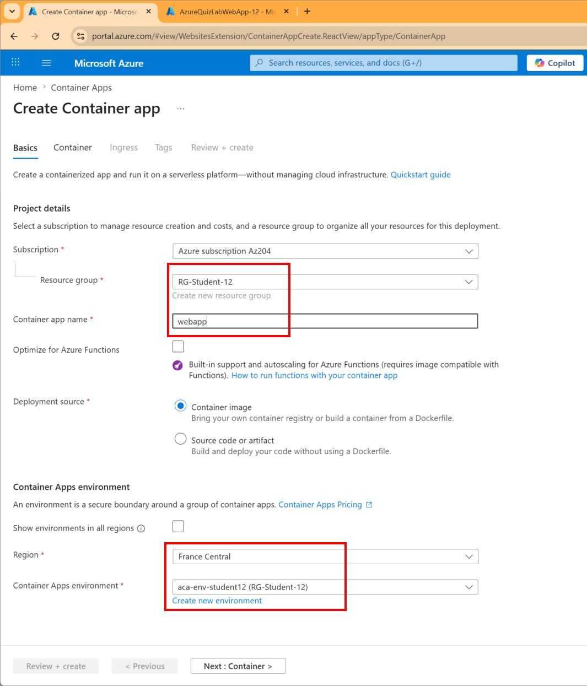
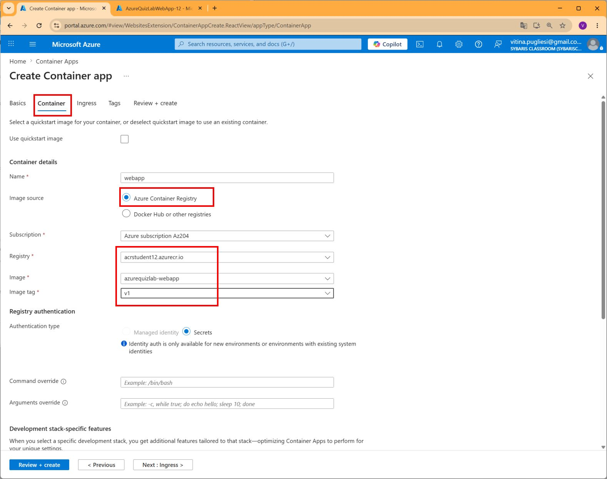
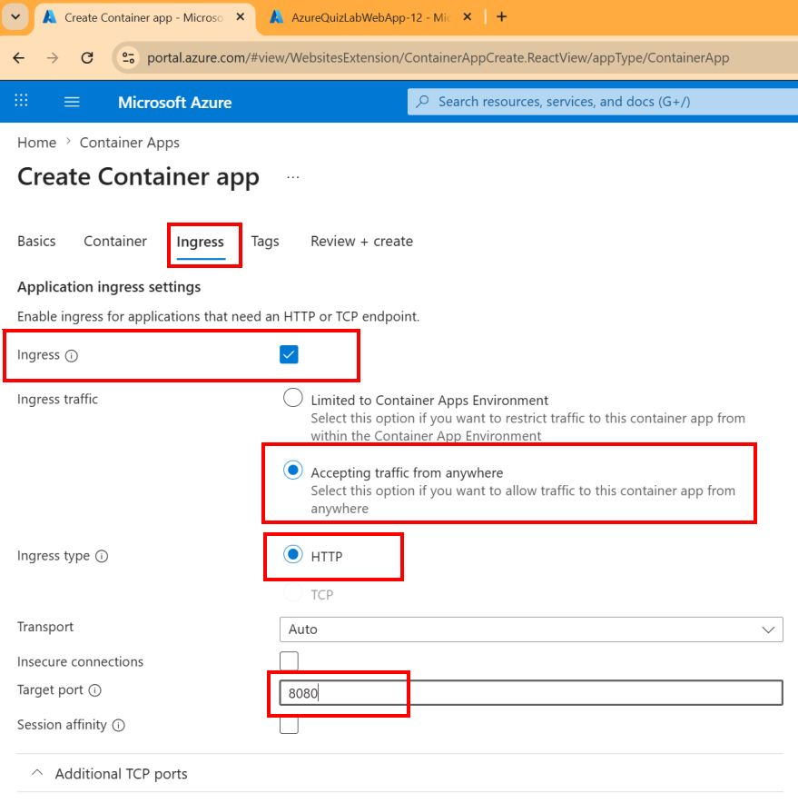

La ligne de commande équivalente pour créer la Container App est la suivante (Sauter cette étape si vous avez déjà créé l'app via le portail) :

```bash
az containerapp create \
  --name webapp \
  --resource-group RG-Student-XX \
  --environment aca-env-studentXX \
  --image acrstudentXX.azurecr.io/azurequizlab-webapp:v1 \
  --registry-server acrstudentXX.azurecr.io \
  --target-port 8080 \
  --ingress external
```

### Étape 3 — Configurer Managed Identity + AcrPull + registre

Cloud Shell :

```bash
az containerapp identity assign \
  --name webapp \
  --resource-group RG-Student-XX \
  --system-assigned

PRINCIPAL_ID=$(az containerapp identity show \
  --name webapp \
  --resource-group RG-Student-XX \
  --query principalId -o tsv)

ACR_ID=$(az acr show \
  --name acrstudentXX \
  --resource-group RG-Student-XX \
  --query id -o tsv)

az role assignment create \
  --assignee-object-id "$PRINCIPAL_ID" \
  --assignee-principal-type ServicePrincipal \
  --role AcrPull \
  --scope "$ACR_ID"

az containerapp registry set \
  --name webapp \
  --resource-group RG-Student-XX \
  --server acrstudentXX.azurecr.io \
  --identity system
```

📸 Capture attendue (Portail) :

- onglet `Identity` activé,
- rôle `AcrPull` visible côté ACR (`Access control (IAM)`),
- registre ACR visible dans la configuration de la Container App.

### Étape 3 bis — Définir la configuration SQL (obligatoire)

À ce stade, la webapp peut démarrer mais échouer à l'exécution si les variables SQL ne sont pas définies.

Renseigner les variables d'environnement suivantes dans la Container App (format Bash) :

```bash
SQL_LOGIN="<login>"
SQL_PASSWORD="<password>"
SQL_SERVER_NAME="sql-AzureQuiz-00"   # ou votre serveur SQL
SQL_DATABASE_NAME="AzureQuizLabDB"
```

Cloud Shell :

```bash
az containerapp update \
  --name webapp \
  --resource-group RG-Student-XX \
  --set-env-vars \
    ConnectionStrings__DefaultConnection="User ID=${SQL_LOGIN};Password=${SQL_PASSWORD};" \
    SqlServerName="${SQL_SERVER_NAME}" \
    SqlDatabaseName="${SQL_DATABASE_NAME}"
```

Portail Azure (alternative) : `webapp` > `Containers` > `Environment variables` > `Add` puis `Save as new revision`.

> ℹ️ Ces variables reprennent le modèle du TP8. Sans `ConnectionStrings__DefaultConnection`, le site répondra une erreur.

---

## 🟦 Partie 3 — Health Probes

Les health probes permettent à ACA de surveiller l'état de votre conteneur :

| Type | Rôle |
|---|---|
| **Startup** | Laisse le temps au conteneur de démarrer. Les autres probes ne s'activent qu'après son succès. |
| **Liveness** | Vérifie que le conteneur est toujours en vie. En cas d'échec répété, ACA redémarre le conteneur. |
| **Readiness** | Vérifie que le conteneur est prêt à recevoir du trafic. En cas d'échec, il est temporairement retiré du load balancer. |

### Étape 4 — Configurer les probes via le portail

1. Ouvrir `webapp` > `Containers`
2. Aller dans l'onglet `Health probes`
3. Configurer :

**Liveness probe :**

| Champ | Valeur |
|---|---|
| Transport | HTTP |
| Path | `/` |
| Port | 8080 |
| Period (seconds) | 30 |
| Failure threshold | 3 |

**Readiness probe :**

| Champ | Valeur |
|---|---|
| Transport | HTTP |
| Path | `/` |
| Port | 8080 |
| Period (seconds) | 10 |
| Failure threshold | 3 |

**Startup probe :**

| Champ | Valeur |
|---|---|
| Transport | HTTP |
| Path | `/` |
| Port | 8080 |
| Initial delay (seconds) | 5 |
| Period (seconds) | 10 |
| Failure threshold | 3 |

4. Cliquer `Save as new revision` pour appliquer les changements

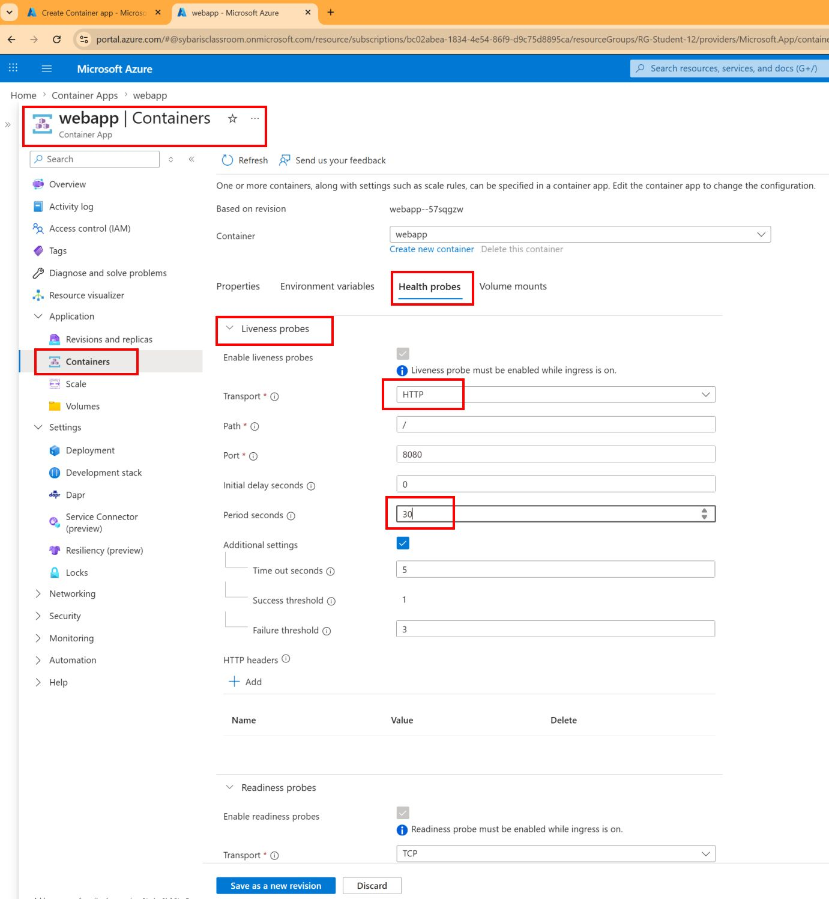

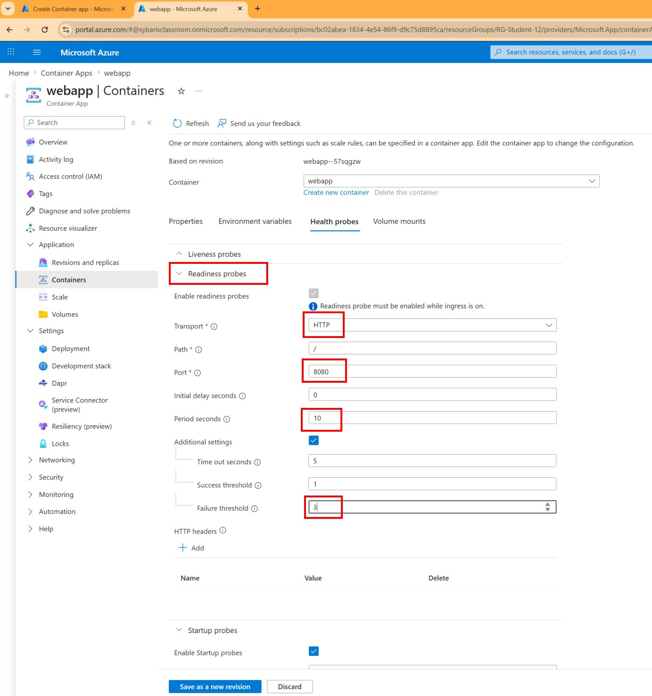

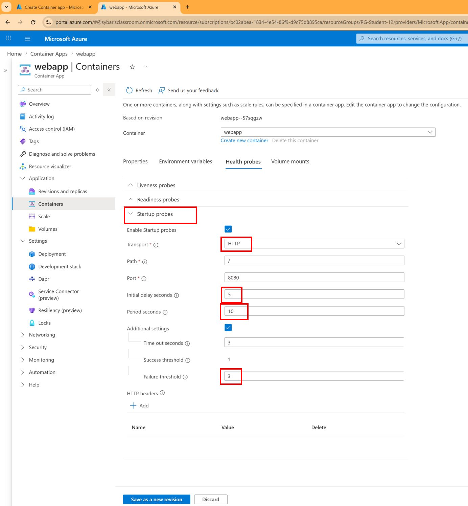

---

## 🟦 Partie 4 — Autoscaling avec règles HTTP

### Étape 5 — Configurer le scaling avec une règle HTTP

Contrairement à ACI (TP8) qui exécute un nombre fixe de conteneurs, ACA peut ajuster automatiquement le nombre de replicas en fonction de la charge.

Portail Azure :

1. Ouvrir `webapp` > `Scale`
2. Régler `Min replicas = 0`, `Max replicas = 5`
3. Cliquer `Add` pour ajouter une règle de scaling
4. Configurer :

| Champ | Valeur |
|---|---|
| Rule name | http-rule |
| Type | HTTP scaling |
| Concurrent requests | 10 |

5. Cliquer `Add scale rule`
6. Cliquer `Save as new revision` 

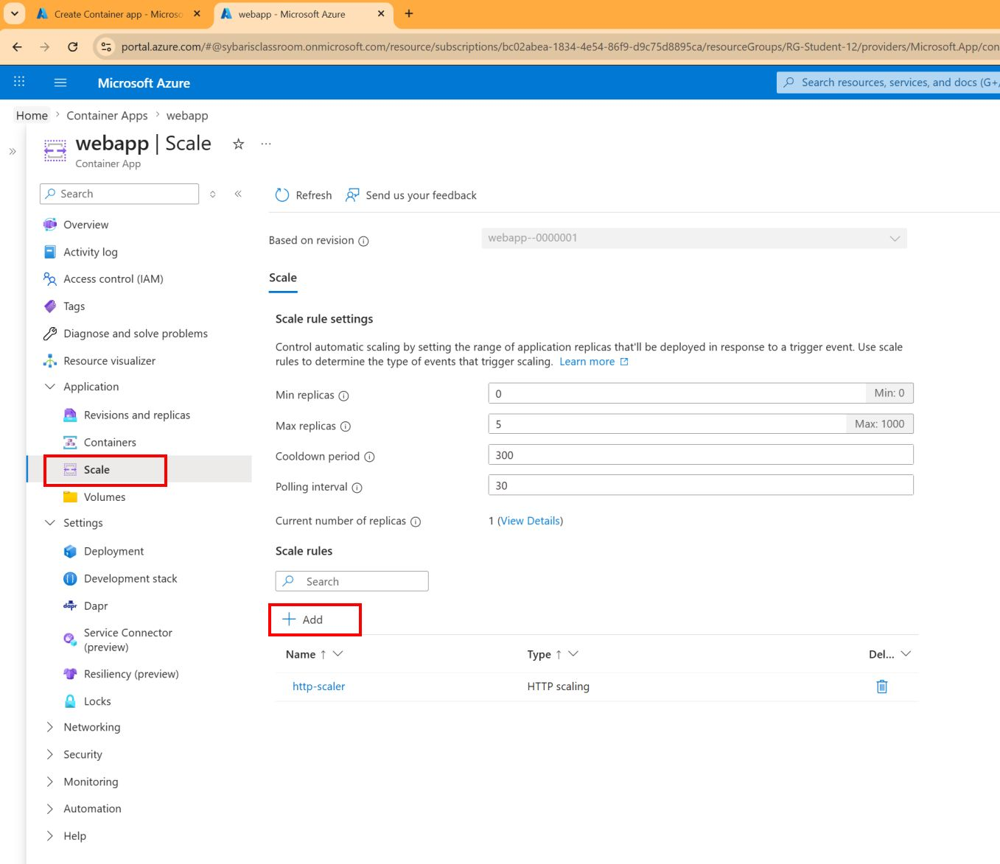
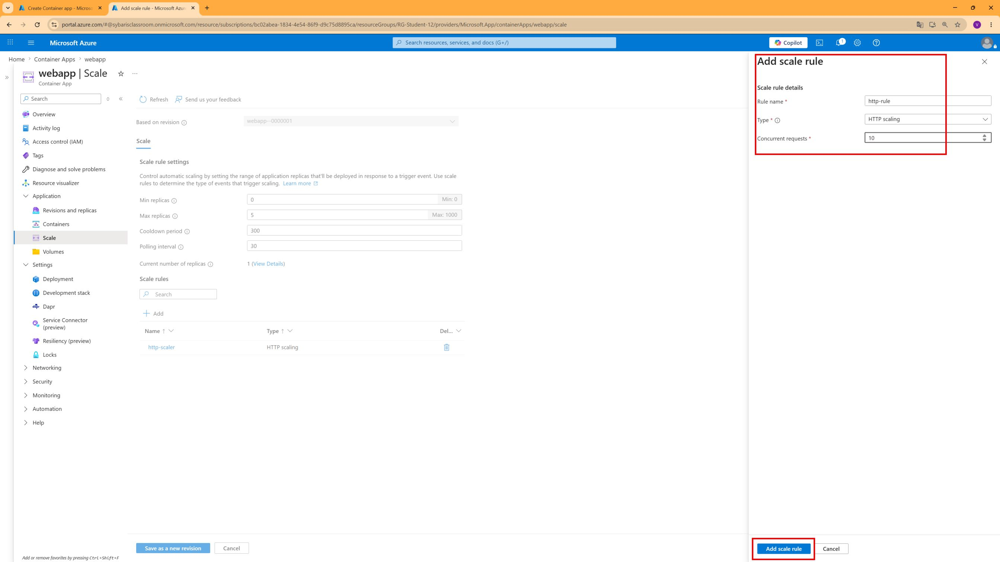

Cloud Shell (alternative) :

```bash
az containerapp update \
  --name webapp \
  --resource-group RG-Student-XX \
  --min-replicas 0 \
  --max-replicas 5 \
  --scale-rule-name http-rule \
  --scale-rule-http-concurrency 10
```

> ℹ️ Avec `min-replicas = 0`, l'application peut scaler à zéro quand il n'y a aucune requête (scale-to-zero). Le premier appel après une période d'inactivité prendra quelques secondes (cold start).

### Étape 6 — Observer le comportement du scaling

Vérifier le nombre de replicas actifs :

```bash
az containerapp replica list \
  --name webapp \
  --resource-group RG-Student-XX \
  -o table
```

Pour observer le scaling de façon visible, utilisez une charge concurrente en CLI .

1. Récupérer l'URL publique de l'application :

```bash
APP_FQDN=$(az containerapp show \
  --name webapp \
  --resource-group RG-Student-XX \
  --query properties.configuration.ingress.fqdn -o tsv)

echo "https://${APP_FQDN}"
```

2. Générer une charge parallèle pendant ~90 secondes :

```bash
for i in {1..90}; do
  seq 1 30 | xargs -I{} -P 30 curl -k -s -o /dev/null "https://${APP_FQDN}/" >/dev/null 2>&1
  sleep 1
done
```

3. Dans un second terminal Cloud Shell, surveiller les replicas pendant le test :

```bash
watch -n 5 "az containerapp replica list --name webapp --resource-group RG-Student-XX -o table"
```

> ℹ️ Si vous restez à 1 replica, baissez temporairement le seuil HTTP à 1 pour rendre l'effet plus visible en TP :

```bash
az containerapp update \
  --name webapp \
  --resource-group RG-Student-XX \
  --scale-rule-name http-rule \
  --scale-rule-http-concurrency 1
```

Puis relancez le test de charge ci-dessus.

Le nombre de replicas augmente sous charge et redescend après quelques minutes d'inactivité.

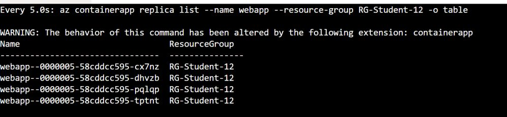

---

## 🟦 Partie 5 — Révisions et Traffic Splitting

### Étape 7 — Passer en mode multi-révision

Par défaut, ACA fonctionne en mode **single revision** : chaque mise à jour remplace la révision active. Le mode **multi-révision** permet de maintenir plusieurs versions actives simultanément et de répartir le trafic entre elles.

Vérifier que le mode est bien `Single` :
```bash
az containerapp show \
  --name webapp \
  --resource-group RG-Student-XX \
  --query properties.configuration.activeRevisionsMode \
  -o tsv
```

Basculer en mode `Multiple` :
```bash
az containerapp revision set-mode \
  --name webapp \
  --resource-group RG-Student-XX \
  --mode multiplec
```

Vérifier que le mode est bien `Multiple` :
```bash
az containerapp show \
  --name webapp \
  --resource-group RG-Student-XX \
  --query properties.configuration.activeRevisionsMode \
  -o tsv
```

Dans `Revisions`, le mode est affiché comme `Multiple` :

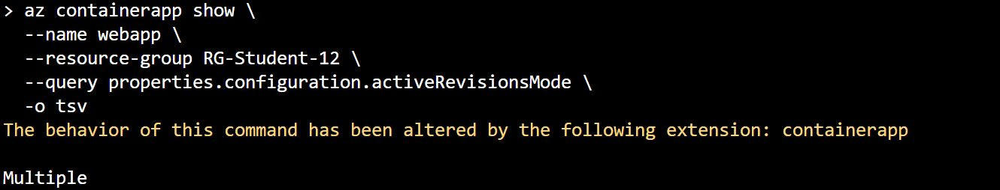

### Étape 8 — Créer une révision "maintenance" sans reconstruire d'image

Pour obtenir un comportement visuellement différent sans passer par un nouveau build Docker, utilisez la variable `MaintenanceMode` (introduite au TP2).

Créer une nouvelle révision en activant le mode maintenance :

```bash
az containerapp update \
  --name webapp \
  --resource-group RG-Student-XX \
  --set-env-vars MaintenanceMode=true
```

> ℹ️ En mode multi-révision, cette mise à jour de configuration crée une nouvelle révision, même si l'image conteneur ne change pas.

### Étape 9 — Traffic splitting (canary) avec la révision MaintenanceMode

Lister les révisions pour récupérer leurs noms :

```bash
az containerapp revision list \
  --name webapp \
  --resource-group RG-Student-XX \
  -o table
```

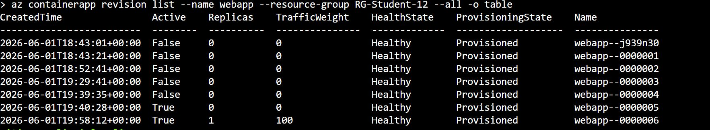

Répartir le trafic 80/20 entre la révision "normale" (`MaintenanceMode=false`) et la révision "maintenance" (`MaintenanceMode=true`) :

```bash
az containerapp ingress traffic set \
  --name webapp \
  --resource-group RG-Student-XX \
  --revision-weight <nom-revision-v1>=80 <nom-revision-v2>=20
```

> ⚠️ Remplacer `<nom-revision-v1>` et `<nom-revision-v2>` par les noms exacts affichés par la commande `revision list` (ex : `webapp--abcdefg`).

Dans `Revisions`, les deux révisions sont actives avec les pourcentages 80 % et 20 %:

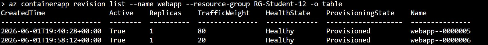

Vérification : rafraîchir l'URL de l'application plusieurs fois dans le navigateur. Environ 1 fois sur 5, la version avec `MaintenanceMode=true` devrait s'afficher.

### Étape 10 — Basculer 100 % du trafic et rollback

Une fois la révision "maintenance" validée, basculer tout le trafic :

```bash
az containerapp ingress traffic set \
  --name webapp \
  --resource-group RG-Student-XX \
  --revision-weight <nom-revision-v2>=100
```

Vérification : toutes les requêtes affichent la version avec `MaintenanceMode=true`.

Pour effectuer un rollback vers la révision "normale" (`MaintenanceMode=false`), il suffit de rediriger le trafic :

```bash
az containerapp ingress traffic set \
  --name webapp \
  --resource-group RG-Student-XX \
  --revision-weight <nom-revision-v1>=100
```

Dans `Revisions`, seule la révision "normale" reçoit 100 % du trafic:

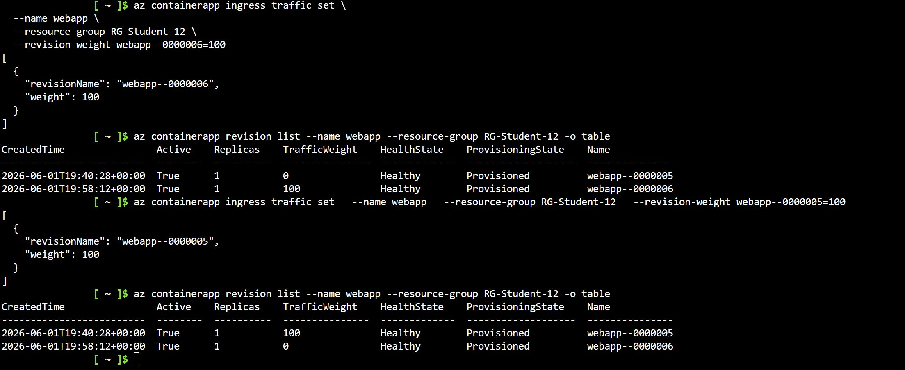

> ℹ️ C'est l'avantage majeur du mode multi-révision : un rollback est instantané, sans reconstruction ni redéploiement d'image.

---

## 📘 Pour aller plus loin

Ces sujets ne font pas partie du TP mais sont utiles pour approfondir :

- **Monitoring ACA** : dans `webapp` > `Metrics`, ajouter `Replica Count`, `Requests`, `CPU Usage` / `Memory Working Set`, puis observer une fenêtre de 30 minutes pour corréler charge et scaling.
- **Dapr** : activer le sidecar Dapr (`--enable-dapr true --dapr-app-id webapp --dapr-app-port 8080`) pour bénéficier du service discovery, du state management et du pub/sub entre services.
- **Microservices** : créer un second Container App (ex : API de scoring) avec ingress `internal`, et l'appeler depuis la webapp via son URL interne `https://scoring.internal.<env>.azurecontainerapps.dev`.
- **CI/CD Containers** : créer un workflow GitHub Actions qui build l'image, la push dans ACR et met à jour la Container App automatiquement.
