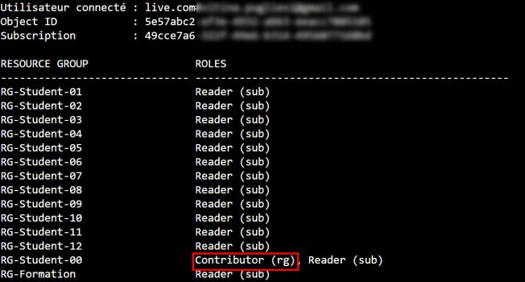

# 🧪 Scripts / Snippets

## 🎯 Objectifs

Ici sont regroupés un ensemble de scripts utiles pour differentes taches

------------------------------------------------------------------------

# 🟢 Script 1 --- Déterminer son Resource Group (RG)

## 🎯 Objectif du script :

Le script suivant liste les resources groups disposibles pour la formation, et le role du user actuellement connecté

## 🗄️ Script :

``` bash
#!/bin/bash

USER_NAME=$(az account show --query user.name -o tsv)
USER_OBJECT_ID=$(az ad signed-in-user show --query id -o tsv)
SUB_ID=$(az account show --query id -o tsv)

echo ""
echo "Utilisateur connecté : $USER_NAME"
echo "Object ID            : $USER_OBJECT_ID"
echo "Subscription         : $SUB_ID"
echo ""

# Entête tableau
printf "%-30s %-50s\n" "RESOURCE GROUP" "ROLES"
printf "%-30s %-50s\n" "------------------------------" "--------------------------------------------------"

# Récupère rôles subscription une fois
SUB_ROLES=$(az role assignment list \
    --assignee $USER_OBJECT_ID \
    --scope "/subscriptions/$SUB_ID" \
    --query "[].roleDefinitionName" -o tsv)

# Boucle RG
for RG in $(az group list --query "[].name" -o tsv)
do
    RG_SCOPE="/subscriptions/$SUB_ID/resourceGroups/$RG"

    RG_ROLES=$(az role assignment list \
        --assignee $USER_OBJECT_ID \
        --scope "$RG_SCOPE" \
        --query "[].roleDefinitionName" -o tsv)

    ROLE_LIST=""

    # Ajoute rôles RG
    for ROLE in $RG_ROLES
    do
        ROLE_LIST+="$ROLE (rg), "
    done

    # Ajoute rôles subscription (hérités)
    for ROLE in $SUB_ROLES
    do
        ROLE_LIST+="$ROLE (sub), "
    done

    if [ -z "$ROLE_LIST" ]; then
        ROLE_LIST="None"
    else
        ROLE_LIST=${ROLE_LIST%, }
    fi

    printf "%-30s %-50s\n" "$RG" "$ROLE_LIST"
done
```

## 👉 Résultat :




------------------------------------------------------------------------
------------------------------------------------------------------------
------------------------------------------------------------------------


# 🟢 Script XX --- Titre

## 🎯 Objectif du script :

Description de l'objectif

## 🗄️ Script :

``` bash
code
```
## 👉 Résultat :


